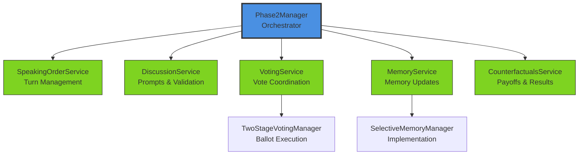

# Architectural Diagram Plan
## Distributive Justice Experiment Framework - Visual Documentation Strategy
**Master Thesis of Lucas Mueller**

**Goal**: Create progressive, reader-friendly architectural diagrams that guide understanding from high-level concepts to detailed implementation.

**Design Philosophy**:
- Start simple, add complexity gradually
- Each diagram stands alone but builds on previous ones
- Use consistent visual language across all diagrams
- Prioritize clarity over completeness

---

## Recommended Tooling

### Primary Tool: Mermaid
**Why Mermaid?**
- ✅ Markdown-based syntax (human-readable source)
- ✅ Renders directly in GitHub/GitLab
- ✅ Multiple diagram types (flowcharts, sequence, class, state)
- ✅ No special software needed to view
- ✅ Easy to version control and review
- ✅ Can be embedded in documentation

**Installation**:
```bash
# For local rendering (optional)
npm install -g @mermaid-js/mermaid-cli

# For Python integration (optional)
pip install mermaid-py
```

### Alternative/Supplementary Tools

**For complex architecture diagrams**:
- `diagrams` Python package - Infrastructure-as-code style diagrams
- Installation: `pip install diagrams`
- Pros: Beautiful, code-based, supports many icons
- Cons: Requires Graphviz backend

**For UML from code**:
- `pyreverse` (part of pylint) - Auto-generate from Python code
- Installation: `pip install pylint`
- Pros: Automatically extracts class relationships
- Cons: Can be overwhelming for large codebases

---

## Diagram Hierarchy: Progressive Disclosure

### Level 1: Executive Overview (60 seconds to understand)
**Target Audience**: Researchers, managers, first-time readers

**Diagram 1.1: Two-Phase Experiment Flow**
- Type: Simple flowchart
- Shows: Phase 1 → Phase 2 → Results
- Complexity: 3-5 boxes max
- File: `docs/diagrams/01_experiment_overview.md`

**Diagram 1.2: High-Level System Context**
- Type: Context diagram (C4 model inspired)
- Shows: Experiment Framework ↔ LLM Providers ↔ Users
- Complexity: 5-7 boxes max
- File: `docs/diagrams/02_system_context.md`

---

### Level 2: Conceptual Architecture (5 minutes to understand)
**Target Audience**: Developers starting to work with the codebase

**Diagram 2.1: Phase 1 Architecture**
- Type: Component diagram
- Shows: Phase1Manager → ParticipantAgents (parallel execution)
- Key elements: Seeding, Memory Management, Ranking Collection
- Complexity: 10-12 boxes
- File: `docs/diagrams/03_phase1_architecture.md`

**Diagram 2.2: Phase 2 Services Architecture**
- Type: Component diagram with layers
- Shows: Phase2Manager as orchestrator with 6 services below
- Key elements: Service boundaries, major dependencies
- Complexity: 12-15 boxes
- File: `docs/diagrams/04_phase2_services.md`

**Diagram 2.3: Data Model Overview**
- Type: Simplified class diagram
- Shows: Core types (JusticePrinciple, PrincipleChoice, Phase1Results, Phase2Results)
- Complexity: 8-10 classes
- File: `docs/diagrams/05_data_model_core.md`

---

### Level 3: Detailed Workflows (10-15 minutes to understand)
**Target Audience**: Developers implementing features or debugging

**Diagram 3.1: Phase 2 Discussion Round Sequence**
- Type: Sequence diagram
- Shows: One complete discussion round with memory updates
- Participants: Phase2Manager, DiscussionService, MemoryService, ParticipantAgent
- Complexity: 15-20 interactions
- File: `docs/diagrams/06_discussion_sequence.md`

**Diagram 3.2: Voting Process Flow**
- Type: Sequence diagram
- Shows: Complete voting flow (Initiation → Confirmation → Secret Ballot → Consensus)
- Participants: VotingService, TwoStageVotingManager, ParticipantAgents
- Complexity: 20-25 interactions
- File: `docs/diagrams/07_voting_sequence.md`

**Diagram 3.3: Memory Management Flow**
- Type: Flowchart with decision points
- Shows: MemoryService routing logic (simple vs complex updates)
- Key elements: Truncation rules, guidance styles, event routing
- Complexity: 12-15 decision boxes
- File: `docs/diagrams/08_memory_flow.md`

**Diagram 3.4: Payoff Calculation Process**
- Type: Flowchart
- Shows: CounterfactualsService logic (consensus vs no-consensus paths)
- Key elements: Principle application, income assignment, counterfactual generation
- Complexity: 15-18 boxes
- File: `docs/diagrams/09_payoff_calculation.md`

---

### Level 4: Implementation Details (Reference documentation)
**Target Audience**: Core contributors, system architects

**Diagram 4.1: Complete Service Dependency Graph**
- Type: Component diagram with protocols
- Shows: All service interfaces, protocol-based dependencies
- Complexity: 20-25 components
- File: `docs/diagrams/10_service_dependencies.md`

**Diagram 4.2: Complete Data Model**
- Type: Full class diagram
- Shows: All models from `models/` directory with relationships
- Complexity: 25-30 classes
- File: `docs/diagrams/11_data_model_complete.md`

**Diagram 4.3: Configuration System**
- Type: Class diagram
- Shows: Pydantic models, Phase2Settings hierarchy, validation chain
- Complexity: 15-20 classes
- File: `docs/diagrams/12_configuration_system.md`

**Diagram 4.4: Error Handling Hierarchy**
- Type: Class diagram (inheritance tree)
- Shows: Exception classes, retry mechanisms, parsing error recovery
- Complexity: 10-12 classes
- File: `docs/diagrams/13_error_handling.md`

---

### Level 5: Dynamic Behavior (Advanced analysis)
**Target Audience**: Performance optimization, debugging complex issues

**Diagram 5.1: Full Experiment Execution Timeline**
- Type: Gantt/timeline diagram
- Shows: Parallel Phase 1 tasks, sequential Phase 2 rounds, timing estimates
- Complexity: 20-25 time blocks
- File: `docs/diagrams/14_execution_timeline.md`

**Diagram 5.2: State Machine - Phase 2 States**
- Type: State diagram
- Shows: Discussion → Voting Check → Confirmation → Ballot → Consensus/Continue
- Complexity: 8-10 states
- File: `docs/diagrams/15_phase2_states.md`

---

## Integration with Documentation

### Where to Place Diagrams

**1. TECHNICAL_README.md Integration**
Add diagrams at strategic points:
- Section 1.1 (Veil of Ignorance) → Diagram 1.1
- Section 2.2 (Phase 2 Architecture) → Diagram 2.2
- Section 3 intro (Services) → Diagram 2.2 (repeated for context)
- Section 4.1 (Voting Architecture) → Diagram 3.2
- Section 7.1 (Three-Tier Memory) → Diagram 3.3
- Section 11 (Experiment Flow) → Diagram 5.1

**2. README.md**
- Add Diagram 1.1 (Two-Phase Overview) for quick orientation
- Add Diagram 1.2 (System Context) to show external dependencies

**3. Dedicated Diagrams Directory**
Create `docs/diagrams/` with:
- Individual `.md` files for each diagram (Mermaid source)
- `README.md` explaining diagram purpose and reading order
- Optional: Generated `.png` files for presentations

**4. Code Documentation (Docstrings)**
- Link to relevant sequence diagrams from service classes
- Example: VotingService docstring → link to `07_voting_sequence.md`

---

## Visual Style Guide

### Color Palette (Mermaid compatible)
```
- Primary (Framework Core): #4A90E2 (Blue)
- Services: #7ED321 (Green)
- Agents: #F5A623 (Orange)
- Data Models: #BD10E0 (Purple)
- External Systems: #50E3C2 (Teal)
- Error/Retry: #D0021B (Red)
```

### Naming Conventions
- **Boxes**: Use actual class/service names (e.g., "Phase2Manager", not "Manager")
- **Arrows**: Label with method names or data types
- **Colors**: Consistent across all diagrams (services always green, etc.)

### Simplification Rules
1. **Omit getters/setters** in class diagrams
2. **Show only public methods** in component diagrams
3. **Limit sequence diagrams to 1 round** (not all 10 rounds)
4. **Use "..." notation** to indicate repeated patterns
5. **Add notes** for complex logic instead of showing every branch

---

## Implementation Phases

### Phase 1: Foundation (Priority: HIGH)
**Create Level 1-2 diagrams** (diagrams 1.1 through 2.3)
- Estimated time: 3-4 hours
- Impact: Helps 80% of readers immediately
- Deliverable: 5 core diagrams embedded in TECHNICAL_README.md

### Phase 2: Workflow Details (Priority: MEDIUM)
**Create Level 3 diagrams** (diagrams 3.1 through 3.4)
- Estimated time: 4-5 hours
- Impact: Helps developers understand complex flows
- Deliverable: 4 sequence/flow diagrams for debugging

### Phase 3: Reference Documentation (Priority: LOWER)
**Create Level 4-5 diagrams** (diagrams 4.1 through 5.2)
- Estimated time: 5-6 hours
- Impact: Comprehensive reference for advanced work
- Deliverable: Complete visual documentation suite

---

## Quality Checklist

For each diagram, verify:
- [ ] Can be understood in isolation (with brief caption)
- [ ] Uses consistent naming with codebase
- [ ] Renders correctly in GitHub markdown preview
- [ ] Has descriptive title and legend (if needed)
- [ ] Complexity appropriate for target audience
- [ ] Links to relevant code files or documentation
- [ ] Source `.md` file is version controlled
- [ ] Follows visual style guide (colors, fonts)

---

## Example: Diagram Template

```markdown
# Diagram 2.2: Phase 2 Services Architecture

**Purpose**: Show how Phase2Manager orchestrates 6 specialized services

**Target Audience**: Developers starting to work with Phase 2

**Key Concepts**:
- Phase2Manager = Orchestrator (doesn't implement business logic)
- Services = Single-responsibility components
- Protocol-based = Interfaces for testability



**Related Files**:
- `core/phase2_manager.py` - Orchestrator implementation
- `core/services/` - Service implementations
- See TECHNICAL_README.md Section 3 for detailed descriptions

**Next Steps**: See Diagram 3.1 for detailed discussion sequence
```

---

## Success Metrics

The diagrams are successful if:
1. **New contributors** can understand system architecture in < 15 minutes
2. **Questions about "how does X work?"** are answered by pointing to a diagram
3. **Code reviews** reference diagrams for architectural decisions
4. **Documentation maintenance** becomes easier (diagrams as source of truth)
5. **Onboarding time** decreases by 30-50%

---

## Maintenance Plan

**When to Update Diagrams**:
- [ ] New service added to Phase 2
- [ ] Major refactoring of voting or memory systems
- [ ] New experiment phase introduced
- [ ] Data model changes (new principle types, etc.)
- [ ] Configuration system modified

**Review Schedule**:
- Monthly: Check if Level 1-2 diagrams still accurate
- Quarterly: Verify Level 3-4 diagrams match implementation
- Per release: Update all diagrams if major changes

---

## Getting Started

**Immediate Next Steps**:
1. Create `docs/diagrams/` directory
2. Install Mermaid CLI (optional): `npm install -g @mermaid-js/mermaid-cli`
3. Create Diagram 1.1 (Two-Phase Overview) first
4. Get feedback from 2-3 developers
5. Iterate on style and complexity
6. Proceed with remaining Level 1-2 diagrams

**First Diagram to Create**:
Start with Diagram 2.2 (Phase 2 Services Architecture) - it has the highest immediate value for understanding the codebase.
