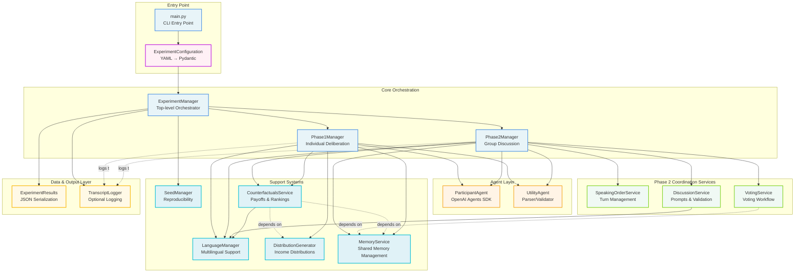
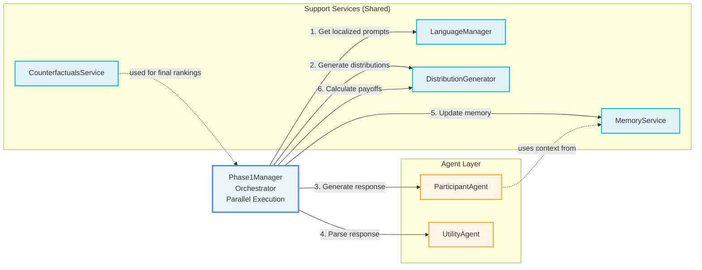
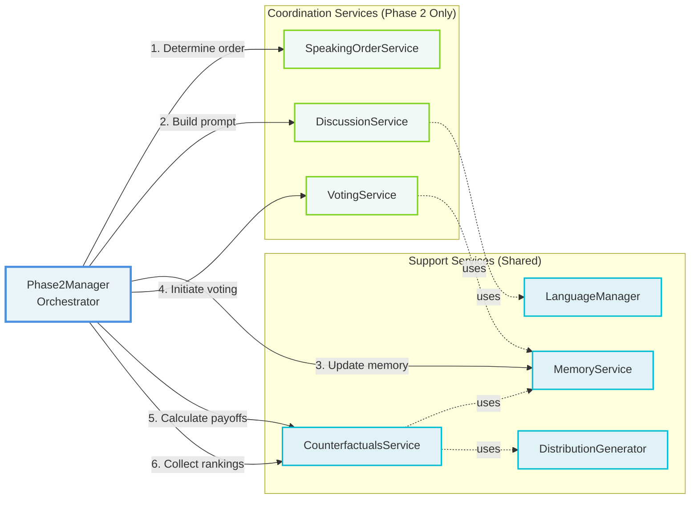

# Technical Architecture Guide

**Purpose**: High-level technical architecture overview and entry point to detailed documentation
**Audience**: Developers new to the codebase, architects, technical stakeholders
**Layer**: 0 - Architectural Overview

---

## Table of Contents

- [Introduction](#introduction)
- [System Architecture](#system-architecture)
- [Phase 2 Services Architecture](#phase-2-services-architecture)
- [Services Responsibilities](#services-responsibilities)
- [Data Flow Across Phases](#data-flow-across-phases)
- [Key Architectural Patterns](#key-architectural-patterns)
- [Configuration System](#configuration-system)
- [Navigation Guide](#navigation-guide)

---

## Introduction

This framework implements a Python-based system for conducting distributive justice experiments with AI agents, replicating the methodology from Frohlich & Oppenheimer (1992). The architecture is designed around three core principles:

1. **Services-First Design**: Phase 2 uses specialized services with clear responsibilities
2. **Configuration-Driven Behavior**: YAML configurations control all experimental parameters
3. **Protocol-Based Dependencies**: Clean boundaries enable isolated testing and maintainability

The system orchestrates two-phase experiments:
- **Phase 1**: Individual agents deliberate and learn about justice principles
- **Phase 2**: Group discussion to reach consensus through formal voting mechanisms

---

## System Architecture

The system follows a hierarchical orchestration pattern with specialized services:



### Architecture Layers

**Layer 1: Configuration & Entry**
- CLI entry point (`main.py`)
- YAML-based configuration with Pydantic validation
- Environment-specific settings (API keys, model providers)

**Layer 2: Core Orchestration**
- `ExperimentManager`: Coordinates both phases, manages agent contexts, outputs results
- `Phase1Manager`: Orchestrates individual agent deliberation (uses support services)
- `Phase2Manager`: Coordinates group discussion (uses coordination services + support services)

**Layer 3: Phase 2 Coordination Services**
- Three Phase 2-specific coordination services:
  - `SpeakingOrderService`: Turn management and finisher restrictions
  - `DiscussionService`: Prompt building and statement validation
  - `VotingService`: Complete voting workflow coordination
- Protocol-based dependency injection for testability
- Configuration-driven behavior via `Phase2Settings`

**Layer 4: Agent Layer**
- `ParticipantAgent`: AI agents using OpenAI Agents SDK
- `UtilityAgent`: Response parsing and validation

**Layer 5: Support Systems**
- `MemoryService`: Shared memory management (Phase 1 & Phase 2)
- `CounterfactualsService`: Payoff calculations, counterfactuals, rankings (Phase 1 & Phase 2)
- `LanguageManager`: Multilingual support (English, Spanish, Mandarin)
- `DistributionGenerator`: Income distribution generation
- `SeedManager`: Reproducibility via comprehensive seeding

**Layer 6: Data & Output Layer**
- `ExperimentResults`: JSON serialization of complete experiment data
- `TranscriptLogger`: Optional transcript logging for all agent interactions

---

## Phase 1 Services Architecture

Phase 1 orchestrates individual agent deliberation using **support services** for consistent operations. Phase1Manager coordinates all participants in parallel, with each participant going through identical sequential steps.

**Key Characteristics**:
- **Parallel execution**: All participants run Phase 1 simultaneously
- **Support services**: Uses shared services (MemoryService, CounterfactualsService, LanguageManager, DistributionGenerator)
- **Sequential steps**: Each participant completes 5 steps in order (initial ranking, explanation, post-explanation ranking, application rounds x4, final ranking)



### Service Communication Pattern

Phase1Manager follows a **parallel execution pattern** where:
1. All participants execute Phase 1 simultaneously (no dependencies between participants)
2. Each participant goes through identical sequential steps:
   - **Step 1.1**: Initial ranking (LanguageManager → ParticipantAgent → UtilityAgent → MemoryService)
   - **Step 1.2**: Principle explanation (LanguageManager → ParticipantAgent → MemoryService)
   - **Step 1.3**: Post-explanation ranking (LanguageManager → ParticipantAgent → UtilityAgent → MemoryService)
   - **Step 1.4**: Application rounds x4 (LanguageManager → DistributionGenerator → ParticipantAgent → UtilityAgent → DistributionGenerator → MemoryService)
   - **Step 1.5**: Final ranking (LanguageManager → ParticipantAgent → UtilityAgent → MemoryService)
3. Services perform their specialized operations and return results
4. Phase1Manager coordinates service calls but doesn't implement business logic

**Parallel Benefits**:
- Total execution time ≈ single participant time
- No coordination overhead between participants
- Independent memory and context for each participant

**Support Services Usage**:
- **LanguageManager**: Provides localized prompts for all 5 steps
- **DistributionGenerator**: Creates income distributions and calculates payoffs (Step 1.4)
- **MemoryService**: Updates participant memory after each step (consistent with Phase 2)
- **ParticipantAgent**: Generates rankings and selections
- **UtilityAgent**: Parses responses into structured data
- **CounterfactualsService**: Optionally used for final ranking collection (if applicable)

---

## Phase 2 Services Architecture

Phase 2 uses a **services-first architecture** with two types of services:
1. **Coordination Services**: Phase 2-specific orchestration (SpeakingOrderService, DiscussionService, VotingService)
2. **Support Services**: Shared utilities used by both phases (MemoryService, CounterfactualsService, etc.)



### Service Communication Pattern

Services follow a **delegation pattern** where Phase2Manager:
1. Calls service methods with necessary context
2. Services perform their specialized operations
3. Services return results to Phase2Manager
4. Phase2Manager coordinates between services

Services **do not call each other directly** (except protocol-based dependencies like `MS` and `DG`). This ensures:
- Clear ownership of responsibilities
- Predictable control flow
- Easy debugging and testing
- Minimal coupling between services

---

## Services Responsibilities

### Phase 2 Coordination Services

| Service | Primary Responsibility | Key Operations | Dependencies | Configuration |
|---------|----------------------|----------------|--------------|---------------|
| **SpeakingOrderService** | Turn management | • Determine speaking order<br/>• Apply finisher restrictions<br/>• Randomization strategies | None | Phase2Settings |
| **DiscussionService** | Discussion orchestration | • Build discussion prompts<br/>• Validate statements<br/>• Manage history length<br/>• Format group composition | LanguageManager | Phase2Settings.public_history_max_length |
| **VotingService** | Voting workflow | • Initiate voting<br/>• Coordinate confirmation<br/>• Manage secret ballot<br/>• Validate consensus | MemoryService | Phase2Settings voting configuration |

### Support Services (Shared Across Phases)

| Service | Primary Responsibility | Key Operations | Used By | Configuration |
|---------|----------------------|----------------|---------|---------------|
| **MemoryService** | Memory management | • Update discussion memory<br/>• Update voting memory<br/>• Update results memory<br/>• Apply guidance styles<br/>• Truncate content | Phase1Manager<br/>Phase2Manager | Phase2Settings memory configuration |
| **CounterfactualsService** | Payoffs & rankings | • Apply chosen principle<br/>• Calculate payoffs<br/>• Calculate counterfactuals<br/>• Format results<br/>• Collect final rankings | Phase1Manager<br/>Phase2Manager | Phase2Settings |
| **LanguageManager** | Multilingual support | • Load translations<br/>• Get localized prompts<br/>• Format cultural context | Phase1Manager<br/>Phase2Manager<br/>Services | Language config |
| **DistributionGenerator** | Income distributions | • Generate distributions<br/>• Apply principles<br/>• Calculate payoffs | Phase1Manager<br/>CounterfactualsService | Distribution ranges |
| **SeedManager** | Reproducibility | • Initialize RNG<br/>• Provide seeded randomness | ExperimentManager | Seed value |

### Service Modification Guide

**When adding or modifying behavior**, work with the appropriate service:

**Phase 2 Coordination Services (Phase 2 Only):**
- **Speaking order changes** → `SpeakingOrderService`
- **Discussion prompt updates** → `DiscussionService`
- **Voting workflow changes** → `VotingService`

**Support Services (Used by Phase 1 & Phase 2):**
- **Memory update strategies** → `MemoryService`
- **Payoff or results logic** → `CounterfactualsService`
- **Multilingual prompts** → `LanguageManager`
- **Income distributions** → `DistributionGenerator`
- **Reproducibility/seeding** → `SeedManager`

**Important**: Never modify Phase1Manager or Phase2Manager directly for feature changes. Managers should only orchestrate service calls, not implement business logic.

---

## Data Flow Across Phases

### Complete Experiment Data Flow

```mermaid
flowchart TD
    Start([Experiment Start]) --> Config[YAML Configuration]
    Config --> Parse[Pydantic Parsing<br/>ExperimentConfiguration]

    Parse --> EM[ExperimentManager]
    EM --> InitAgents[Initialize Agents<br/>Create Contexts]

    InitAgents --> Phase1[Phase 1: Individual Deliberation]

    subgraph "Phase 1 Flow"
        Phase1 --> P1_Steps[For Each Agent Parallel:<br/>1.1 Initial Ranking<br/>1.2 Explanation<br/>1.3 Post-Explanation Ranking<br/>1.4 Application Rounds x4<br/>1.5 Final Ranking]
        P1_Steps --> P1_Results[Phase1Results<br/>• Rankings<br/>• Application choices<br/>• Earnings<br/>• Memory state]
    end

    P1_Results --> UpdateContext[Update Agent Contexts<br/>Bank Balance += Phase1 Earnings]

    UpdateContext --> Phase2[Phase 2: Group Discussion]

    subgraph "Phase 2 Flow"
        Phase2 --> P2_Discussion[Discussion Rounds<br/>SpeakingOrderService<br/>DiscussionService<br/>MemoryService]
        P2_Discussion --> P2_Voting[Voting Process<br/>VotingService<br/>MemoryService]
        P2_Voting --> P2_Consensus{Consensus<br/>Reached?}
        P2_Consensus -->|No & More Rounds| P2_Discussion
        P2_Consensus -->|Yes or Max Rounds| P2_Results_Calc[Apply Principle<br/>CounterfactualsService]
        P2_Results_Calc --> P2_Rankings[Collect Final Rankings<br/>CounterfactualsService]
        P2_Rankings --> P2_Results[Phase2Results<br/>• Consensus info<br/>• Discussion history<br/>• Voting records<br/>• Payoffs<br/>• Final rankings]
    end

    P2_Results --> FinalResults[ExperimentResults<br/>Phase1Results + Phase2Results]
    FinalResults --> Output[Output JSON + Transcripts]
    Output --> End([Experiment Complete])

    %% Styling
    classDef configStyle fill:#FFF0F5,stroke:#BD10E0,stroke-width:2px
    classDef phase1Style fill:#E8F4F8,stroke:#4A90E2,stroke-width:2px
    classDef phase2Style fill:#F0F9F4,stroke:#7ED321,stroke-width:2px
    classDef resultsStyle fill:#FFF4E6,stroke:#F5A623,stroke-width:2px
    classDef decisionStyle fill:#E0F2F7,stroke:#00BCD4,stroke-width:2px

    class Config,Parse configStyle
    class Phase1,P1_Steps,P1_Results phase1Style
    class Phase2,P2_Discussion,P2_Voting,P2_Results_Calc,P2_Rankings,P2_Results phase2Style
    class FinalResults,Output resultsStyle
    class P2_Consensus decisionStyle
```



### Key Data Transformations

**Configuration → Agent Contexts**
```
YAML → ExperimentConfiguration → ParticipantContext[]
   ↓
Each context initialized with:
- Agent name, model, language
- Initial bank balance (0.0)
- Empty memory
- Experiment stage (INITIALIZATION)
```

**Phase 1 → Phase 2 Transition**
```
Phase1Results → Update Contexts
   ↓
Each context updated with:
- bank_balance += phase1_earnings
- memory += phase1_final_memory
- stage = GROUP_DISCUSSION
```

**Phase 2 → Final Results**
```
Phase2Results → ExperimentResults
   ↓
Complete experiment data:
- All rankings (initial, post-explanation, final Phase 1, final Phase 2)
- All application choices
- All discussion statements
- All voting records
- Final payoffs and counterfactuals
```

---

## Data & Output Layer

The framework produces structured outputs for analysis and debugging:

### ExperimentResults (JSON Output)

**Structure**:
```json
{
  "experiment_id": "uuid",
  "timestamp": "ISO 8601",
  "configuration": {
    "agents": [...],
    "phase2_settings": {...},
    "seed": 42
  },
  "phase1_results": {
    "participant_name": {
      "initial_ranking": [...],
      "post_explanation_ranking": [...],
      "application_results": [...],
      "final_ranking": [...],
      "total_earnings": 0.0
    }
  },
  "phase2_results": {
    "consensus_reached": true/false,
    "agreed_principle": {...},
    "discussion_history": [...],
    "voting_records": [...],
    "payoffs": {...},
    "assigned_classes": {...},
    "alternative_earnings": {...},
    "final_rankings": {...}
  }
}
```

**Output Location**: Configurable via command line (default: `results/experiment_TIMESTAMP.json`)

**Usage**:
```bash
python main.py config/experiment.yaml results/my_experiment.json
```

### TranscriptLogger (Optional Detailed Logging)

**Purpose**: Capture complete interaction history for debugging and analysis

**Configuration** (in YAML):
```yaml
transcript_logging:
  enabled: true
  output_path: "transcripts/experiment_TIMESTAMP.txt"
  include_instructions: false  # Optional: include system prompts
  include_agent_responses: true  # Default: capture agent outputs
```

**Captures**:
- All prompts sent to participant agents
- Optional system instructions (if enabled)
- Agent responses (if enabled)
- Timestamps for each interaction
- Phase and round context

**Privacy Notice**: Agent responses may contain unexpected content. Document storage locations and access controls when enabling transcripts.

**Performance**: Lightweight string serialization. Instruction capture has generation overhead.

---

## Key Architectural Patterns

### 1. Services-First Architecture

**Problem**: Phase 2 logic was becoming complex and hard to maintain in Phase2Manager

**Solution**: Extract specialized services with single responsibilities

**Benefits**:
- Clear ownership of features
- Easy to test services in isolation
- Configuration-driven behavior
- No feature flags or legacy pathways

**Example**:
```python
# Phase2Manager delegates to services
speaking_order = self.speaking_order_service.determine_speaking_order(
    participants, discussion_history, round_num
)

prompt = self.discussion_service.build_discussion_prompt(
    participant, context, discussion_history, config
)
```

---

### 2. Protocol-Based Dependency Injection

**Problem**: Services need to depend on other services without tight coupling

**Solution**: Define Protocol classes for service interfaces

**Benefits**:
- Services can be tested with mock implementations
- Clear contracts between services
- Easy to swap implementations

**Example**:
```python
class MemoryServiceProtocol(Protocol):
    async def update_discussion_memory(...) -> str: ...

class VotingService:
    def __init__(self, memory_service: MemoryServiceProtocol):
        self.memory_service = memory_service
```

---

### 3. Configuration-Driven Behavior

**Problem**: Experimental parameters hardcoded in logic

**Solution**: Centralize all settings in `Phase2Settings` configuration

**Benefits**:
- Easy to adjust experimental conditions
- No code changes for parameter tuning
- Configuration versioning

**Example**:
```yaml
phase2_settings:
  public_history_max_length: 100000
  statement_min_length: 10
  voting_timeout: 120
  enable_intelligent_retries: true
```

---

### 4. Multilingual Support via Language Manager

**Problem**: Supporting multiple languages across all prompts and messages

**Solution**: Centralized translation system with JSON-based templates

**Benefits**:
- Consistent terminology across languages
- Easy to add new languages
- Cultural context adaptations

**Structure**:
```
translations/
├── english/
│   ├── phase1_prompts.json
│   ├── phase2_prompts.json
│   └── results_prompts.json
├── spanish/
│   └── ...
└── mandarin/
    └── ...
```

---

### 5. Comprehensive Seeding for Reproducibility

**Problem**: Need reproducible experiments with AI agents

**Solution**: `SeedManager` controls all randomness

**Coverage**:
- Income class probabilities
- Distribution generation
- Speaking order randomization
- Random principle assignment (no consensus)

**Usage**:
```python
seed_manager = SeedManager(seed=42)
random_choice = seed_manager.random.choice(options)
```

---

### 6. Two-Stage Voting with Numerical Validation

**Problem**: Complex LLM-based voting detection was unreliable

**Solution**: Structured two-stage voting with numerical inputs

**Stages**:
1. **Vote Initiation**: "Do you want to initiate voting?" (end of round only)
2. **Vote Confirmation**: "Agree to participate?" (1=Yes, 0=No)
3. **Secret Ballot**: Select principle (1-4) and constraint amount

**Benefits**:
- Deterministic validation
- Clear user intent
- Multilingual number parsing
- Reduced ambiguity

---

## Configuration System

### Configuration Hierarchy

```
experiment_config.yaml
    ↓
ExperimentConfiguration (Pydantic)
    ├─ agents: List[AgentConfig]
    ├─ phase2_settings: Phase2Settings
    ├─ income_class_probabilities: Dict
    ├─ distribution_range_phase1: Tuple
    ├─ distribution_range_phase2: Tuple
    └─ seed: Optional[int]
```

### Key Configuration Areas

**1. Agent Configuration**
```yaml
agents:
  - name: "Agent_1"
    model: "gpt-4o"
    language: "english"
    temperature: 0.7
    personality: "Analytical and detail-oriented"
```

**2. Phase 2 Settings** (`config/phase2_settings.py`)
```yaml
phase2_settings:
  max_rounds: 10
  public_history_max_length: 100000
  statement_min_length: 10
  voting_confirmation_timeout: 120
  memory_guidance_style: "narrative"  # or "structured"
```

**3. Income Distribution**
```yaml
income_class_probabilities:
  low: 0.25
  medium_low: 0.25
  medium_high: 0.25
  high: 0.25

distribution_range_phase1: [100, 1000]
distribution_range_phase2: [100, 1000]
```

**4. Reproducibility**
```yaml
seed: 42  # Ensures deterministic experiments
```

### Configuration Validation

All configurations are validated via Pydantic models:
- Type checking
- Range validation
- Required field enforcement
- Default value provision

---

## Navigation Guide

### For New Developers

**Start Here**:
1. This document (TECHNICAL_ARCHITECTURE.md) - Understand overall architecture
2. [README.md](./README.md) - Setup and basic usage
3. [Diagram 01: Complete Experiment Overview](./docs/diagrams/01_experiment_complete_overview.md) - High-level process

**Then Explore**:
- [Phase 1 Process Flow](./docs/diagrams/02_phase1_process_flow.md) - Individual deliberation details
- [Phase 2 Process Flow](./docs/diagrams/03_phase2_process_flow.md) - Group discussion details

### For Feature Development

**Phase 1 Features**:
- [Phase 1 Service Sequence](./docs/diagrams/04_phase1_service_sequence.md) - Service-level interactions
- Code: `core/phase1_manager.py`

**Phase 2 Discussion Features**:
- [Discussion Round Details](./docs/diagrams/05_discussion_round_detailed.md) - Single round breakdown
- Services: `SpeakingOrderService`, `DiscussionService`, `MemoryService`

**Phase 2 Voting Features**:
- [Voting Process Details](./docs/diagrams/06_voting_detailed.md) - Voting workflow
- Service: `VotingService`
- Code: `core/two_stage_voting_manager.py`

**Phase 2 Results Features**:
- [Post-Discussion Results](./docs/diagrams/08_post_discussion_results_service_sequence.md) - Results and rankings
- Service: `CounterfactualsService`

### For Understanding Data Models

- [Data Models Diagram](./docs/diagrams/07_data_models.md) - All data structures
- Code: `models/` directory

### For Testing

- [CLAUDE.md](./CLAUDE.md) - Testing strategy and commands
- Test modes: `--mode=ultra_fast`, `--mode=dev`, `--mode=ci`, `--mode=full`
- Tests: `tests/` directory with unit, component, integration layers

### For Multilingual Support

- [CLAUDE.md](./CLAUDE.md#multi-language-support) - Language system overview
- Code: `utils/language_manager.py`
- Templates: `translations/{language}/` directories

### For Model Providers

- [README.md](./README.md#model-provider-support) - OpenAI, Gemini, OpenRouter, Ollama
- [GEMINI.md](./GEMINI.md) - Gemini-specific setup
- Code: `experiment_agents/participant_agent.py`

---

## Documentation Map

### Layer 0: Architectural Overview (You are here)
- **TECHNICAL_ARCHITECTURE.md** - Complete architecture guide

### Layer 1: High-Level Process Flows
- [01_experiment_complete_overview.md](./docs/diagrams/01_experiment_complete_overview.md) - Two-phase experiment structure
- [02_phase1_process_flow.md](./docs/diagrams/02_phase1_process_flow.md) - Individual deliberation flow
- [03_phase2_process_flow.md](./docs/diagrams/03_phase2_process_flow.md) - Group discussion flow

### Layer 2: Detailed Service Interactions
- [04_phase1_service_sequence.md](./docs/diagrams/04_phase1_service_sequence.md) - Phase 1 service calls
- [05_discussion_round_detailed.md](./docs/diagrams/05_discussion_round_detailed.md) - Discussion round breakdown
- [06_voting_detailed.md](./docs/diagrams/06_voting_detailed.md) - Voting process details
- [07_data_models.md](./docs/diagrams/07_data_models.md) - Data structures
- [08_post_discussion_results_service_sequence.md](./docs/diagrams/08_post_discussion_results_service_sequence.md) - Results and rankings

### Supporting Documentation
- [README.md](./README.md) - Project overview and quickstart
- [CLAUDE.md](./CLAUDE.md) - Development guidelines and testing
- [GEMINI.md](./GEMINI.md) - Gemini model setup

---

## Quick Reference

### Common Development Tasks

| Task | Starting Point |
|------|----------------|
| Add new justice principle | `models/principle_types.py` + translation files |
| Modify discussion prompts | `DiscussionService` + `translations/` |
| Change voting logic | `VotingService` |
| Adjust memory management | `MemoryService` + `Phase2Settings` |
| Update payoff calculation | `CounterfactualsService` + `DistributionGenerator` |
| Modify JSON output structure | `models/experiment_results.py` |
| Configure transcript logging | `config/models.py` (transcript_logging settings) |
| Add new language | Create `translations/{language}/` directory |
| Modify agent behavior | `experiment_agents/participant_agent.py` |
| Change configuration options | `config/models.py` + `Phase2Settings` |

### Key Files Reference

| Component | File Location | Lines of Interest |
|-----------|---------------|-------------------|
| Experiment orchestration | `core/experiment_manager.py` | Main flow |
| Phase 1 logic | `core/phase1_manager.py` | 199-625 |
| Phase 2 orchestration | `core/phase2_manager.py` | Services delegation |
| Speaking order | `core/services/speaking_order_service.py` | Full file |
| Discussion management | `core/services/discussion_service.py` | Full file |
| Voting workflow | `core/services/voting_service.py` | Full file |
| Memory updates | `core/services/memory_service.py` | Full file |
| Payoffs & rankings | `core/services/counterfactuals_service.py` | 148-229, 1120-1341 |
| Two-stage voting | `core/two_stage_voting_manager.py` | Full file |
| Participant agents | `experiment_agents/participant_agent.py` | Full file |
| Utility parsing | `experiment_agents/utility_agent.py` | Full file |
| Language support | `utils/language_manager.py` | Full file |
| Distributions | `utils/distribution_generator.py` | Full file |
| JSON output | `models/experiment_results.py` | Data models |
| Transcript logging | `utils/logging/transcript_logger.py` | Full file |

---

## Contact and Contribution

For questions about the architecture or contributions:
- Review this guide and linked diagrams
- Check [CLAUDE.md](./CLAUDE.md) for development guidelines
- Follow existing code patterns and service ownership
- Run test suite before submitting changes: `pytest --mode=ci`

---

**Last Updated**: 2025-11-14
**Maintained by**: Lucas Mueller
