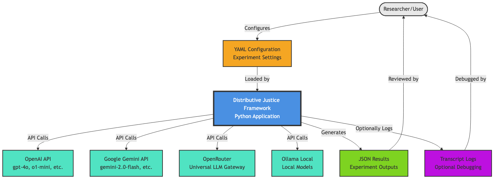
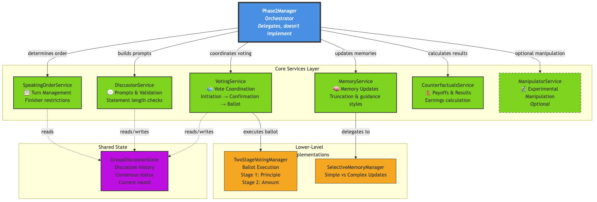
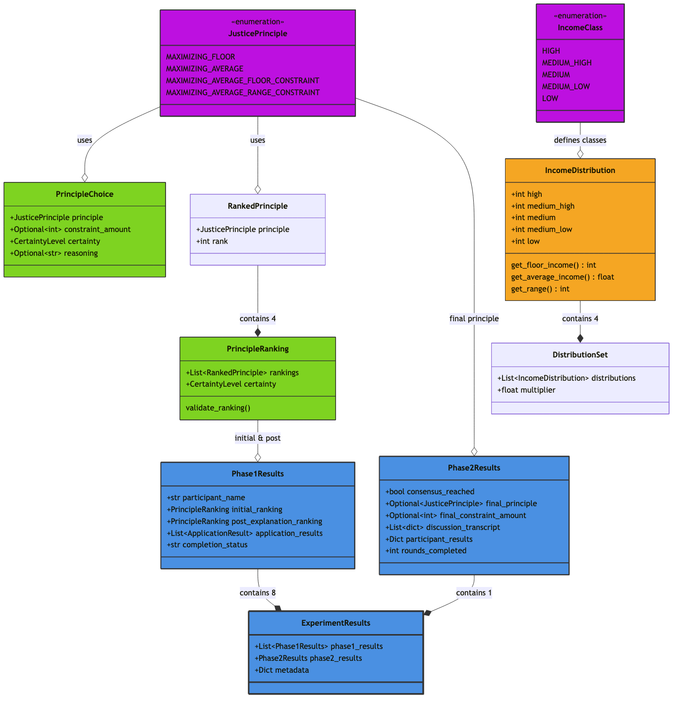
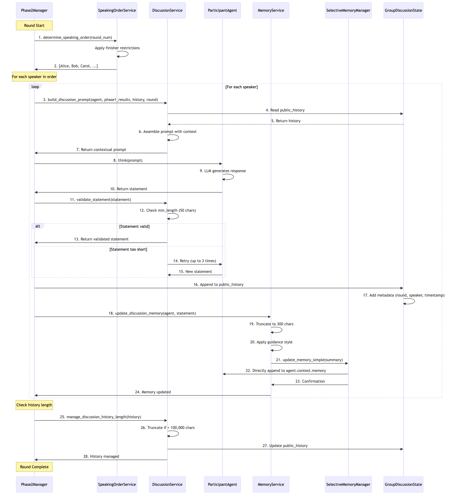
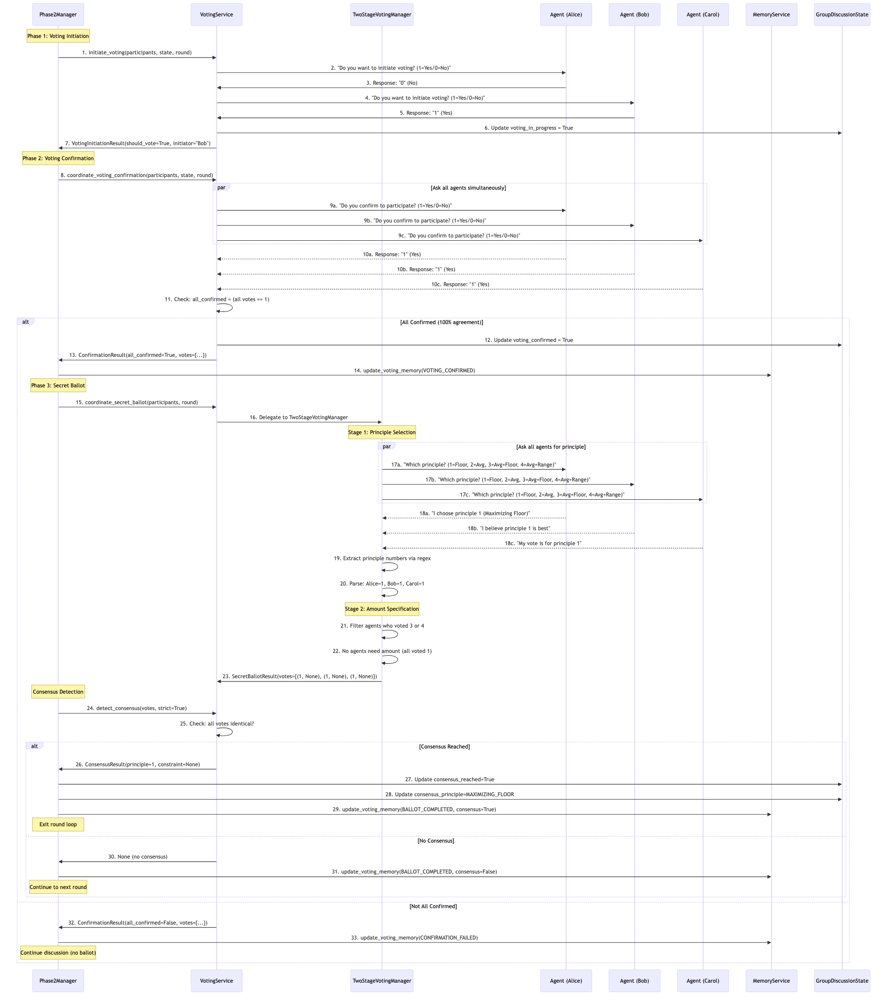
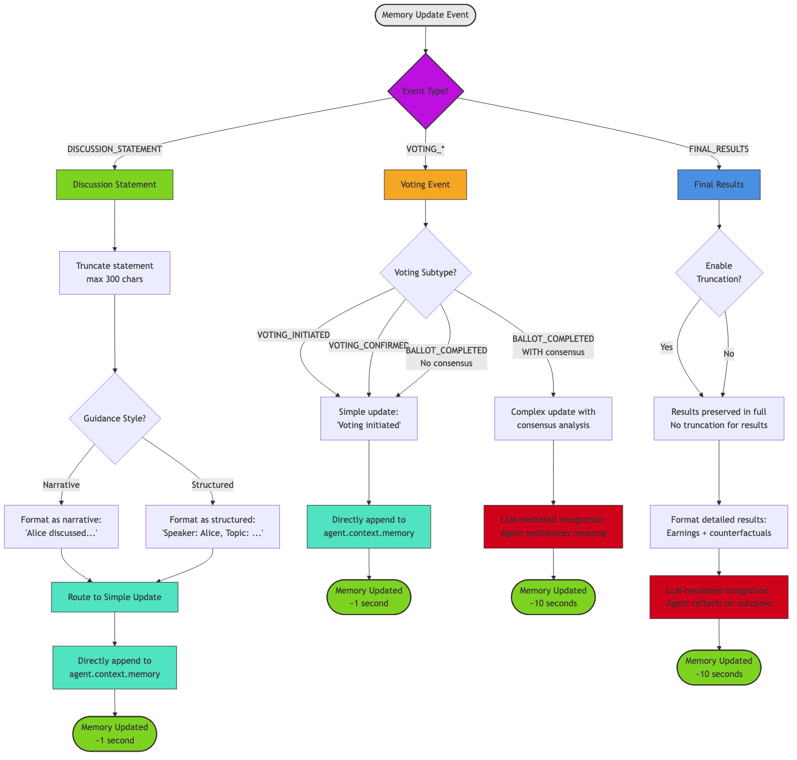
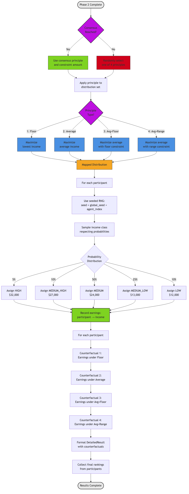

# TECHNICAL README: Frohlich Experiment Framework

## Executive Summary

This document provides a comprehensive technical analysis of the **Technical Implementation of the Master Thesis of Lucas Mueller** framework—a sophisticated Python system for conducting computational experiments on distributive justice. The framework orchestrates AI agents in a two-phase experiment grounded in **Rawlsian philosophy** and inspired by Frohlich & Oppenheimer's empirical implementation.

**Core Thesis**: Under a computationally-simulated "veil of ignorance," agents autonomously reason about and reach consensus on principles of distributive justice through formal voting mechanisms and memory-augmented discussion.

**Scale**:
- Two-phase experiment orchestration with 6 specialized Phase 2 services
- Deterministic two-stage voting system with multilingual support
- Sophisticated memory management with content truncation
- Reproducible experiments via seeding and configuration
- Multi-provider LLM support (OpenAI, Google Gemini, OpenRouter, Ollama)

### Visual Documentation Guides

This technical README integrates **9 progressive architectural diagrams** organized by complexity:

**Executive Overview**
- [Diagram 01: Two-Phase Experiment Flow](docs/diagrams/01_experiment_overview.md) - High-level experiment progression
- [Diagram 02: System Context](docs/diagrams/02_system_context.md) - External integrations and multi-provider support

**Conceptual Architecture**
- [Diagram 03: Phase 1 Architecture](docs/diagrams/03_phase1_architecture.md) - Parallel execution and seeding strategy
- [Diagram 04: Phase 2 Services](docs/diagrams/04_phase2_services.md) - **MOST IMPORTANT** - Services-first architecture
- [Diagram 05: Data Model Overview](docs/diagrams/05_data_model_core.md) - Core types and validation

**Detailed Workflows**
- [Diagram 06: Discussion Round Sequence](docs/diagrams/06_discussion_sequence.md) - Complete discussion workflow
- [Diagram 07: Voting Process Flow](docs/diagrams/07_voting_sequence.md) - Four-phase voting with multilingual support
- [Diagram 08: Memory Management Flow](docs/diagrams/08_memory_flow.md) - Three-tier memory architecture
- [Diagram 09: Payoff Calculation Process](docs/diagrams/09_payoff_calculation.md) - Principle application and counterfactuals

**Recommended Reading Paths:**
- **Researcher/Non-Technical**: Diagrams 01 → 02 → 05
- **New Developer**: Diagrams 01 → **04** → 03 → 05
- **Debugging**: Navigate directly to relevant workflow diagram (06-09)

---

## LEVEL 1: EXECUTIVE OVERVIEW

*Audience: Researchers, managers, first-time readers*

---

## 1. Two-Phase Experiment Flow

### 1.1 The Veil of Ignorance Scenario

The experiment implements a computational variant of **John Rawls' veil of ignorance** thought experiment:

1. **Information Asymmetry**: Agents are randomly assigned to one of 5 income classes (high, medium_high, medium, medium_low, low)
2. **Uncertainty**: Agents know the 4 justice principles but not which class they'll occupy
3. **Deliberation**: Agents participate in structured discussion and reach consensus on a principle
4. **Payoff Realization**: After consensus, agents' actual income class is revealed, determining their final earnings

### 1.2 Four Justice Principles

The framework operationalizes four distinct principles (implemented in `models/principle_types.py`):

**Principle 1: MAXIMIZING_FLOOR**
- Strategy: Maximize the lowest income in the distribution
- Philosophy: Rawlsian "difference principle" that prioritizes the worst-off members
- Configuration: No constraint parameters required

**Principle 2: MAXIMIZING_AVERAGE**
- Strategy: Maximize average income across all classes
- Philosophy: Utilitarian approach focused on total welfare maximization
- Configuration: No constraint parameters required

**Principle 3: MAXIMIZING_AVERAGE_FLOOR_CONSTRAINT**
- Strategy: Maximize average income while maintaining a minimum floor constraint
- Example: Maximize average income but ensure no class earns less than fifteen thousand dollars
- Configuration: Requires a positive integer constraint amount specification

**Principle 4: MAXIMIZING_AVERAGE_RANGE_CONSTRAINT**
- Strategy: Maximize average income while limiting the income spread between highest and lowest earners
- Example: Maximize average income but ensure income spread does not exceed ten thousand dollars
- Configuration: Requires a positive integer constraint amount specification

Each principle produces different income distributions and payoffs for different agent classes, creating meaningful trade-offs in the bargaining process.

### 1.3 Income Distribution System

**Distribution Generator** (`core/distribution_generator.py`) provides four income distributions per round:

**Base Distribution Structure**: The system uses a standard baseline distribution with five income classes:
- High income (Class 1, richest): $32,000
- Medium-high income (Class 2): $27,000
- Medium income (Class 3, most likely): $24,000
- Medium-low income (Class 4): $13,000
- Low income (Class 5, poorest): $12,000

**Two distribution generation modes**:

1. **Dynamic Mode**: Applies random scaling multipliers (ranging from 0.8 to 1.2) to the base distribution. The multiplier is generated from a seeded random number generator for reproducibility. Each income class value is multiplied by this scaling factor to create varied economic scenarios.

2. **Original Values Mode**: Uses predefined historical distributions derived from Frohlich's original empirical data. The system maps rounds to specific situations: Round 1 uses Situation A, Round 2 uses Situation B, Round 3 uses Situation C, and Round 4 uses Situation D.

**Income Class Probabilities**: Each round specifies probability distributions for class assignment:
- High income: 5% probability
- Medium-high income: 10% probability
- Medium income: 50% probability (modal class - most likely)
- Medium-low income: 25% probability
- Low income: 10% probability

When calculating payoffs, the framework uses **weighted expected value** calculations by summing the products of each income class value multiplied by its probability.

---

## 2. System Context & Integration

### 2.1 Multi-Provider Model Support

**Intelligent Model Provider Detection**:

The system implements a ModelProvider enumeration (`experiment_agents/participant_agent.py`) with four values:
- OPENAI: String value "openai"
- GEMINI: String value "gemini"
- OPENROUTER: String value "openrouter"
- OLLAMA: String value "ollama"

The detect_model_provider function auto-detects the provider from the model string:
- If model string is "gpt-4o" or "o1-mini" or any string starting with "gpt-" or "o1-" or "o3-", returns OpenAI provider
- If model string is "gemini-2.0-flash" or any string starting with "gemini-" or "gemma-", returns Google Gemini provider
- If model string contains a slash character (e.g., "anthropic/claude-3.5-sonnet" format using "provider/model" pattern), returns OpenRouter provider
- If model string starts with "ollama/" (e.g., "ollama/gemma2:7b"), returns Ollama provider

**Provider-Specific Implementation**:

The system creates different client instances based on the detected provider:

For **OpenAI provider**: Creates a native OpenAI Agents SDK client using the Agents constructor with api_key parameter reading from the OPENAI_API_KEY environment variable

For **GEMINI provider**: Creates a client using the anthropic.Anthropic constructor with api_key parameter reading from the GEMINI_API_KEY environment variable and base_url parameter set to "https://generativelanguage.googleapis.com/openai/"

For **OPENROUTER provider**: Creates an OpenRouter proxy client using the anthropic.Anthropic constructor with api_key parameter reading from the OPENROUTER_API_KEY environment variable and base_url parameter set to "https://openrouter.ai/api/v1". This allows access to any model via the provider/model format

For **OLLAMA provider**: Creates a local Ollama instance client using the anthropic.Anthropic constructor with api_key parameter reading from the OLLAMA_API_KEY environment variable (defaulting to "ollama" if not set) and base_url parameter reading from the OLLAMA_BASE_URL environment variable (defaulting to "http://localhost:11434/v1" if not set)

### 2.2 External Dependencies and Configuration

**Configuration Inputs**:
- YAML configuration files (`config/models.py` with Pydantic validation)
- Environment variables for API keys and service endpoints
- Translation files for multilingual support (`translations/*.json`)

**Results Outputs**:
- Structured JSON experiment results (`models/principle_types.py`)
- Optional transcript logging for debugging and analysis
- Trace URLs for OpenAI Agents SDK observability

---

## LEVEL 2: CONCEPTUAL ARCHITECTURE

*Audience: Developers starting with codebase, architects reviewing design*

---

## 3. Phase 1 Architecture

### 3.1 Phase 1: Individual Familiarization (Parallel Execution)

**Purpose**: Agents independently learn about justice principles and reason about their preferences without group influence.

**Flow** (`core/phase1_manager.py`):

The Phase 1 manager executes tasks for each participant in parallel using asynchronous task scheduling:

1. **Initial Ranking**: The agent ranks the four justice principles from 1 to 4 (best to worst) without any prior knowledge of specific income distributions

2. **Principle Explanation**: The agent receives detailed explanations of each principle, including empirical payoff examples that illustrate real outcomes

3. **Post-Explanation Ranking**: The agent re-ranks the principles after understanding their practical implications. This tests both learning effectiveness and preference stability

4. **Application Tasks** (four rounds): For each round, the agent receives four different income distributions, selects which distribution to apply their chosen principle to, and the system calculates the participant's expected payoff. The participant then provides reasoning for their choices

**Key Implementation Details**:

- **Deterministic Random Number Generators**: Each participant receives a seeded random number generator instance, where the seed equals the base experiment seed plus the agent's index (e.g., agent 0 gets seed 42, agent 1 gets seed 43, etc.). This ensures complete reproducibility across experiment runs.

- **Memory Management**: The system integrates a SelectiveMemoryManager for context truncation to prevent context window overflow. Old statements are truncated to a maximum of 300 characters each, and accumulated internal reasoning is limited to 200 characters.

- **Output Structure**: Phase1Results contains the agent's initial ranking, post-explanation ranking, application results from all four rounds, participant name, and completion status indicator.

---

## 4. Phase 2 Services Architecture

**MOST IMPORTANT DIAGRAM FOR DEVELOPERS**

### 4.1 Services-First Architecture Overview

The framework employs a **services-first architecture** for Phase 2, replacing monolithic logic with focused, testable services using **Protocol-based dependency injection**.

The Phase2Manager acts as an orchestrator that delegates responsibilities to specialized services:
- **SpeakingOrderService**: Manages turn allocation with finisher restrictions
- **DiscussionService**: Generates discussion prompts and validates statements
- **VotingService**: Coordinates the complete voting process (initiation, confirmation, and ballot)
- **MemoryService**: Updates agent memories with event summaries
- **CounterfactualsService**: Calculates payoffs and prepares results formatting
- **ManipulatorService**: Provides optional experimental manipulation capabilities

### 4.2 Phase 2: Group Discussion and Consensus (Sequential with Services)

**Purpose**: Agents engage in structured group discussion to reach collective consensus on a justice principle via formal voting.

**Full Phase 2 Flow**:

Phase 2 executes an asynchronous workflow that coordinates group discussion and formal consensus building:

**Initialization**: The speaking order service determines the turn allocation for each round, optionally applying finisher restrictions if that setting is active.

**Discussion Rounds Loop**: For each round (from 1 to the configured maximum):

**1. Discussion Stage** - Sequential agent statements with memory context:
- For each participant in the speaking order, the discussion service builds a contextual discussion prompt that incorporates the participant's Phase 1 results, the discussion history, current round number, and consensus status
- The agent generates a statement by processing the discussion prompt
- The statement is validated against minimum length requirements (with up to 3 retries if validation fails)
- The validated statement is appended to the public history with metadata (round number, participant name, timestamp)
- The memory service updates the agent's memory with a truncated summary (maximum 300 characters)

**2. Voting Initiation Check**:
- The discussion service builds a voting initiation prompt asking if agents want to initiate voting
- Each participant responds with a binary answer (1=Yes, 0=No) using numerical agreement detection
- If any participant votes yes, or if this is the final round, voting proceeds

**2a. Confirmation Phase** (if voting initiated):
- The voting service coordinates a confirmation phase where all agents must agree to participate
- Confirmation results indicate whether all agents confirmed (requires 100% agreement to proceed)

**2b. Secret Ballot** (if all confirmed):
- **Stage 1 - Principle Selection**: Each participant receives a ballot prompt and responds with a principle number (1-4). The TwoStageVotingManager extracts the principle number via regex (with up to 3 retries). If extraction fails, the system falls back to keyword matching in the participant's language
- **Stage 2 - Amount Specification**: For participants who voted for principles 3 or 4 (constraint principles), the system prompts for a constraint amount and extracts a positive integer via regex (with up to 3 retries)

**2c. Consensus Detection**:
- The voting service detects consensus by checking if all votes are identical in strict mode
- If consensus is reached, the system records the consensus principle and constraint amount, then exits the round loop
- If no consensus, the system updates voting failure memory and continues to the next discussion round

**3. Payoff Calculation and Results Formatting**:
- The counterfactuals service calculates final results based on whether consensus was reached and which principle was selected
- The service formats detailed results including participant payoffs

**4. Final Rankings Collection**:
- Each participant receives a final ranking prompt
- The utility agent parses the ranking responses
- Rankings are stored in the final results

**Return**: The system returns comprehensive Phase2Results containing consensus status, the final principle and constraint amount, the complete discussion transcript, per-participant results, and the number of rounds completed.

### 4.3 Service Ownership and Modification Guide

When adding or modifying Phase 2 behavior, work with the appropriate service rather than modifying Phase2Manager directly:

#### SpeakingOrderService
**File**: `core/services/speaking_order_service.py`

**Responsibility**: Manage turn allocation with optional finisher restrictions.

**Key Methods**:

**determine_speaking_order** - Determines speaking order for each round with finisher restrictions:
- Takes a list of participant agents and an optional boolean flag to randomize the finisher
- Returns a dictionary mapping round numbers to ordered lists of participants
- Algorithm: Randomly shuffles participant order using a seeded random number generator. If randomize_finisher is enabled, ensures the last speaker differs from previous rounds. Returns the round-to-participants mapping
- Finisher Restriction philosophy: The agent speaking last must not have spoken last in any previous round, which encourages new perspectives at round conclusion

**apply_finisher_restrictions** - Reorders participant list to ensure a new finisher:
- Takes a proposed speaking order and a set of previous finisher names
- Returns a reordered list of participants
- Purpose: Enforces the finisher restriction by swapping participants if necessary

**Configuration**:

Phase 2 settings control finisher behavior:
- **finisher_restrictions_active**: Boolean flag to enable finisher reordering (true/false)
- **use_fixed_speaking_order**: Boolean flag to specify a fixed order instead of random (true/false)

#### DiscussionService
**File**: `core/services/discussion_service.py`

**Responsibility**: Generate contextual discussion prompts, validate statements, manage discussion history.

**Key Methods**:

**build_discussion_prompt** - Builds contextual discussion prompts:
- Takes the participant agent, their Phase 1 results, the discussion history, current round number, and consensus status
- Returns a localized prompt template with agent-specific context
- Includes: The agent's Phase 1 rankings and application results, a summary of previous statements (with truncation applied), current round context, and system instructions for tone and length

**validate_statement** - Validates statement quality:
- Takes a statement string, minimum length threshold (default 50 characters), and maximum retry count (default 3)
- Returns the validated statement string
- Process: Checks if the statement meets minimum length requirements and retries up to the maximum if validation fails
- Raises a ValidationError exception if maximum retries are exceeded

**manage_discussion_history_length** - Truncates discussion history intelligently:
- Takes the history list and maximum character length
- Returns the truncated history list
- Strategy: Removes oldest entries first (chronological ordering), keeps enough context for decision-making, and preserves critical principle discussion
- Uses the Phase2Settings public_history_max_length parameter (default: 100,000 characters)

**Multilingual Support**:

The service uses translation keys for discussion prompts:
- Round start prompts: "discussion_round_{round}_start"
- Voting initiation prompts: "discussion_voting_initiation"
- Final round prompts: "discussion_final_round"

The language manager retrieves localized versions for English, Spanish, and Mandarin by calling the get method with the translation key and any required parameters (such as round number).

#### VotingService
**File**: `core/services/voting_service.py`

**Responsibility**: Coordinate complete voting process (initiation → confirmation → secret ballot).

**Key Methods**:

**initiate_voting** - Determines if voting should be initiated:
- Takes participants list, discussion state, current round number, and optional timeout in seconds
- Returns a VotingInitiationResult containing whether voting should proceed and which participant initiated it
- Process: Generates an initiation prompt asking "Do you want to initiate voting?", collects responses from each participant with numerical answer detection (1=Yes, 0=No), and returns after the first Yes response or when all participants have been checked

**coordinate_voting_confirmation** - Confirmation Phase where all agents must agree:
- Takes participants list, discussion state, current round number, and optional timeout in seconds
- Returns a ConfirmationResult containing an all_confirmed boolean and a dictionary mapping participant names to vote-confidence tuples
- Process: Sends confirmation prompt "Do you agree to participate in voting? (1=Yes, 0=No)" to all participants, collects responses, and validates that 100% agreement was achieved (all agents said Yes)

**coordinate_secret_ballot** - Executes two-stage secret ballot process:
- Takes participants list, current round number, and optional timeout in seconds
- Returns a SecretBallotResult containing vote data
- Stages: Stage 1 collects principle selection (1-4), Stage 2 collects amount specification (for principles 3 and 4)
- Implementation: Handled by TwoStageVotingManager with deterministic numerical validation

**detect_consensus** - Detects unanimous agreement on principle and constraint:
- Takes a list of vote tuples (principle number, optional constraint amount) and a strict mode boolean flag
- Returns either a ConsensusResult object or None if no consensus reached
- Behavior: In strict mode (True), all agents must vote identically. In non-strict mode (False), majority rule applies (not used in current implementation)

**Error Handling**:

The service implements automatic retry with exponential backoff through an internal method that executes voting interactions with timeout protection. When a timeout occurs, the system retries up to the configured voting_retry_limit with exponentially increasing timeout durations (using an asyncio.wait_for pattern with timeout escalation).

#### MemoryService
**File**: `core/services/memory_service.py`

**Responsibility**: Unified memory management with intelligent routing and content truncation.

**Architecture**:

The memory system uses a layered architecture where SelectiveMemoryManager (lower-level implementation) is wrapped by MemoryService (public API). The MemoryService routes events by type (discussion, voting, results), applies truncation rules (maximum 300 character statements, maximum 200 character reasoning), delegates to SelectiveMemoryManager for implementation, and provides consistent guidance style application.

**Key Methods**:

**update_discussion_memory** - Updates agent memory with discussion statements:
- Takes the agent, context, statement summary (participant's statement), round number, and optional include_reasoning flag
- Returns the memory update result string
- Process: Truncates statement to 300 characters, formats with memory guidance style (narrative or structured), delegates to SelectiveMemoryManager for insertion, and returns the result
- Routing: Routes to update_memory_simple for direct insertion

**update_voting_memory** - Updates agent memory with voting events:
- Takes the agent, context, event type (VOTING_INITIATED, VOTING_CONFIRMED, or BALLOT_COMPLETED), round number, optional vote choice, and consensus_reached flag
- Returns the memory update result string
- Three sub-events handled:
  1. VOTING_INITIATED: Group is considering voting
  2. VOTING_CONFIRMED: All agents agreed to participate
  3. BALLOT_COMPLETED: Secret ballot results (with consensus if reached)
- Routing: Routes to update_memory_complex if consensus reached, otherwise uses simple insertion for status updates

**update_final_results_memory** - Updates agent memory with final Phase 2 results:
- Takes the agent, context, result content string, final earnings amount, and consensus_reached flag
- Returns the memory update result string
- Content includes: Consensus principle and constraint (if reached), agent's assigned income class, final earnings (actual payoff), and counterfactual earnings under other principles
- Routing: Always uses update_memory_complex for detailed analysis

**Configuration**:

Phase 2 memory management settings:
- **guidance_style**: "narrative" or "structured" formatting
- **public_history_max_length**: Maximum character count (default: 100,000)
- **statement_max_length**: Maximum statement characters (300)
- **reasoning_max_length**: Maximum reasoning characters (200)
- **enable_truncation**: Boolean flag to enable/disable truncation

#### CounterfactualsService
**File**: `core/services/counterfactuals_service.py`

**Responsibility**: Calculate payoffs, generate counterfactual analyses, format detailed results.

**Key Methods** (detailed in Section 9):

- **calculate_payoffs**: Calculates final earnings based on consensus principle
- **format_detailed_results**: Generates transparent results with counterfactual analysis
- **collect_final_rankings**: Collects final rankings after results revelation

---

## 5. Data Model & Configuration

### 5.1 Core Type Hierarchy

The framework defines data models in `models/principle_types.py` and related files:

**JusticePrinciple enumeration** (string-based enum):
- MAXIMIZING_FLOOR: String value "maximizing_floor" (Principle 1)
- MAXIMIZING_AVERAGE: String value "maximizing_average" (Principle 2)
- MAXIMIZING_AVERAGE_FLOOR_CONSTRAINT: String value "maximizing_average_floor_constraint" (Principle 3)
- MAXIMIZING_AVERAGE_RANGE_CONSTRAINT: String value "maximizing_average_range_constraint" (Principle 4)

**PrincipleChoice model** (Pydantic BaseModel):
- principle field: JusticePrinciple type
- constraint_amount field: Optional integer (None allowed), used for principles 3 and 4
- certainty field: CertaintyLevel type with values VERY_UNSURE, UNSURE, NO_OPINION, SURE, VERY_SURE
- reasoning field: Optional string (None allowed)

**PrincipleRanking model** (Pydantic BaseModel):
- rankings field: List of RankedPrinciple objects (exactly 4 items with ranks 1-4)
- certainty field: CertaintyLevel type

**IncomeClass enumeration** (string-based enum):
- HIGH: String value "high"
- MEDIUM_HIGH: String value "medium_high"
- MEDIUM: String value "medium"
- MEDIUM_LOW: String value "medium_low"
- LOW: String value "low"

**IncomeDistribution model** (Pydantic BaseModel):
- high field: Integer
- medium_high field: Integer
- medium field: Integer
- medium_low field: Integer
- low field: Integer
- Methods available: get_floor_income() returns integer, get_average_income(probabilities) returns float, get_range() returns integer

**DistributionSet model** (Pydantic BaseModel):
- distributions field: List of IncomeDistribution objects (always contains 4 distributions)
- multiplier field: Float value applied to base

**Phase1Results model** (Pydantic BaseModel):
- participant_name field: String
- initial_ranking field: PrincipleRanking object
- post_explanation_ranking field: PrincipleRanking object
- application_results field: List of ApplicationResult objects (4 rounds)
- completion_status field: String

**Phase2Results model** (Pydantic BaseModel):
- consensus_reached field: Boolean
- final_principle field: Optional JusticePrinciple (None allowed)
- final_constraint_amount field: Optional integer (None allowed)
- discussion_transcript field: List of dictionaries
- participant_results field: Dictionary mapping strings to DetailedResult objects
- rounds_completed field: Integer

**ExperimentResults model** (Pydantic BaseModel):
- phase1_results field: List of Phase1Results objects
- phase2_results field: Phase2Results object
- metadata field: Dictionary mapping strings to any type (includes timestamps, seed, config file path, etc.)

### 5.2 Context Objects

**ParticipantContext model** (Pydantic BaseModel): Represents the agent's working context updated throughout the experiment and sent in every prompt to the LLM.

Common fields:
- participant_name: String
- current_phase: ExperimentPhase enumeration value
- current_stage: ExperimentStage enumeration value
- current_round: Integer
- memory: String containing accumulated memory from MemoryService
- assigned_income_class: Optional IncomeClass (None allowed)
- interaction_type: Optional string (None allowed) with values like "discussion", "voting", "ranking"

Phase 1 specific fields:
- income_distributions: Optional DistributionSet (None allowed)
- principle_explanations: Optional dictionary (None allowed)

Phase 2 specific fields:
- public_discussion_history: Optional string (None allowed)
- current_principle_choice: Optional PrincipleChoice (None allowed)

**GroupDiscussionState model** (Pydantic BaseModel): Represents shared state for Phase 2 discussion.

Fields:
- public_history: List of dictionaries containing all statements so far
- consensus_reached: Boolean flag
- consensus_principle: Optional JusticePrinciple (None allowed)
- consensus_constraint: Optional integer (None allowed)
- current_round: Integer
- voting_in_progress: Boolean flag

### 5.3 YAML-Driven Configuration

**File**: `config/models.py` with Pydantic validation

**Configuration Structure**:

The experiment configuration uses YAML format with the following major sections:

**Main experiment settings**:
- experiment_name: String identifier (e.g., "baseline_v1")
- phase2_rounds: Integer number of discussion rounds (e.g., 10)
- distribution_mode: String mode selector, either "dynamic" or "original_values"

**Phase 2 settings**:
- finisher_restrictions_active: Boolean (true/false)
- statement_min_length: Integer minimum character count (e.g., 50)
- statement_validation_retries: Integer retry count (e.g., 3)
- public_history_max_length: Integer character limit (e.g., 100000)
- memory_management subsection:
  - guidance_style: String, either "narrative" or "structured"
  - enable_truncation: Boolean (true/false)
- voting subsection:
  - voting_confirmation_timeout: Integer seconds (e.g., 30)
  - voting_secret_ballot_timeout: Integer seconds (e.g., 45)
  - voting_retry_limit: Integer count (e.g., 3)

**Agents configuration** (8 participants for standard setup):
Each agent entry includes:
- name: String identifier (e.g., "Alice", "Bob")
- model: String model identifier (e.g., "gpt-4o")
- language: String language code (e.g., "en" for English)
- temperature: Float value (e.g., 0.7)

**Income distribution settings**:
- income_class_probabilities mapping:
  - high: Float probability (e.g., 0.05)
  - medium_high: Float probability (e.g., 0.10)
  - medium: Float probability (e.g., 0.50)
  - medium_low: Float probability (e.g., 0.25)
  - low: Float probability (e.g., 0.10)

**Reproducibility setting**:
- seed: Integer global seed for all random number generators (e.g., 42)

---

## LEVEL 3: DETAILED WORKFLOWS

*Audience: Feature implementation, debugging, deep understanding*

---

## 6. Discussion Round Workflow

### 6.1 Complete Discussion Round Flow

A single discussion round consists of sequential agent statements with memory context updates:

**1. Speaking Order Determination**:
- SpeakingOrderService determines turn allocation for the round
- Optionally applies finisher restrictions (last speaker must differ from previous rounds)
- Returns ordered list of participants

**2. For Each Speaker in Order**:

**Step 2a: Prompt Building** (DiscussionService)
- Builds contextual discussion prompt incorporating:
  - Participant's Phase 1 results (rankings, application choices)
  - Discussion history (truncated summaries of previous statements)
  - Current round number and consensus status
  - Tone and length instructions
- Returns localized prompt in participant's language

**Step 2b: Agent Thinking** (ParticipantAgent)
- Agent processes the discussion prompt
- Generates statement using LLM
- Returns raw statement text

**Step 2c: Statement Validation** (DiscussionService)
- Validates statement meets minimum length (default: 50 characters)
- Retries up to maximum attempts (default: 3) if validation fails
- Raises ValidationError if maximum retries exceeded
- Returns validated statement

**Step 2d: History Update** (Phase2Manager)
- Appends validated statement to public history with metadata:
  - Round number
  - Participant name
  - Timestamp
  - Statement text

**Step 2e: Memory Update** (MemoryService)
- Truncates statement to maximum 300 characters
- Formats with guidance style (narrative or structured)
- Updates agent's memory via SelectiveMemoryManager (simple insertion)
- Returns memory update result

**3. Round Completion**:
- All participants have spoken
- Public history contains all statements for the round
- Agent memories updated with truncated summaries
- Ready for voting check or next round

### 6.2 Discussion History Management

**Truncation Strategy**:

The manage_discussion_history_length function handles history truncation:
- Takes a history list and max_length_chars parameter (default 100,000)
- Returns the truncated history list

Algorithm: If the total history character count exceeds max_length_chars, the function removes the oldest statement first (maintaining chronological ordering), recalculates the total length, and repeats until the total is under the limit. This ensures recent context is preserved while old statements are pruned.

**Configuration**:
- **public_history_max_length**: Maximum total characters (default: 100,000)
- **statement_max_length**: Maximum per-statement truncation in memory (300 characters)
- **enable_truncation**: Boolean flag to enable/disable truncation

### 6.3 Error Handling in Discussion

**Validation Failures**:
- Statement too short: Retry up to statement_validation_retries (default: 3)
- Still fails: Raise ValidationError and potentially skip agent
- Timeout: Handled by retry mechanism with exponential backoff

**Memory Overflow**:
- Emergency truncation if history exceeds limits
- Oldest statements removed first
- Critical recent context preserved

---

## 7. Voting Process Deep Dive

### 7.1 Four-Phase Voting Architecture

The voting system orchestrates four distinct phases:

**PHASE 1: VOTING INITIATION**
- Trigger: End of discussion round or final round reached
- Process: Sequential check asking each participant "Do you want to initiate voting?" (1=Yes, 0=No)
- Outcome: If any agent votes Yes (or final round), proceed to Confirmation Phase
- Method: VotingService.initiate_voting()

**PHASE 2: VOTING CONFIRMATION**
- Trigger: Voting initiated
- Process: All participants asked "Do you confirm to participate in voting?" (1=Yes, 0=No) in parallel
- Requirement: 100% unanimous agreement to proceed
- Outcome: If all confirm, proceed to Secret Ballot; otherwise, return to discussion
- Method: VotingService.coordinate_voting_confirmation()

**PHASE 3: SECRET BALLOT** (Two-Stage Process)

**Stage 1: Principle Selection**
- Prompt: "Which principle do you choose? (1=Floor, 2=Average, 3=Avg+Floor, 4=Avg+Range)"
- Extraction: Regex pattern to extract first digit 1-4 from response
- Fallback: Keyword matching in participant's language if regex fails
- Retry: Up to max_retries (default: 3) on extraction failure
- Method: TwoStageVotingManager.conduct_principle_selection()

**Stage 2: Amount Specification** (Principles 3 & 4 only)
- Filter: Only participants who voted for principles 3 or 4
- Prompt: "What is your constraint amount? Please specify a number."
- Extraction: Regex pattern to extract first positive integer
- Cultural Adaptation: Multilingual number format parsing (see Section 7.2)
- Retry: Up to max_retries with cultural number parsing on failure
- Method: TwoStageVotingManager.conduct_amount_specification()

**PHASE 4: CONSENSUS DETECTION**
- Input: List of vote tuples (principle number, optional constraint amount)
- Algorithm: Check if all votes are identical
- Strict Mode: All agents must vote identically for same principle and same constraint
- Outcome: If consensus reached, exit discussion loop; otherwise, continue to next round
- Method: VotingService.detect_consensus()

### 7.2 Two-Stage Voting Manager

**File**: `core/two_stage_voting_manager.py`

**Responsibility**: Deterministic two-stage voting with multilingual validation.

**Stage 1: Principle Selection** (Deterministic Numerical Input)

**conduct_principle_selection** - Executes Stage 1 principle selection:
- Takes participants list, round number, and optional timeout in seconds
- Returns a dictionary mapping participant names to principle numbers (1-4)
- Algorithm:
  1. Sends prompt: "Which principle do you choose? (1=Floor, 2=Average, 3=Avg+Floor, 4=Avg+Range)"
  2. For each participant: Gets response, uses regex to extract first digit 1-4, falls back to keyword matching in participant's language on parse failure, retries up to max_retries on continued failure
- Key Design: Replaces complex LLM-based principle detection with regex validation, supports keyword fallback for multilingual responses, and provides deterministic results with no interpretation variance

**Internal extraction method**: Extracts the first digit 1-4 from response text using regular expression pattern matching, returning the integer value if found or None if not found

**Stage 2: Amount Specification** (For Constraint Principles)

**conduct_amount_specification** - Executes Stage 2 amount specification:
- Takes participants list, principle mapping from Stage 1, round number, and optional timeout
- Returns a dictionary mapping participant names to constraint amounts (or None)
- Algorithm:
  1. Filters participants who voted for principle 3 or 4
  2. For each filtered participant: Sends prompt "What is your constraint amount? Please specify a number.", uses regex to extract first positive integer, retries with cultural adaptation (number format parsing) on parse failure, returns integer or None if failed after retries
- Multilingual Number Parsing Support:
  - English: Handles 1000, 1,000 (comma separator), 1.000 (period separator)
  - Spanish: Handles 1.000 (period for thousands), 1,000 (comma)
  - Mandarin: Handles 1000 with cultural context for large numbers
- Uses the get_amount_formatter function from the cultural_adaptation module

**Internal extraction method**: Extracts the first positive integer from response text using regular expression pattern matching, returning the integer value if found or None otherwise

**Key Design Rationale**:
- **Deterministic**: Replaces complex LLM parsing approaches (such as "Does the agent want principle 3?") with simple regex pattern matching
- **Multilingual**: Supports keyword fallback and cultural number formatting for international use
- **Auditable**: Each vote is extractable from the raw response with clear validation rules
- **Testable**: Uses stateless validation functions that enable comprehensive unit testing

### 7.3 Multilingual Voting Support

**Number Format Parsing** (`utils/cultural_adaptation.py`):

The get_amount_formatter function provides multilingual number format parsing based on the language parameter:

For **English language**:
- Accepts "1000" (plain number) and "1,000" (comma as thousands separator), both parsing to integer 1000

For **Spanish language**:
- Accepts "1.000" (period as thousands separator) and "1,000" (comma as thousands separator), both parsing to integer 1000

For **Mandarin language**:
- Accepts "1000" (plain number), "1千" (using the thousand character), and "1万" (using the ten-thousand character), all parsing with cultural awareness for large numbers

**Keyword Fallback** (`core/principle_keywords.py`):

The match_principle_from_text function provides fallback principle detection via keywords when numerical extraction fails. It takes a text string and language parameter, returning an optional integer representing the principle number.

Example responses by language:

**English**:
- "I choose the maximizing average principle" maps to principle 2
- "Floor constraint sounds best" maps to principle 3

**Spanish**:
- "Prefiero maximizar el piso" (I prefer to maximize the floor) maps to principle 1
- "El promedio me parece bien" (The average seems good to me) maps to principle 2

**Mandarin**:
- "最大化平均收入" (maximize average income) maps to principle 2
- "保证最低收入" (guarantee minimum income) maps to principle 1

### 7.4 Consensus Definition

**Strict Unanimity**: All participants must vote for the **same principle** (1, 2, 3, or 4) and the **same constraint amount** (if principle 3 or 4).

**Consensus Detection Function**: The detect_consensus function takes a list of vote tuples (each containing principle number and optional constraint amount) and returns a boolean.

**Example scenarios**:
1. If votes are [(1, None), (1, None), (1, None)] representing Alice, Bob, and Carol all voting for Floor with no constraint, then consensus equals True (all agree on principle 1)
2. If votes are [(3, 15000), (3, 15000), (3, 15000)] representing Alice, Bob, and Carol all voting for Avg+Floor with floor=15k, then consensus equals True (all agree on principle 3 with 15k floor)
3. If votes are [(1, None), (2, None), (1, None)] representing Alice voting Floor, Bob voting Average (different), and Carol voting Floor, then consensus equals False (no unanimous agreement)

The algorithm checks if the votes list is non-empty. If empty, returns False. Otherwise, takes the first vote and returns True only if all subsequent votes equal the first vote.

### 7.5 Timeout and Retry Mechanisms

**Configuration Settings**:

Phase 2 voting timeout settings:
- **voting_initiation_timeout**: 30 seconds
- **voting_confirmation_timeout**: 30 seconds
- **voting_secret_ballot_timeout**: 45 seconds
- **voting_retry_limit**: 3 attempts
- **voting_retry_backoff_factor**: 1.5 (for exponential backoff)

**Retry Algorithm**:

The _invoke_with_retry internal function executes with exponential backoff retry. It takes a prompt string, maximum retries count (default 3), and base timeout duration (default 30 seconds), returning the response string.

The algorithm uses exponential backoff retry strategy:
- Attempt 1: timeout equals 30 seconds
- Attempt 2: timeout equals 45 seconds (30 multiplied by 1.5)
- Attempt 3: timeout equals 67.5 seconds (45 multiplied by 1.5)

The function stops on either successful response or when max retries are exceeded.

For each attempt in the range from 0 to max_retries, it calculates the timeout as base_timeout multiplied by (1.5 raised to the power of attempt). It then tries to await the participant.think method call with the prompt, wrapping it in asyncio.wait_for with the calculated timeout. If a TimeoutError exception occurs and the current attempt is less than max_retries minus 1, it sleeps for 1 second (brief pause before retry) then continues. If the exception occurs on the final attempt, it raises the exception.

---

## 8. Memory Management System

### 8.1 Three-Tier Memory Architecture

The framework implements a three-tier memory architecture:

**TIER 1: CONTEXT WINDOW** (ParticipantAgent.context):
- Contains current memories truncated to fit within the context window
- Updated by MemoryService after each event
- Sent to the LLM in every prompt

**TIER 2: AGENT MEMORY STORAGE** (MemoryManager):
- Maintains persistent memory across rounds
- Accumulates discussion statements
- Stores voting events and results
- Applies intelligent truncation to prevent overflow

**TIER 3: DISCUSSION HISTORY** (GroupDiscussionState.public_history):
- Shared among all agents
- Contains all statements in truncated versions
- Used for building context windows

### 8.2 Memory Update Strategies

**File**: `utils/selective_memory_manager.py`

**Two Update Strategies**:

**update_memory_simple** - Direct Memory Insertion (fast):
- Takes an agent, context, and summary string
- Returns the memory update result string
- Process: Directly appends the summary to agent.context.memory without LLM involvement
- Used for: Discussion statements and status updates

**update_memory_complex** - LLM-Mediated Memory Integration (slower):
- Takes an agent, context, new_information string, and optional internal_reasoning string
- Returns the agent's synthesized memory update string
- Process: Asks the agent's LLM to integrate new information by providing a prompt like: "Here's what happened: {new_information}. Current memory: {existing_memory}. Integrate the new information into memory, updating beliefs..."
- Used for: Complex results and voting outcomes with reasoning

**Routing in MemoryService**: The service routes events to the appropriate update method:
- If event_type is in the set [VOTING_INITIATED, DISCUSSION_STATEMENT], calls selective_memory_manager.update_memory_simple
- If event_type is in the set [VOTING_COMPLETE, FINAL_RESULTS], calls selective_memory_manager.update_memory_complex

### 8.3 Truncation Rules

**Applied by MemoryService**:

The system defines truncation rules based on content type:

For **statement content type**:
- Maximum characters: 300
- Strategy: truncate_end_with_ellipsis (cuts off at 300 characters and appends "...")

For **reasoning content type**:
- Maximum characters: 200
- Strategy: truncate_end_with_ellipsis (cuts off at 200 characters and appends "...")

For **result content type**:
- Maximum characters: None (no truncation applied)
- Strategy: preserve_full (results are preserved in their entirety)

Example of truncation: If the original statement is "I believe in maximizing the floor because fairness requires we protect the worst-off members of society..." and it exceeds 300 characters, the truncated version becomes the first 300 characters of the original statement plus "..."

**History Truncation**:

The manage_discussion_history_length function handles history truncation:
- Takes a history list and max_length_chars parameter (default 100,000)
- Returns the truncated history list

Algorithm: If the total history character count exceeds max_length_chars, the function removes the oldest statement first (maintaining chronological ordering), recalculates the total length, and repeats until the total is under the limit. This ensures recent context is preserved while old statements are pruned.

### 8.4 Memory Overflow Prevention

**Emergency Truncation**:
- Triggered when total memory exceeds critical threshold
- Oldest content removed first (FIFO strategy)
- Preserves recent context and critical decision points
- Logs warning when emergency truncation occurs

**Guidance Styles**:

**_apply_guidance_style** - Formats memory content with guidance style:
- Takes content string and guidance_style indicator ('narrative' or 'structured')
- Returns formatted content string
- Narrative style example: "Agent Alice discussed the importance of fairness..."
- Structured style example: "Topic: Fairness; Agent: Alice; Key Points: ..."

---

## 9. Payoff Calculation & Reproducibility

### 9.1 Payoff Calculation Algorithm

**File**: `core/services/counterfactuals_service.py`

**calculate_payoffs** - Calculates final payoffs based on consensus principle:
- Takes distribution set, optional consensus principle, participants list, and income class probabilities
- Returns a dictionary mapping participant names to final earnings (as floating-point numbers)
- Two scenarios:
  - **Scenario 1 (Consensus Reached)**: Applies the consensus principle to the distribution. For each participant: randomly assigns income class using seeded random number generator (respects probabilities), looks up income for assigned class in mapped distribution, and sets earnings equal to income
  - **Scenario 2 (No Consensus)**: Randomly selects a principle from the four available principles, then applies the same process as Scenario 1

### 9.2 Principle Application Algorithms

**_apply_principle_to_distribution** - Applies a principle to a distribution:
- Takes a justice principle, original income distribution, and optional constraint amount
- Returns a dictionary mapping income classes to income values
- Implementation varies by principle:

**Principle 1 (MAXIMIZING_FLOOR)**:
- Objective: Maximize the lowest income
- Algorithm: Optimizes each income class to maximize the floor value, producing a modified distribution where the floor is the highest possible

**Principle 2 (MAXIMIZING_AVERAGE)**:
- Objective: Maximize average income
- Algorithm: Scales the entire distribution uniformly (already optimal), resulting in the original distribution without changes

**Principle 3 (MAXIMIZING_AVERAGE_FLOOR_CONSTRAINT)**:
- Objective: Maximize average income with a floor constraint
- Algorithm: Sets all incomes to be greater than or equal to the constraint amount, then allocates remaining budget to maximize average
- Example: Original distribution has high=32k, med=24k, med_low=13k, low=12k, avg=20.2k. With a 15k floor constraint, result is high=38k, med=30k, med_low=15k, low=15k, avg=21.6k (redistributed to satisfy floor while maximizing average)

**Principle 4 (MAXIMIZING_AVERAGE_RANGE_CONSTRAINT)**:
- Objective: Maximize average income with range constraint
- Algorithm: Calculates range such that high minus low is less than or equal to constraint amount, then maximizes average subject to range constraint
- Example: Original distribution has high=32k, low=12k, range=20k, avg=20.2k. With 10k range max constraint, result is high=22k, low=12k, range=10k, avg=17.2k (compressed to satisfy range limit)

### 9.3 Counterfactual Analysis

**format_detailed_results** - Generates transparent results:
- Takes participants list, final payoffs dictionary, consensus_reached flag, optional consensus principle, and distribution set
- Returns a dictionary mapping participant names to DetailedResult objects
- For each participant, includes:
  - Final principle (consensus or random)
  - Assigned income class
  - Final earnings
  - Counterfactual earnings under each of the 4 principles (with same income class assignment)
  - Counterfactual earnings under each of the 4 distributions (with same principle assignment)
- Purpose: Provides transparency and enables post-hoc analysis by showing "Here's what you earned. Here's what you would have earned under other principles."

**Counterfactual Generation Example**:

For participant Alice with final principle MAXIMIZING_FLOOR (voted unanimously) in distribution set round 4 containing four distributions (Dist 1: high=32k, med=24k, low=12k; Dist 2: high=28k, med=20k, low=13k; Dist 3: high=31k, med=21k, low=14k; Dist 4: high=21k, med=19k, low=15k), where Alice is assigned the medium income class (50% probability):

**Actual Result**: Distribution Used is Dist 1 (application-chosen), Principle Used is MAXIMIZING_FLOOR, Alice's Earnings are 24,000

**Counterfactuals (same income class)**:
- By Principle (Dist 1): If Maximizing_Floor then 24,000 (actual); If Maximizing_Average then 24,000 (different mapping, potentially different income); If Avg+Floor(15k) then 25,000; If Avg+Range(10k) then 23,000
- By Distribution (Maximizing_Floor principle): If Dist 1 then 24,000 (actual); If Dist 2 then 20,000 (lower incomes); If Dist 3 then 21,000; If Dist 4 then 19,000

### 9.4 Reproducibility and Seeding

**File**: `utils/seed_manager.py`

**SeedManager Class**: Provides centralized seeding for reproducible experiments with three levels of seeding.

**Initialization**: The constructor takes a global_seed parameter (default 42) and:
- Stores the global_seed as an instance variable
- Creates a global Random number generator instance initialized with the global_seed
- Initializes an empty seeds_by_component dictionary for per-component seeds

**get_seed_for method** - Gets deterministic seed for a component:
- Takes a component_name string parameter
- Returns an integer seed value
- Behavior: Deterministically generates a seed for the named component. Given the same global_seed, always returns the same component seed
- Example usage: Calling seed_manager.get_seed_for("phase1") returns the phase1 seed, calling get_seed_for("participant_1") returns participant_1's seed, calling get_seed_for("voting") returns the voting seed

**_build_participant_rngs method** - Creates deterministic RNG for each participant:
- Takes an ExperimentConfiguration object
- Process: Iterates through each agent with enumeration. For agent at index i, calculates seed as global_seed plus i (e.g., seeds 42, 43, 44, 45 for global_seed 42). Creates a Random instance with that seed and assigns it to the agent
- Result: Each participant's randomization is independent yet seeded, ensuring reproducibility

### 9.5 Reproducibility Guarantees

**With configuration plus seed, experiments are fully reproducible**:

Example demonstrating reproducibility:

**Run 1**: Load ExperimentConfiguration from "config.yaml", set config.seed to 42, await FrohlichExperimentManager(config).run_complete_experiment() and store result in results_1

**Run 2**: Load ExperimentConfiguration from "config.yaml", set config.seed to 42, await FrohlichExperimentManager(config).run_complete_experiment() and store result in results_2

**Result**: results_1 equals results_2 exactly (not just probabilistically). Same distributions generated, same agent decisions recorded, same payoffs calculated, same consensus achieved.

**What's Seeded** (deterministic components):
- Distribution generation multiplier
- Participant income class assignment
- Speaking order randomization
- Finisher restriction randomization

**What's NOT Seeded** (LLM-dependent, stochastic components):
- Agent reasoning and statement generation (inherently stochastic by nature)
- Agent's voting choices (depends on LLM temperature and internal model state)

### 9.6 Final Rankings Collection

**collect_final_rankings** - Collects final rankings after results revelation:
- Takes participants list and results dictionary
- Returns a dictionary mapping participant names to PrincipleRanking objects
- Process: Generates final ranking prompt with counterfactual results, asks each participant to rank 4 principles 1-4 (best to worst), parses rankings using utility agent's parse_principle_ranking method, and validates ranking completeness
- Purpose: Measures shift in preferences after payoff revelation

---

## 10. Multilingual Support

### 10.1 Translation Architecture

**File**: `utils/language_manager.py`

**Supported Languages**: The SupportedLanguage enumeration defines three language codes:
- ENGLISH: String value "en"
- SPANISH: String value "es"
- MANDARIN: String value "zh"

**LanguageManager Class**: Provides centralized translation management.

The class loads translations from JSON files in the translations directory:
- translations/en.json for English
- translations/es.json for Spanish
- translations/zh.json for Mandarin

The **get method** retrieves localized strings with substitutions:
- Takes a key string and optional keyword arguments
- Returns the localized string with parameters substituted
- Example usage: Calling lang_manager.get with key "discussion_round_X_start", round parameter 3, and agent_name parameter "Alice" returns the localized string "Round 3: Alice, please share your thoughts..." (exact wording depends on the language)

### 10.2 Cultural Adaptation

**Number Format Parsing** (covered in Section 7.3):
- English: 1000, 1,000
- Spanish: 1.000, 1,000
- Mandarin: 1000, 1千, 1万

**Keyword Fallback** (covered in Section 7.3):
- Language-specific principle keyword matching
- Enables voting even when numerical extraction fails

### 10.3 Multilingual Prompt Generation

All prompts generated through DiscussionService and VotingService use translation keys:
- Retrieved from language manager based on participant's language preference
- Supports parameter substitution (round numbers, agent names, etc.)
- Ensures consistent terminology across languages

---

## SUPPORTING SECTIONS

*Essential reference material for development, debugging, and deployment*

---

## 11. Complete Experiment Flow

The complete experiment follows this execution flow:

**START**: FrohlichExperimentManager initialization

**Configuration Loading**:
- Load Configuration using ExperimentConfiguration.from_yaml method
- Validate configuration using Pydantic models

**Agent Creation**:
- Create 8 ParticipantAgent instances with model provider detection
- Create 1 UtilityAgent instance for parsing operations

**PHASE 1 EXECUTION** (Parallel execution):
- For each participant, create an asyncio task that executes:
  - **Initial Ranking**: Agent ranks 4 principles
  - **Principle Explanation**: Agent receives explanations
  - **Post-Explanation Ranking**: Agent re-ranks principles
  - **Application Tasks** (4 rounds): For each round, generate distribution set, agent selects distribution, calculate payoff, update memory

**PHASE 2 EXECUTION** (Sequential execution):
- **Initialize Services**: Create instances of SpeakingOrderService, DiscussionService, VotingService, MemoryService, CounterfactualsService, and optional ManipulatorService

- **Discussion Rounds Loop** (for round 1 to phase2_rounds):
  - **Determine Speaking Order** for the current round

  - **DISCUSSION STAGE**: For each speaker in order:
    - Build discussion prompt incorporating context
    - Agent generates statement
    - Validate statement (check length, apply retries)
    - Update public history
    - Update agent memories

  - **VOTING CHECK**:
    - Ask each agent: "Do you want to initiate voting?" (1=Yes/0=No)
    - Check if current round is the final round

  - **IF VOTING INITIATED OR FINAL ROUND**:
    - **VOTING CONFIRMATION PHASE**: Ask all agents to confirm participation (1=Yes/0=No). Requires 100% agreement to proceed

    - **IF ALL CONFIRMED**:
      - **STAGE 1: Principle Selection**: Use TwoStageVotingManager to extract principle number 1-4 via regex (with keyword fallback if regex fails)
      - **STAGE 2: Amount Specification**: If principle 3 or 4, extract constraint amount via regex (with cultural adaptation for number formats if needed)
      - **DETECT CONSENSUS**: Check if all votes are identical
        - If YES: Set consensus_reached=True and exit the rounds loop
        - If NO: Update voting failure memory and continue to next round

    - **IF NOT ALL CONFIRMED**: Update confirmation failure memory and continue to next round

- **End of round loop** (exits when consensus reached or max rounds completed)

**PAYOFF CALCULATION** (CounterfactualsService):
- Apply consensus principle (or select random principle if no consensus)
- Randomly assign income classes to agents (seeded, respects probability distributions)
- Calculate final earnings for each agent
- Calculate counterfactuals showing earnings under all 4 principles

**FINAL RANKING COLLECTION**:
- For each agent:
  - Present results with counterfactuals
  - Ask agent to re-rank principles
  - Parse ranking response

**COMPILE RESULTS & EXPORT**:
- Assemble ExperimentResults object containing phase1_results, phase2_results, and metadata
- Save to JSON file

**END**

---

## 12. Testing Strategy

The testing framework provides **intelligent test acceleration** with layered execution and automatic API key detection. It includes both traditional test types and new ultra-fast mocking-based tests.

### 12.1 Traditional Test Layers

- **Unit tests** (`tests/unit/`): Component-level testing
  - Individual service testing for isolated behavior validation
  - Protocol-based dependency injection for clean service testing
  - Fast execution, no external dependencies
- **Component tests** (`tests/component/`): Mid-level integration testing
  - Requires API key for LLM interactions
  - Enforces multilingual coverage (English, Spanish, Mandarin)
  - Language coverage validation with detailed reporting
- **Integration tests** (`tests/integration/`): Cross-component testing
  - End-to-end Phase 2 workflows through services
  - Service interaction and memory consistency validation
  - Heavier multilingual flows requiring API access
- **Snapshot tests** (`tests/snapshots/`): Regression and golden snapshot testing
  - Validates expected behaviors against baseline results
  - Snapshot comparisons for consistent outputs
- **Live tests**: Full system validation with external API calls
  - Most comprehensive validation requiring API access
  - Automatically enabled when OPENAI_API_KEY is present

### 12.2 Strategic Mocking Layer

- **Fast tests** (`tests/unit/test_fast_*`): Ultra-fast service boundary testing
  - Minimal API calls required
  - **Response parsing tests**: Multilingual response validation with deterministic data
  - **Data flow tests**: Service integration testing with synthetic data
  - **Service interface tests**: Protocol-based boundary validation
  - **Multilingual coverage**: English, Spanish, Mandarin with realistic mock responses

### 12.3 Intelligent Test Execution Modes

The enhanced test runner provides mode-based execution optimized for different development phases:

- **Ultra-fast mode** (`--mode ultra_fast`): Unit tests only
- **Development mode** (`--mode dev`): Unit + fast tests
- **CI mode** (`--mode ci`): Comprehensive validation
- **Full mode** (`--mode full`): Complete validation

### 12.4 Test Configuration System

- **Configuration factory** (`tests/support/config_factory.py`): Optimized configs for different test scenarios
- **Smart language selection** (`tests/support/language_matrix.py`): Intelligent multilingual testing
- **Mock utilities** (`tests/support/mock_utilities.py`): Comprehensive mocking framework
- **Environment control**: Development-friendly test execution with configurable behavior

### 12.5 Test Execution Patterns

- **Daily development**: `pytest --mode=ultra_fast`
- **Pre-commit**: `pytest --mode=dev`
- **CI/CD pipeline**: `pytest --mode=ci`
- **Release validation**: `pytest --mode=full`
- **Service boundary testing**: `python -m pytest tests/unit/test_fast_*`
- **Import validation**: Automatic module import testing across all layers

### 12.6 Key Test Files

The test suite is organized in the tests directory:

**tests/unit/** directory:
- test_fast_response_parsing.py: Multilingual voting parsing tests
- test_fast_data_flows.py: Service integration tests with mocked dependencies
- test_fast_*.py: Collection of fast tests

**tests/component/** directory:
- test_voting_service.py: Voting service integration tests
- test_memory_service.py: Memory management tests
- test_distribution_generator.py: Payoff calculation tests

**tests/integration/** directory:
- test_phase1_execution.py: Full Phase 1 flow integration tests
- test_phase2_execution.py: Full Phase 2 with services integration tests

**tests/snapshots/** directory:
- test_golden_results.py: Baseline result validation using snapshot testing

---

## 13. Performance Characteristics

### 13.1 Phase 1 Timing

Timing varies based on model and configuration.

**Components**:
- Initial ranking
- Explanations
- 4 application rounds
- Memory updates

Participants execute in parallel for efficiency.

### 13.2 Phase 2 Timing

Timing varies based on agent count, model, and consensus speed.

**Components per round**:
- Discussion phase (sequential agent statements)
- Voting check
- If voting initiated:
  - Confirmation phase
  - Secret ballot (stage 1 plus stage 2)
  - Consensus detection

### 13.3 Token Usage (GPT-4o)

**Phase 1 token usage**: Approximately 50,000 tokens for 8 agents

**Phase 2 token usage**: Approximately 200,000 tokens for a typical experiment

**Total per experiment**: Approximately 250,000 tokens

---

## 14. Error Handling & Recovery

### 14.1 Error Type Hierarchy

**File**: `utils/error_handling.py`

The framework defines a hierarchy of exception classes:

**ExperimentError** (base exception class): Base class for all experiment errors. Inherits from Python's built-in Exception class.

**ExperimentLogicError** (exception class): Represents logic errors in experiment flow. Inherits from ExperimentError.

**AgentCommunicationError** (exception class): Represents communication failures with agents. Inherits from ExperimentError.

**ValidationError** (exception class): Represents data validation errors. Inherits from ExperimentError.

**ExperimentErrorHandler class**: Provides error handler with automatic retry.

The **handle_with_retry method** is an asynchronous method that:
- Takes a coroutine, max_retries parameter (default 3), and base_delay parameter (default 1.0 seconds)
- Executes the coroutine with exponential backoff retry
- Returns the coroutine result if successful

### 14.2 Parsing Error Recovery

**File**: `utils/parsing_errors.py`

**ParsingError enumeration**: Classifies parsing failures with four values:
- EXTRACTION_FAILED: String value "extraction_failed" (regex found nothing in the response)
- INVALID_FORMAT: String value "invalid_format" (found text but in wrong format)
- OUT_OF_RANGE: String value "out_of_range" (value exists but is outside expected range)
- LANGUAGE_MISMATCH: String value "language_mismatch" (detected language doesn't match expected language)

**detect_parsing_failure_type function**: Classifies why parsing failed
- Takes response string and context string parameters
- Returns a ParsingError enumeration value
- Analyzes the response to determine which error type occurred

**handle_parsing_error function**: Routes to appropriate recovery strategy
- Takes error (ParsingError enumeration value) and response string parameters
- Executes recovery logic based on the error type
- May retry with different parsing strategy, adjust validation rules, or escalate to human review

---

## 15. Debugging & Logging

### 15.1 Debug Logging

**Enable detailed logging** using Python's logging module:

To enable DEBUG level logging globally:
- Import the logging module
- Call logging.basicConfig with level parameter set to logging.DEBUG

To enable DEBUG level logging for a specific logger:
- Import the logging module
- Get a logger instance using logging.getLogger with the module name (e.g., "core.phase2_manager")
- Call setLevel method on the logger instance with logging.DEBUG parameter

**Key log locations** for debugging:
- core/phase2_manager.py: Overall Phase 2 flow execution
- core/services/voting_service.py: Voting process coordination
- core/two_stage_voting_manager.py: Vote extraction and validation
- utils/selective_memory_manager.py: Memory update operations

### 15.2 Transcript Logging

**Enable in configuration file**:

Add a transcript_logging section to your YAML configuration:
- enabled: Boolean true to enable transcript logging
- output_path: String path to output directory (e.g., "transcripts/")
- include_instructions: Boolean true to include system instructions (note: this is expensive, adding approximately 5% overhead)
- include_agent_responses: Boolean true to include full agent responses (this is the default behavior)

**Transcript structure**:

The transcript JSON file contains:
- experiment_id: String UUID identifier
- timestamp: String ISO 8601 timestamp (e.g., "2025-01-01T00:00:00")
- interactions: Array of interaction objects, where each object contains:
  - interaction_type: String describing the interaction (e.g., "phase1_discussion", "phase2_voting")
  - participant: String agent name (e.g., "Alice")
  - prompt: String containing the full prompt sent to the agent
  - response: String containing the full response from the agent
  - duration_seconds: Float indicating how long the interaction took (e.g., 5.2)

---

## 16. Reference Implementation

**Quick Start Commands**:

**Install dependencies**:
Execute: pip install -r requirements.txt

**Set API keys** (using environment variables):
- Execute: export OPENAI_API_KEY="sk-..." (replacing with your actual key)
- Execute: export OPENROUTER_API_KEY="sk-..." (optional, only if using OpenRouter)

**Run quick test**:
Execute: python main.py config/fast.yaml results/test.json

**Run with custom configuration**:
Execute: python main.py config/my_experiment.yaml results/my_output.json

**Run test suites**:
- Execute: pytest --mode=ultra_fast
- Execute: pytest --mode=dev
- Execute: pytest --mode=ci
- Execute: pytest --mode=full

---

## 17. Summary

This technical document has provided a comprehensive overview of the Frohlich Experiment Framework, a sophisticated system for conducting computational experiments on distributive justice. The framework successfully implements:

- A two-phase experiment architecture separating individual familiarization from group consensus-building
- Six specialized services providing clean separation of concerns in Phase 2
- Deterministic two-stage voting with multilingual support across English, Spanish, and Mandarin
- Sophisticated memory management preventing context overflow while preserving critical information
- Complete reproducibility through comprehensive seeding strategies
- Multi-provider LLM support enabling experimentation across different models and providers
- Robust error handling and recovery mechanisms
- Comprehensive testing infrastructure with intelligent test acceleration

The framework represents a novel approach to computational social science, enabling rigorous empirical investigation of how artificial agents reason about principles of distributive justice under uncertainty.

---

**For visual guides and diagrams, see:**
- [docs/diagrams/README.md](docs/diagrams/README.md) - Complete diagram index
- [docs/diagrams/04_phase2_services.md](docs/diagrams/04_phase2_services.md) - 🔥 Most important for developers
