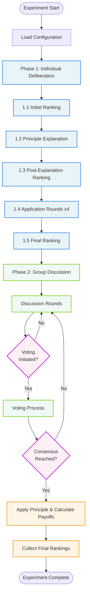

# Diagram 01: Complete Experiment Overview

**Purpose**: High-level view of the two-phase experiment structure
**Audience**: Researchers, managers, new developers
**Layer**: 1 - High-Level Process Flow

---

---

## Phase 1: Individual Deliberation (Parallel)

Each agent independently:
1. **Initial Ranking**: Rank 4 justice principles without knowledge
2. **Principle Explanation**: Learn principles with payoff examples
3. **Post-Explanation Ranking**: Re-rank after learning
4. **Application Rounds** (x4): Select principle and distribution, receive payoffs
5. **Final Ranking**: Final preference after experiencing outcomes

**Duration**: ~5-10 API calls per agent
**Details**: See [02_phase1_process_flow.md](./02_phase1_process_flow.md)

---

## Phase 2: Group Discussion (Sequential)

Agents discuss and reach consensus:
- **Discussion Rounds**: Agents speak in rotating order
- **Voting**: End-of-round voting attempts (initiation → confirmation → ballot)
- **Consensus**: Unanimous agreement on principle and constraints required

**Duration**: 5-20 rounds typical, ~30-100 API calls total
**Details**: See [03_phase2_process_flow.md](./03_phase2_process_flow.md)

---

## Key Outputs

- **Phase1Results**: Rankings (initial, post-explanation, final), application choices, earnings
- **Phase2Results**: Discussion history, voting records, consensus outcome, final rankings
- **Payoffs**: Calculated counterfactuals and actual earnings under chosen principle

---

## Related Files

- `core/experiment_manager.py` - Orchestrates both phases
- `core/phase1_manager.py` - Phase 1 implementation
- `core/phase2_manager.py` - Phase 2 implementation

---

## Next Steps

- **Deep Dive Phase 1**: [02_phase1_process_flow.md](./02_phase1_process_flow.md)
- **Deep Dive Phase 2**: [03_phase2_process_flow.md](./03_phase2_process_flow.md)
- **Service Architecture**: [04_phase1_service_sequence.md](./04_phase1_service_sequence.md)
