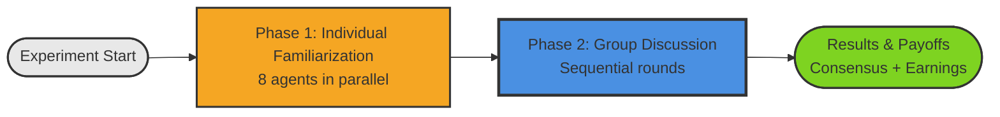

# Diagram 1.1: Two-Phase Experiment Flow

**Purpose**: Provide a quick overview of the complete experiment structure

**Target Audience**: Researchers, managers, first-time readers

**Complexity Level**: Executive (3-5 boxes)

---

## Overview

The Frohlich Experiment follows a simple two-phase structure where AI agents first learn about justice principles individually, then discuss and reach consensus as a group.

---

## Key Points

**Phase 1: Individual Familiarization** (Parallel Execution)
- 8 agents independently learn about 4 justice principles
- Each agent ranks principles and applies them to sample distributions
- Output: Individual preferences and reasoning

**Phase 2: Group Discussion** (Sequential Rounds)
- Agents discuss and debate principles as a group
- Formal voting process to reach unanimous consensus
- Multiple rounds until consensus or maximum rounds reached

**Results & Payoffs**
- Consensus principle determines income distribution
- Agents assigned to income classes (with probabilities)
- Final earnings calculated based on consensus outcome

---

## What Happens in Each Phase?

| Phase | Key Activities | Parallelization |
|-------|----------------|-----------------|
| Phase 1 | Ranking, learning, application | ✅ Parallel (all 8 agents) |
| Phase 2 | Discussion, voting, consensus | ❌ Sequential (turn-based) |
| Results | Payoff calculation, final rankings | ✅ Parallel (all 8 agents) |

---

## Related Files

- `core/experiment_manager.py` - Orchestrates complete experiment
- `core/phase1_manager.py` - Phase 1 implementation
- `core/phase2_manager.py` - Phase 2 implementation

---

## Next Steps

- **For conceptual understanding**: See Diagram 2.1 (Phase 1 Architecture) and Diagram 2.2 (Phase 2 Services)
- **For detailed workflows**: See Diagram 3.1 (Discussion Sequence) and Diagram 3.2 (Voting Process)
- **For technical details**: See TECHNICAL_README.md Section 2
