```mermaid
flowchart TD
    Start([Phase 1 Start]) --> Init[Initialize Agent Context]
    Init --> Note1[/"⚡ All agents run in parallel"/]

    Note1 --> Step1[Step 1.1: Initial Ranking]

    Step1 --> S1_1[Prompt: Rank 4 principles<br/>without explanation]
    S1_1 --> S1_2[Agent generates ranking]
    S1_2 --> S1_3[UtilityAgent parses ranking]
    S1_3 --> S1_4[Update memory with initial preference]

    S1_4 --> Step2[Step 1.2: Principle Explanation]

    Step2 --> S2_1[Load localized explanations<br/>with payoff examples]
    S2_1 --> S2_2[Agent reads detailed explanations]
    S2_2 --> S2_3[Update memory with knowledge]

    S2_3 --> Step3[Step 1.3: Post-Explanation Ranking]

    Step3 --> S3_1[Prompt: Re-rank principles<br/>after learning]
    S3_1 --> S3_2[Agent generates new ranking]
    S3_2 --> S3_3[UtilityAgent parses ranking]
    S3_3 --> S3_4[Update memory with informed preference]

    S3_4 --> Step4[Step 1.4: Application Rounds]

    Step4 --> Loop{Round<br/>1-4?}
    Loop -->|Round N| S4_1[Generate 4 income distributions]
    S4_1 --> S4_2[Prompt: Select principle<br/>and distribution]
    S4_2 --> S4_3[Agent makes selection]
    S4_3 --> S4_4[UtilityAgent parses choice]
    S4_4 --> S4_5[Calculate payoff for round]
    S4_5 --> S4_6[Update context with earnings]
    S4_6 --> S4_7[Update memory with outcome]
    S4_7 --> Loop

    Loop -->|Complete| Step5[Step 1.5: Final Ranking]

    Step5 --> S5_1[Prompt: Rank principles<br/>after experiencing outcomes]
    S5_1 --> S5_2[Agent generates final ranking]
    S5_2 --> S5_3[UtilityAgent parses ranking]
    S5_3 --> S5_4[Update memory with final preference]

    S5_4 --> Collect[Collect Phase1Results]
    Collect --> Results[/"Phase1Results:<br/>• Initial ranking<br/>• Post-explanation ranking<br/>• Application choices x4<br/>• Final ranking<br/>• Total earnings<br/>• Final memory state"/]

    Results --> End([Phase 1 Complete])

    %% Styling
    classDef stepStyle fill:#E8F4F8,stroke:#4A90E2,stroke-width:3px
    classDef processStyle fill:#FFF4E6,stroke:#F5A623,stroke-width:2px
    classDef utilityStyle fill:#F3E5F5,stroke:#BD10E0,stroke-width:2px
    classDef memoryStyle fill:#E0F2F1,stroke:#50E3C2,stroke-width:2px
    classDef noteStyle fill:#FFFDE7,stroke:#FDD835,stroke-width:2px

    class Step1,Step2,Step3,Step4,Step5 stepStyle
    class S1_2,S2_2,S3_2,S4_3,S4_5,S5_2 processStyle
    class S1_3,S3_3,S4_4,S5_3 utilityStyle
    class S1_4,S2_3,S3_4,S4_7,S5_4 memoryStyle
    class Note1,Results noteStyle
```

# Diagram 02: Phase 1 Complete Process Flow

**Purpose**: Detailed view of Phase 1 individual deliberation with all 5 steps
**Audience**: Researchers, developers implementing Phase 1 features
**Layer**: 1 - High-Level Process Flow

---



---

## Step-by-Step Breakdown

### Step 1.1: Initial Ranking (Round 0, Stage: INITIAL_RANKING)
**Purpose**: Capture uninformed preferences (veil of ignorance)

- Agent ranks 4 principles: Maximax, Maximin, Floor Constraint, Range Constraint
- No prior knowledge or explanations provided
- UtilityAgent validates and parses ranking
- Memory updated with initial preference

**Code**: `phase1_manager.py:199-268`

---

### Step 1.2: Principle Explanation (Round -1, Stage: PRINCIPLE_EXPLANATION)
**Purpose**: Educate agents about justice principles

- Load localized explanations from `translations/{language}/principle_explanations.json`
- Include payoff examples for each principle
- Agent processes detailed explanations
- Memory updated with acquired knowledge

**Code**: `phase1_manager.py:271-329`

---

### Step 1.3: Post-Explanation Ranking (Round 0, Stage: POST_EXPLANATION_RANKING)
**Purpose**: Capture informed preferences after learning

- Agent re-ranks principles after understanding them
- Shows preference shift from initial ranking
- UtilityAgent validates ranking
- Memory updated with informed preference

**Code**: `phase1_manager.py:332-401`

---

### Step 1.4: Application Rounds (Rounds 1-4, Stage: APPLICATION)
**Purpose**: Experience principles through concrete choices

**For each of 4 rounds**:
1. Generate 4 income distributions (DistributionGenerator)
2. Agent selects preferred principle and distribution
3. UtilityAgent parses selection
4. Calculate payoff based on agent's income class
5. Update running total earnings
6. Update memory with application outcome

**Cumulative learning**: Each round builds on previous outcomes

**Code**: `phase1_manager.py:404-578`

---

### Step 1.5: Final Ranking (Round 5, Stage: FINAL_RANKING) ⭐
**Purpose**: Capture experience-based preferences after concrete applications

- Agent ranks principles after experiencing real outcomes
- Reflects both learning AND application experience
- Most informed preference ranking
- UtilityAgent validates ranking
- Memory updated with final preference

**Code**: `phase1_manager.py:581-625`

**⚠️ Critical Note**: This step was previously missing from documentation but exists in implementation.

---

## Execution Model

**Parallelism**: All agents execute Phase 1 independently and simultaneously
- No inter-agent communication
- No shared state
- Identical principle explanations (localized)
- Different income class assignments

**Timing**: ~5-10 API calls per agent (5 ranking prompts + 4 application prompts)

---

## Output Structure

```python
Phase1Results:
    agent_id: str
    initial_ranking: List[JusticePrinciple]           # Step 1.1
    post_explanation_ranking: List[JusticePrinciple]  # Step 1.3
    application_results: List[ApplicationRoundResult] # Step 1.4 (x4)
    final_ranking: List[JusticePrinciple]             # Step 1.5 ⭐
    total_earnings: int
    final_memory_state: List[Dict]
```

---

## Related Files

- `core/phase1_manager.py` - Complete Phase 1 orchestration
- `experiment_agents/participant_agent.py` - Agent implementation
- `experiment_agents/utility_agent.py` - Response parsing
- `translations/{language}/principle_explanations.json` - Localized content

---

## Next Steps

- **Phase 2 Process**: [03_phase2_process_flow.md](./03_phase2_process_flow.md)
- **Service Details**: [04_phase1_service_sequence.md](./04_phase1_service_sequence.md)
- **Data Models**: [07_data_models.md](./07_data_models.md)
