```mermaid
flowchart TD
    Start([Phase 2 Start]) --> Init[Initialize from Phase 1 memory]

    Init --> RoundLoop{Round N<br/>of Max?}

    RoundLoop -->|Start Round| Order[Determine Speaking Order]
    Order --> Note1[/"SpeakingOrderService:<br/>Randomize with finisher restrictions"/]

    Note1 --> SpeakLoop[For Each Speaker in Order]

    SpeakLoop --> BuildPrompt[Build Discussion Prompt]
    BuildPrompt --> Note2[/"DiscussionService:<br/>Context + history + group info"/]

    Note2 --> AgentSpeak[Agent Generates Statement]
    AgentSpeak --> Validate{Statement<br/>Valid?}

    Validate -->|No| Retry{Retry<br/>Available?}
    Retry -->|Yes| AgentSpeak
    Retry -->|No| Error[Log Error]
    Error --> NextSpeaker

    Validate -->|Yes| Append[Append to Public History]
    Append --> NextSpeaker{More<br/>Speakers?}

    NextSpeaker -->|Yes| SpeakLoop
    NextSpeaker -->|No| MemoryPhase

    MemoryPhase[/"⭐ POST-ROUND MEMORY UPDATE PHASE"/]
    MemoryPhase --> MemLoop[For Each Participant]
    MemLoop --> UpdateMem[Update Memory with Complete Round]
    UpdateMem --> Note3[/"MemoryService:<br/>Complete context + all statements"/]
    Note3 --> MemNext{More<br/>Participants?}
    MemNext -->|Yes| MemLoop
    MemNext -->|No| CheckCountdown

    CheckCountdown{Rounds<br/>Remaining == 2?}
    CheckCountdown -->|Yes| Countdown[Insert Countdown Message]
    CheckCountdown -->|No| VotePrompt
    Countdown --> VotePrompt

    VotePrompt[End-of-Round Voting Attempt]
    VotePrompt --> VoteLoop[For Each Participant Sequential]

    VoteLoop --> AskVote[Ask: Initiate Voting?]
    AskVote --> VoteResponse{Response?}

    VoteResponse -->|Yes| VotingSubprocess
    VoteResponse -->|No| NextVoter{More<br/>Participants?}
    NextVoter -->|Yes| VoteLoop
    NextVoter -->|No| NoVoting

    NoVoting[No Voting Initiated] --> RoundLoop

    VotingSubprocess[/"📊 VOTING SUBPROCESS"/]
    VotingSubprocess --> Confirm[Confirmation Phase]
    Confirm --> Note4[/"VotingService:<br/>All agents must agree 1=Yes, 0=No"/]
    Note4 --> ConfirmResult{All<br/>Confirmed?}

    ConfirmResult -->|No| NoVoting
    ConfirmResult -->|Yes| Ballot[Secret Ballot Phase]

    Ballot --> Stage1[Stage 1: Select Principle 1-4]
    Stage1 --> Stage2{Principle<br/>3 or 4?}
    Stage2 -->|Yes| Amount[Stage 2: Specify Floor/Range]
    Stage2 -->|No| CheckConsensus
    Amount --> CheckConsensus

    CheckConsensus{Unanimous<br/>Agreement?}
    CheckConsensus -->|No| NoVoting
    CheckConsensus -->|Yes| ConsensusReached

    ConsensusReached[Consensus Achieved] --> ExitLoop
    RoundLoop -->|Max Rounds| ExitLoop

    ExitLoop[/"End Discussion Loop"/]
    ExitLoop --> ApplyPrinciple[Apply Chosen Principle]
    ApplyPrinciple --> Calculate[Calculate Payoffs & Counterfactuals]
    Calculate --> Note5[/"CounterfactualsService:<br/>All scenarios computed"/]

    Note5 --> DeliverResults[Deliver Results to Agents]
    DeliverResults --> UpdateResults[Update Memory with Results]
    UpdateResults --> CollectRankings[Collect Final Rankings]

    CollectRankings --> End([Phase 2 Complete])

    %% Styling
    classDef roundStyle fill:#E8F4F8,stroke:#4A90E2,stroke-width:2px
    classDef speakStyle fill:#FFF4E6,stroke:#F5A623,stroke-width:2px
    classDef memoryStyle fill:#E0F2F1,stroke:#50E3C2,stroke-width:3px
    classDef voteStyle fill:#F3E5F5,stroke:#BD10E0,stroke-width:2px
    classDef successStyle fill:#F0F9F4,stroke:#7ED321,stroke-width:3px
    classDef noteStyle fill:#FFFDE7,stroke:#FDD835,stroke-width:2px
    classDef decisionStyle fill:#FFF0F5,stroke:#E91E63,stroke-width:2px

    class Order,BuildPrompt roundStyle
    class AgentSpeak,Append speakStyle
    class MemoryPhase,MemLoop,UpdateMem memoryStyle
    class VotingSubprocess,Confirm,Ballot,Stage1,Stage2,Amount voteStyle
    class ConsensusReached,ExitLoop,Calculate successStyle
    class Note1,Note2,Note3,Note4,Note5 noteStyle
    class Validate,Retry,CheckCountdown,VoteResponse,ConfirmResult,CheckConsensus,NextVoter,NextSpeaker,MemNext decisionStyle
```

# Diagram 03: Phase 2 Complete Process Flow

**Purpose**: Detailed view of Phase 2 group discussion with post-round memory updates
**Audience**: Researchers, developers implementing Phase 2 features
**Layer**: 1 - High-Level Process Flow

---



---

## Round Structure (Repeats 1 to Max Rounds)

### 1. Speaking Order Determination
**Service**: SpeakingOrderService

- Randomize speaking order for fairness
- Apply finisher restrictions (agents who speak last limited times)
- Ensure all agents participate equally over rounds

**Code**: `core/services/speaking_order_service.py`

---

### 2. Discussion Phase (All Speakers)

For each speaker in order:

1. **Build Prompt** (DiscussionService)
   - Agent's context (income, phase 1 results)
   - Public discussion history
   - Group composition information
   - Round number and guidelines

2. **Agent Statement Generation**
   - Agent produces discussion statement
   - Validation: minimum length, timeout checks
   - Retry mechanism for invalid statements

3. **Append to History**
   - Add statement to public shared history
   - **No memory update yet** (deferred to post-round phase)

**Code**: `core/phase2_manager.py:677-806`

---

### 3. Post-Round Memory Update Phase ⭐

**Critical Timing**: After all speakers finish, before voting

For each participant:

1. **Complete Context Assembly**
   - All statements from round are available
   - Complete discussion history
   - Round outcome fully visible

2. **Memory Update** (MemoryService)
   - Symmetric: all agents receive same round information
   - Guidance style: narrative or structured format
   - Character limits enforced
   - Truncation if needed

**Why Post-Round?**: Ensures all agents have complete, consistent view of round before making voting decisions.

**Code**: `core/phase2_manager.py:873-900`

---

### 4. Countdown Message (Conditional)

**Trigger**: When `rounds_remaining == 2`

- Insert system message: "⏰ 2 rounds remaining to reach consensus"
- Encourages agents to converge toward agreement
- Message visible in next round's history

**Code**: `core/phase2_manager.py:905-917`

---

### 5. End-of-Round Voting Attempt

For each participant (sequential):

1. **Initiation Prompt**: "Do you want to initiate voting?" (Yes/No)
2. **First Yes breaks loop**: Proceed to voting subprocess
3. **All No**: Continue to next round

**Service**: VotingService

---

## Voting Subprocess

**Trigger**: Any agent initiates voting

### Stage 1: Confirmation Phase
- **All agents** must confirm participation
- Binary choice: 1 = Yes, 0 = No
- **All must agree**: Single No aborts voting, return to discussion

### Stage 2: Secret Ballot
**Two-stage voting**:

1. **Principle Selection** (all agents)
   - Vote for principle 1-4
   - Numerical input validation

2. **Amount Specification** (if principle 3 or 4)
   - Floor constraint amount (principle 3)
   - Range constraint amount (principle 4)
   - Numerical validation

### Stage 3: Consensus Detection
- **Unanimous agreement required**: All agents same principle + amount
- **Consensus → Exit loop**
- **No consensus → Return to discussion**

**Code**: `core/services/voting_service.py`

---

## Post-Discussion Phase

After consensus or max rounds reached:

### 1. Apply Chosen Principle
- Use consensus principle (or handle no-consensus case)
- Calculate income distributions

### 2. Calculate Payoffs (CounterfactualsService)
- Actual payoffs under chosen principle
- Counterfactual payoffs under all other principles
- Comparative analysis

### 3. Deliver Results to Agents
- Formatted results with all scenarios
- Update memory with outcomes

### 4. Collect Final Rankings
- Agents rank principles after seeing results
- Captures post-experience preferences

**Code**: `core/phase2_manager.py:313-382`

---

## Key Features

### Memory Management
- **Timing**: Post-round updates ensure consistency
- **Content**: Complete round context, all statements
- **Limits**: Configurable character limits (default 100,000)
- **Truncation**: Intelligent preservation of recent content

### Voting Coordination
- **Initiation**: Voluntary, any agent can start
- **Confirmation**: All must agree to participate
- **Consensus**: Unanimous agreement required
- **Retry**: Failed votes return to discussion

### Round Progression
- **Typical**: 5-20 rounds for consensus
- **Maximum**: Configurable (default 10-20)
- **Countdown**: Alert at 2 rounds remaining

---

## Output Structure

```python
Phase2Results:
    consensus_reached: bool
    chosen_principle: Optional[JusticePrinciple]
    discussion_history: List[Dict]
    voting_records: List[VotingRecord]
    payoffs: Dict[str, PayoffResult]
    final_rankings: Dict[str, List[JusticePrinciple]]
    rounds_completed: int
```

---

## Related Files

- `core/phase2_manager.py` - Phase 2 orchestration
- `core/services/speaking_order_service.py` - Turn management
- `core/services/discussion_service.py` - Prompt building, validation
- `core/services/voting_service.py` - Voting coordination
- `core/services/memory_service.py` - Memory updates
- `core/services/counterfactuals_service.py` - Payoff calculations

---

## Next Steps

- **Discussion Details**: [05_discussion_round_detailed.md](./05_discussion_round_detailed.md)
- **Voting Details**: [06_voting_detailed.md](./06_voting_detailed.md)
- **Data Models**: [07_data_models.md](./07_data_models.md)
- **Phase 1 Process**: [02_phase1_process_flow.md](./02_phase1_process_flow.md)
