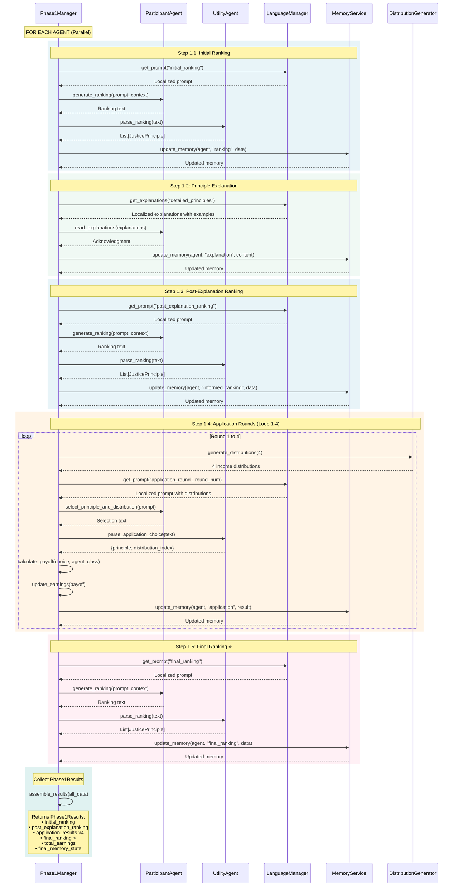

# Diagram 04: Phase 1 Service Sequence (Detailed)

**Purpose**: Service-level interactions during Phase 1 execution
**Audience**: Developers implementing Phase 1 features, debugging
**Layer**: 2 - Detailed Service Interactions

---



---

## Service Responsibilities

### Phase1Manager
**Role**: Orchestrates complete Phase 1 flow for all agents

**Key Methods**:
- `run_phase1_for_agent()` - Main execution loop
- `_step_1_1_initial_ranking()` - Initial preference capture
- `_step_1_2_detailed_explanation()` - Principle education
- `_step_1_3_post_explanation_ranking()` - Informed preference
- `_step_1_4_application_rounds()` - Practical application (x4)
- `_step_1_5_final_ranking()` - Experience-based preference ⭐

**Code**: `core/phase1_manager.py`

---

### ParticipantAgent
**Role**: AI agent representing a participant

**Key Interactions**:
- Receives prompts in configured language
- Generates rankings (initial, post-explanation, final)
- Makes principle/distribution selections
- Maintains internal reasoning state

**Code**: `experiment_agents/participant_agent.py`

---

### UtilityAgent
**Role**: Parser and validator for agent responses

**Responsibilities**:
- Parse ranking text → structured `List[JusticePrinciple]`
- Parse application choices → `{principle, distribution_index}`
- Validate response format and content
- Handle multilingual responses

**Code**: `experiment_agents/utility_agent.py`

---

### LanguageManager
**Role**: Localization and translation management

**Provides**:
- Localized prompts from `translations/{language}/`
- Principle explanations with cultural context
- Consistent terminology across languages

**Code**: `utils/language_manager.py`

---

### MemoryService
**Role**: Agent memory state management

**Operations**:
- Update memory after each step
- Enforce character limits
- Apply guidance styles (narrative/structured)
- Maintain context continuity

**Code**: `core/services/memory_service.py` (conceptually; Phase 1 uses direct updates)

---

### DistributionGenerator
**Role**: Create income distribution scenarios

**Functionality**:
- Generate 4 distributions per application round
- Ensure diversity of scenarios
- Consistent calculation methods

**Code**: `utils/distribution_generator.py`

---

## Timing and Performance

### API Calls Per Agent
- **Initial Ranking**: 1 call (ParticipantAgent) + 1 call (UtilityAgent)
- **Explanation**: 1 call (ParticipantAgent)
- **Post-Explanation Ranking**: 1 + 1 calls
- **Application Rounds**: 4 × (1 + 1) calls = 8 calls
- **Final Ranking**: 1 + 1 calls ⭐

**Total**: ~13 API calls per agent (with retries may increase)

### Parallel Execution
- All agents run Phase 1 simultaneously
- No dependencies between agents
- Total wall-clock time ≈ single agent time

---

## Memory Update Pattern

After each step:
```python
memory_update = {
    "step": "step_name",
    "round": round_number,
    "stage": ExperimentStage,
    "content": step_specific_data,
    "timestamp": current_time
}

agent.memory.append(memory_update)
```

Memory grows incrementally, preserving full Phase 1 journey for Phase 2 initialization.

---

## Error Handling

### Retry Mechanisms
- **Ranking parsing failures**: Retry with clarified prompt
- **Application choice parsing**: Retry with format examples
- **Timeout**: Configurable timeout per step (default 60s)

### Fallbacks
- **Invalid ranking**: Request re-ranking with validation rules
- **Malformed selection**: Provide format template and retry
- **Persistent failures**: Log error, mark agent as failed

---

## Data Flow Summary

```
Configuration → Phase1Manager → (Parallel for each agent)
    ↓
1. Initial Ranking → UtilityAgent → Memory
2. Explanation → Direct to Memory
3. Post-Explanation Ranking → UtilityAgent → Memory
4. Application Rounds x4 → UtilityAgent → Payoff → Memory
5. Final Ranking → UtilityAgent → Memory ⭐
    ↓
Phase1Results (includes final_ranking) → Phase2Manager
```

---

## Critical Implementation Notes

### Final Ranking Step (Step 1.5) ⭐
**Previously Undocumented**

- **Location**: `phase1_manager.py:581-625`
- **Round Number**: 5
- **Stage**: `ExperimentStage.FINAL_RANKING`
- **Purpose**: Capture preference after experiencing all 4 application rounds
- **Output**: Included in `Phase1Results.final_ranking`

This step is **critical** for understanding preference evolution:
- Initial ranking: Pure veil of ignorance
- Post-explanation: After learning
- Final ranking: After concrete experience ⭐

---

## Related Files

- `core/phase1_manager.py` - Complete orchestration (lines 199-625)
- `experiment_agents/participant_agent.py` - Agent implementation
- `experiment_agents/utility_agent.py` - Response parsing
- `utils/language_manager.py` - Localization
- `utils/distribution_generator.py` - Distribution creation
- `models/phase1_models.py` - Data models

---

## Next Steps

- **Phase 2 Service Details**: [05_discussion_round_detailed.md](./05_discussion_round_detailed.md)
- **Data Models**: [07_data_models.md](./07_data_models.md)
- **High-Level Process**: [02_phase1_process_flow.md](./02_phase1_process_flow.md)
