# Diagram 2.2: Phase 2 Services Architecture

**Purpose**: Show how Phase2Manager orchestrates 6 specialized services for group discussion and consensus

**Target Audience**: Developers working with Phase 2 code

**Complexity Level**: ⭐⭐ Conceptual (12-15 boxes)

**Priority**: 🔥 HIGHEST - Most important diagram for understanding the codebase

---

## Services-First Architecture

```mermaid
graph TB
    Manager[Phase2Manager<br/>Orchestrator<br/><i>Delegates, doesn't implement</i>]

    subgraph "Core Services Layer"
        Speaking[SpeakingOrderService<br/>📋 Turn Management<br/>Finisher restrictions]
        Discussion[DiscussionService<br/>💬 Prompts & Validation<br/>Statement length checks]
        Voting[VotingService<br/>🗳️ Vote Coordination<br/>Initiation → Confirmation → Ballot]
        Memory[MemoryService<br/>🧠 Memory Updates<br/>Truncation & guidance styles]
        Counter[CounterfactualsService<br/>💰 Payoffs & Results<br/>Earnings calculation]
        Manipulator[ManipulatorService<br/>🔬 Experimental Manipulation<br/><i>Optional</i>]
    end

    subgraph "Lower-Level Implementations"
        TwoStage[TwoStageVotingManager<br/>Ballot Execution<br/>Stage 1: Principle<br/>Stage 2: Amount]
        Selective[SelectiveMemoryManager<br/>Simple vs Complex Updates]
    end

    subgraph "Shared State"
        State[GroupDiscussionState<br/>Discussion history<br/>Consensus status<br/>Current round]
    end

    Manager -->|determines order| Speaking
    Manager -->|builds prompts| Discussion
    Manager -->|coordinates voting| Voting
    Manager -->|updates memories| Memory
    Manager -->|calculates results| Counter
    Manager -->|optional manipulation| Manipulator

    Voting -->|executes ballot| TwoStage
    Memory -->|delegates to| Selective

    Speaking -.->|reads| State
    Discussion -.->|reads/writes| State
    Voting -.->|reads/writes| State

    style Manager fill:#4A90E2,stroke:#333,stroke-width:4px,color:#fff
    style Speaking fill:#7ED321,stroke:#333,stroke-width:2px
    style Discussion fill:#7ED321,stroke:#333,stroke-width:2px
    style Voting fill:#7ED321,stroke:#333,stroke-width:2px
    style Memory fill:#7ED321,stroke:#333,stroke-width:2px
    style Counter fill:#7ED321,stroke:#333,stroke-width:2px
    style Manipulator fill:#7ED321,stroke:#333,stroke-width:1px,stroke-dasharray: 5 5
    style TwoStage fill:#F5A623,stroke:#333
    style Selective fill:#F5A623,stroke:#333
    style State fill:#BD10E0,stroke:#333,stroke-width:2px
```



---

## Architectural Principles

### 1. Phase2Manager as Orchestrator
**Role**: Coordinates services but implements NO business logic itself.

**What it does**:
- Calls services in the correct sequence
- Passes data between services
- Manages the discussion round loop
- Handles control flow (continue or exit loop)

**What it does NOT do**:
- Generate discussion prompts (delegates to DiscussionService)
- Validate statements (delegates to DiscussionService)
- Execute voting (delegates to VotingService)
- Update memories (delegates to MemoryService)
- Calculate payoffs (delegates to CounterfactualsService)

### 2. Single Responsibility Principle
Each service owns ONE specific domain:

| Service | Single Responsibility | What It Owns |
|---------|----------------------|--------------|
| SpeakingOrderService | Turn allocation | Speaking order, finisher restrictions |
| DiscussionService | Discussion mechanics | Prompts, validation, history management |
| VotingService | Vote coordination | Initiation, confirmation, ballot orchestration |
| MemoryService | Memory management | Updates, truncation, guidance styles |
| CounterfactualsService | Results & analysis | Payoff calculation, counterfactual generation |
| ManipulatorService | Experimental control | Optional manipulation (research feature) |

### 3. Protocol-Based Dependency Injection
**Why Protocols?** Enables testing services in isolation without full system.

**Example**: VotingService depends on:
- `ParticipantProtocol` (not concrete ParticipantAgent)
- `DiscussionStateProtocol` (not concrete GroupDiscussionState)

**Benefit**: Can inject mock implementations for unit tests (99.97% faster execution)

---

## Service Interactions

### Typical Discussion Round Flow


---

## Service Details

### SpeakingOrderService
**File**: `core/services/speaking_order_service.py`

**Key Method**: `determine_speaking_order(participants, randomize_finisher=False)`

**Logic**:
- Randomly shuffles participant order (seeded for reproducibility)
- If `randomize_finisher=True`: Ensures last speaker differs from previous rounds
- Returns: `Dict[int, List[ParticipantAgent]]` mapping round → speaker order

**Configuration**: `Phase2Settings.finisher_restrictions_active`

---

### DiscussionService
**File**: `core/services/discussion_service.py`

**Key Methods**:
1. `build_discussion_prompt(agent, phase1_results, history, round_num)`
   - Assembles contextual prompt with Phase 1 results and discussion history
   - Applies multilingual templates

2. `validate_statement(statement, min_length=50, max_retries=3)`
   - Checks statement meets minimum length
   - Retries on validation failure
   - Raises ValidationError if max retries exceeded

3. `manage_discussion_history_length(history, max_length=100000)`
   - Truncates oldest statements first
   - Preserves recent context for decision-making

**Configuration**:
- `Phase2Settings.statement_min_length`
- `Phase2Settings.public_history_max_length`

---

### VotingService
**File**: `core/services/voting_service.py`

**Key Methods**:
1. `initiate_voting(participants, discussion_state, round_num)`
   - Asks each agent: "Do you want to initiate voting?" (1=Yes, 0=No)
   - Returns after first "Yes" or when all checked

2. `coordinate_voting_confirmation(participants, discussion_state, round_num)`
   - All agents must confirm participation (requires 100% agreement)
   - Returns: `ConfirmationResult(all_confirmed=bool, votes=dict)`

3. `coordinate_secret_ballot(participants, round_num)`
   - Delegates to TwoStageVotingManager
   - Stage 1: Principle selection (1-4)
   - Stage 2: Amount specification (for principles 3 & 4)

4. `detect_consensus(votes, strict=True)`
   - Checks unanimous agreement on principle AND constraint amount
   - Returns: `ConsensusResult` or `None`

**Configuration**:
- `Phase2Settings.voting_confirmation_timeout`
- `Phase2Settings.voting_secret_ballot_timeout`
- `Phase2Settings.voting_retry_limit`

---

### MemoryService
**File**: `core/services/memory_service.py`

**Key Methods**:
1. `update_discussion_memory(agent, context, statement, round_num)`
   - Truncates statement to 300 characters
   - Applies guidance style (narrative or structured)
   - Routes to SelectiveMemoryManager

2. `update_voting_memory(agent, context, event_type, round_num, vote_choice, consensus_reached)`
   - Handles 3 sub-events: VOTING_INITIATED, VOTING_CONFIRMED, BALLOT_COMPLETED
   - Routes to simple or complex update based on consensus

3. `update_final_results_memory(agent, context, result_content, earnings, consensus_reached)`
   - Always uses complex update (LLM-mediated integration)

**Configuration**:
- `Phase2Settings.memory_management.guidance_style`
- `Phase2Settings.memory_management.enable_truncation`

---

### CounterfactualsService
**File**: `core/services/counterfactuals_service.py`

**Key Methods**:
1. `calculate_payoffs(distribution_set, consensus_principle, participants, probabilities)`
   - If consensus: Applies consensus principle to distributions
   - If no consensus: Randomly selects principle
   - Assigns income classes (respects probabilities with seeded RNG)
   - Returns: `Dict[str, float]` mapping participant → earnings

2. `format_detailed_results(participants, payoffs, consensus_reached, consensus_principle, distributions)`
   - Generates counterfactual earnings under all 4 principles
   - Shows "what you earned" vs "what you would have earned"
   - Returns: `Dict[str, DetailedResult]`

3. `collect_final_rankings(participants, results)`
   - Asks agents to re-rank principles after seeing results
   - Measures preference shift post-payoff

---

### ManipulatorService (Optional)
**File**: `core/services/manipulator_service.py`

**Purpose**: Experimental manipulation for research hypotheses

**Features**:
- Inject specific information to certain agents
- Control information asymmetry
- Test behavioral responses to manipulation

**Note**: Not used in baseline experiments, only for specific research questions.

---

## Why Services-First Architecture?

### Before (Monolithic Phase2Manager)
❌ 800+ line manager class with all logic
❌ Difficult to test in isolation
❌ Hard to understand which code does what
❌ Changes ripple across entire class
❌ Slow test execution (must run full Phase 2)

### After (Services-First)
✅ Manager reduced to ~300 lines (orchestration only)
✅ Each service ~150-250 lines (focused responsibility)
✅ Services testable in isolation with mocks
✅ Clear ownership boundaries
✅ Fast test execution (43 tests in 0.04 seconds)
✅ Easy to add new features (create new service)

---

## Configuration

Phase 2 behavior is controlled through `Phase2Settings` (`config/phase2_settings.py`):

```yaml
phase2_settings:
  # Speaking order
  finisher_restrictions_active: true
  use_fixed_speaking_order: false

  # Discussion
  statement_min_length: 50
  statement_validation_retries: 3
  public_history_max_length: 100000

  # Memory management
  memory_management:
    guidance_style: "narrative"  # or "structured"
    enable_truncation: true

  # Voting
  voting_confirmation_timeout: 30
  voting_secret_ballot_timeout: 45
  voting_retry_limit: 3
  voting_retry_backoff_factor: 1.5
```

---

## Testing Strategy

### Fast Tests (Protocol-Based Mocking)
**File**: `tests/unit/test_fast_*.py`

**Approach**: Mock all dependencies using protocols
- `test_fast_response_parsing.py`: Multilingual voting validation (0 API calls)
- `test_fast_data_flows.py`: Service integration with synthetic data (0 API calls)

**Performance**: 43 tests in ~0.04 seconds (99.97% improvement)

### Component Tests (Real LLM Calls)
**File**: `tests/component/test_*_service.py`

**Approach**: Test each service with real API calls but minimal payloads
- `test_voting_service.py`: End-to-end voting coordination
- `test_memory_service.py`: Memory update strategies

**Performance**: ~5 minutes for full suite

---

## Related Files

**Core Services**:
- `core/services/speaking_order_service.py` (150 lines)
- `core/services/discussion_service.py` (220 lines)
- `core/services/voting_service.py` (280 lines)
- `core/services/memory_service.py` (190 lines)
- `core/services/counterfactuals_service.py` (250 lines)

**Orchestrator**:
- `core/phase2_manager.py` (300 lines)

**Configuration**:
- `config/phase2_settings.py` (120 lines)
- `config/models.py` (500+ lines)

**Supporting**:
- `core/two_stage_voting_manager.py` (200 lines)
- `utils/selective_memory_manager.py` (150 lines)

---

## Next Steps

- **For detailed workflows**: See Diagram 3.1 (Discussion Sequence) and Diagram 3.2 (Voting Process)
- **For memory details**: See Diagram 3.3 (Memory Management Flow)
- **For technical documentation**: See TECHNICAL_README.md Section 3
- **For service modification guide**: See CLAUDE.md "Service Ownership and Modification Guide"
