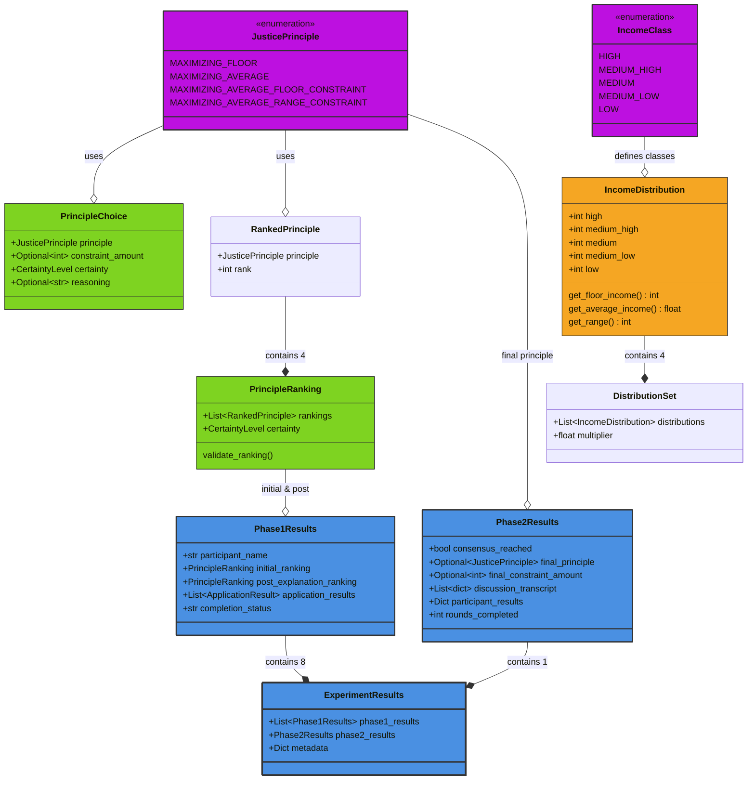
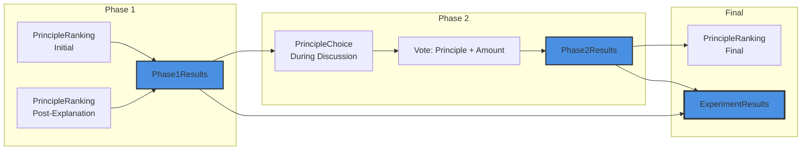

# Diagram 2.3: Data Model Overview

**Purpose**: Show core data types used throughout the experiment framework

**Target Audience**: Developers working with data structures

**Complexity Level**: Conceptual Conceptual (8-10 classes)

---

## Core Data Model



---

## Type Categories

### 1. Justice Principles (Purple)
Core domain types representing distributive justice approaches.

**JusticePrinciple** - The 4 justice principles from Frohlich & Oppenheimer:
1. **MAXIMIZING_FLOOR**: Maximize the lowest income (Rawlsian)
2. **MAXIMIZING_AVERAGE**: Maximize average income (Utilitarian)
3. **MAXIMIZING_AVERAGE_FLOOR_CONSTRAINT**: Maximize average with floor constraint
4. **MAXIMIZING_AVERAGE_RANGE_CONSTRAINT**: Maximize average with range constraint

**PrincipleChoice** - Agent's selection of a principle:
- `principle`: Which principle (1-4)
- `constraint_amount`: For principles 3 & 4 (e.g., $15,000 floor)
- `certainty`: How confident (VERY_UNSURE to VERY_SURE)
- `reasoning`: Optional explanation

**PrincipleRanking** - Agent's preference ordering:
- `rankings`: List of 4 RankedPrinciple objects (ranks 1-4)
- `certainty`: Confidence level
- Validates: All 4 principles present, ranks 1-4 used exactly once

---

### 2. Agent Response Types (Green)
Structured responses from agents during the experiment.

**PrincipleRanking** - Used 3 times per agent:
1. **Phase 1 Initial**: Before learning about principles
2. **Phase 1 Post-Explanation**: After receiving explanations
3. **Phase 2 Final**: After seeing payoff results

**PrincipleChoice** - Used during Phase 2:
- Discussion: Agent's current preference with reasoning
- Voting: Agent's ballot choice with optional constraint amount

---

### 3. Income & Distribution Types (Orange)
Economic model components.

**IncomeClass** - 5 income classes with probabilities:
- HIGH (5% probability): Richest class
- MEDIUM_HIGH (10% probability): Upper-middle class
- MEDIUM (50% probability): Modal class (most likely)
- MEDIUM_LOW (25% probability): Lower-middle class
- LOW (10% probability): Poorest class

**IncomeDistribution** - Income values for each class:
```python
IncomeDistribution(
    high=32000,
    medium_high=27000,
    medium=24000,
    medium_low=13000,
    low=12000
)
```

**Methods**:
- `get_floor_income()`: Returns lowest value (e.g., 12000)
- `get_average_income(probabilities)`: Weighted average (e.g., 20200)
- `get_range()`: high - low (e.g., 20000)

**DistributionSet** - 4 distributions per round:
- Each round generates 4 alternative distributions
- Multiplier applied to base distribution (e.g., 0.9 or 1.1)
- Agents see all 4 and reason about which principle applies to which

---

### 4. Results Types (Blue)
Experiment outputs and aggregations.

**Phase1Results** - Per-agent Phase 1 output:
```python
Phase1Results(
    participant_name="Alice",
    initial_ranking=PrincipleRanking(...),           # Before learning
    post_explanation_ranking=PrincipleRanking(...),   # After learning
    application_results=[                             # 4 rounds
        ApplicationResult(round=1, chosen_distribution=2, ...),
        ApplicationResult(round=2, chosen_distribution=3, ...),
        ApplicationResult(round=3, chosen_distribution=1, ...),
        ApplicationResult(round=4, chosen_distribution=4, ...)
    ],
    completion_status="completed"
)
```

**Phase2Results** - Group Phase 2 output:
```python
Phase2Results(
    consensus_reached=True,
    final_principle=JusticePrinciple.MAXIMIZING_FLOOR,
    final_constraint_amount=None,
    discussion_transcript=[                           # All statements
        {"round": 1, "speaker": "Alice", "statement": "..."},
        {"round": 1, "speaker": "Bob", "statement": "..."},
        ...
    ],
    participant_results={                             # Per-agent results
        "Alice": DetailedResult(earnings=24000, ...),
        "Bob": DetailedResult(earnings=27000, ...),
        ...
    },
    rounds_completed=7
)
```

**ExperimentResults** - Complete experiment output:
```python
ExperimentResults(
    phase1_results=[                                  # 8 agents
        Phase1Results(participant_name="Alice", ...),
        Phase1Results(participant_name="Bob", ...),
        ...
    ],
    phase2_results=Phase2Results(...),
    metadata={                                        # Experiment metadata
        "timestamp": "2025-01-15T10:30:00",
        "seed": 42,
        "config_file": "config/baseline.yaml",
        "duration_seconds": 1847,
        "openai_trace_url": "https://..."
    }
)
```

---

## Data Flow Through Experiment



---

## Key Design Decisions

### 1. Pydantic Models
All data types use Pydantic `BaseModel` for:
- **Automatic validation**: Ensures data integrity
- **Type safety**: Catches errors at runtime
- **JSON serialization**: Easy export to files
- **Documentation**: Auto-generated schemas

### 2. Enumerations
`JusticePrinciple` and `IncomeClass` are string-based enums:
- **Type safety**: Can't use invalid values
- **IDE support**: Autocomplete and type hints
- **Consistency**: Same values throughout codebase

### 3. Optional Fields
Many fields are `Optional[T]`:
- `constraint_amount`: Only for principles 3 & 4
- `final_principle`: Only if consensus reached
- `reasoning`: Agents may not provide reasoning

### 4. Immutability
Results objects are designed to be immutable:
- Created once at end of phase
- Never modified after creation
- Safe to share between components

---

## Context Objects (Runtime State)

In addition to result types, the framework uses context objects for runtime state:

**ParticipantContext** - Agent's working memory:
```python
ParticipantContext(
    participant_name="Alice",
    current_phase=ExperimentPhase.PHASE_2,
    current_stage=ExperimentStage.DISCUSSION,
    current_round=3,
    memory="...",                          # Accumulated memory
    assigned_income_class=None,            # Not revealed until end
    public_discussion_history="...",       # Shared discussion context
    current_principle_choice=PrincipleChoice(...)
)
```

**GroupDiscussionState** - Shared Phase 2 state:
```python
GroupDiscussionState(
    public_history=[...],                  # All statements
    consensus_reached=False,
    consensus_principle=None,
    consensus_constraint=None,
    current_round=3,
    voting_in_progress=False
)
```

---

## Validation Rules

### PrincipleRanking Validation
```python
def validate_ranking(self):
    # Must have exactly 4 rankings
    assert len(self.rankings) == 4

    # Ranks must be 1, 2, 3, 4 (no duplicates)
    ranks = [r.rank for r in self.rankings]
    assert sorted(ranks) == [1, 2, 3, 4]

    # All 4 principles must be present
    principles = [r.principle for r in self.rankings]
    assert len(set(principles)) == 4
```

### PrincipleChoice Validation
```python
def validate_choice(self):
    # Principles 3 & 4 require constraint_amount
    if self.principle in [MAXIMIZING_AVERAGE_FLOOR_CONSTRAINT,
                          MAXIMIZING_AVERAGE_RANGE_CONSTRAINT]:
        assert self.constraint_amount is not None
        assert self.constraint_amount > 0
```

---

## File Locations

**Core Models**:
- `models/principle_types.py` - JusticePrinciple, PrincipleChoice, PrincipleRanking
- `models/income_types.py` - IncomeClass, IncomeDistribution, DistributionSet
- `models/phase1_results.py` - Phase1Results, ApplicationResult
- `models/phase2_results.py` - Phase2Results, DetailedResult
- `models/experiment_results.py` - ExperimentResults

**Context Objects**:
- `models/participant_context.py` - ParticipantContext
- `models/discussion_state.py` - GroupDiscussionState

**Configuration**:
- `config/models.py` - ExperimentConfiguration (Pydantic model for YAML)

---

## JSON Export Example

**Experiment Results JSON Structure**:
```json
{
  "phase1_results": [
    {
      "participant_name": "Alice",
      "initial_ranking": {
        "rankings": [
          {"principle": "maximizing_floor", "rank": 1},
          {"principle": "maximizing_average", "rank": 2},
          ...
        ]
      },
      "post_explanation_ranking": {...},
      "application_results": [...]
    },
    ...
  ],
  "phase2_results": {
    "consensus_reached": true,
    "final_principle": "maximizing_floor",
    "final_constraint_amount": null,
    "discussion_transcript": [...],
    "participant_results": {...},
    "rounds_completed": 7
  },
  "metadata": {...}
}
```

---

## Related Files

**Models Directory**:
- `models/*.py` - All data model definitions (8 files)

**Usage Examples**:
- `core/phase1_manager.py` - Creates Phase1Results
- `core/phase2_manager.py` - Creates Phase2Results
- `core/experiment_manager.py` - Compiles ExperimentResults
- `experiment_agents/utility_agent.py` - Parses rankings and choices

---

## Next Steps

- **For workflow understanding**: See Diagram 3.1 (Discussion Sequence) and Diagram 3.2 (Voting Process)
- **For detailed type definitions**: See `models/` directory source code
- **For validation logic**: See TECHNICAL_README.md Section 9
