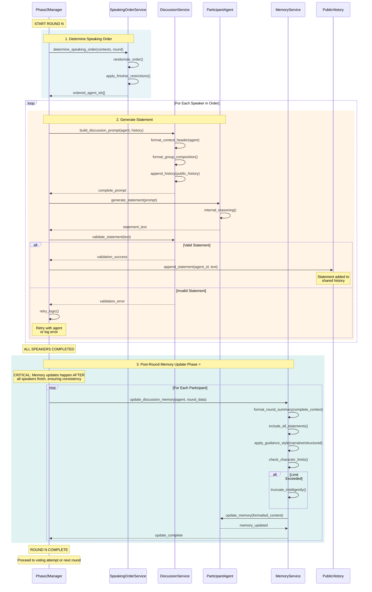

# Diagram 05: Discussion Round Detailed Sequence

**Purpose**: Service-level interactions during a single Phase 2 discussion round
**Audience**: Developers implementing discussion features, debugging
**Layer**: 2 - Detailed Service Interactions

---



---

## Phase Breakdown

### 1. Speaking Order Determination

**Service**: `SpeakingOrderService`

**Process**:
1. **Randomize**: Generate random speaking order for fairness
2. **Finisher Restrictions**: Limit agents who can speak last
   - Prevents same agent always finishing
   - Configurable max finishes per agent
3. **Return**: Ordered list of agent IDs

**Code**: `core/services/speaking_order_service.py:19-89`

---

### 2. Discussion Phase (For Each Speaker)

**Service**: `DiscussionService`

#### 2a. Build Discussion Prompt

**Components**:
```
1. Context Header (agent-specific)
   - Agent's income class assignment
   - Phase 1 results (final ranking, application outcomes)
   - Current round number
   - Group size and composition

2. Public Discussion History
   - All previous statements (chronological)
   - Speaker identification
   - Formatted for readability

3. Discussion Guidelines
   - Encourage constructive dialogue
   - Respect diverse perspectives
   - Work toward consensus

4. Current Round Prompt
   - "What principle do you support?"
   - "Why is this fair?"
   - Localized to agent's language
```

**Code**: `core/services/discussion_service.py:41-177`

#### 2b. Agent Statement Generation

**Process**:
1. Agent receives complete prompt
2. Internal reasoning (if enabled)
3. Generate discussion statement
4. Return statement text

**Validation Requirements**:
- Minimum length (default: 10 characters)
- Maximum length (configurable)
- Non-empty content
- Timeout compliance (default: 60s)

#### 2c. Statement Validation

**Service**: `DiscussionService.validate_statement()`

**Checks**:
- Length validation
- Content validation (not just whitespace)
- Format compliance

**Retry Logic**:
- On failure: retry_attempts (default: 3)
- Clarify requirements in retry prompt
- Log persistent failures

**Code**: `core/services/discussion_service.py:180-235`

#### 2d. Append to Public History

**Data Structure**:
```python
{
    "agent_id": "agent_1",
    "statement": "I support floor constraint...",
    "round": 2,
    "timestamp": "2025-01-14T10:30:00"
}
```

**History Management**:
- Append-only for transparency
- Configurable max length (default: 100,000 characters)
- Truncation preserves recent statements

---

### 3. Post-Round Memory Update Phase ⭐

**CRITICAL TIMING**: After ALL speakers complete, before voting

**Service**: `MemoryService`

#### Why Post-Round?

**Problem**: If memory updates happen during speaking phase, agents have inconsistent views:
- Agent 1 speaks → sees empty history
- Agent 2 speaks → sees only Agent 1's statement
- Agent 3 speaks → sees Agents 1 & 2's statements

**Solution**: Defer memory updates until round completes:
- ALL agents see complete round
- Symmetric information state
- Fair voting decisions

#### Memory Update Process

For each participant:

1. **Assemble Complete Context**
   ```
   Round N Summary:
   - Speaking order: [agent_ids]
   - All statements in chronological order
   - Complete discussion history
   - Round outcome
   ```

2. **Format Based on Guidance Style**
   - **Narrative**: Story-like summary, natural language
   - **Structured**: Bullet points, clear sections

3. **Apply Character Limits**
   - Check memory size against limit (default: 100,000 chars)
   - If exceeded: intelligent truncation
     - Preserve recent content (most relevant)
     - Keep critical context (Phase 1 results, current round)
     - Summarize or remove older statements

4. **Update Agent Memory**
   - Add formatted content to agent's memory state
   - Ensure consistency across all agents

**Code**: `core/services/memory_service.py:51-183`, `core/phase2_manager.py:873-900`

---

## Service Interactions Summary

```
Phase2Manager (Orchestrator)
    ↓
SpeakingOrderService → Determine Order
    ↓
FOR EACH SPEAKER:
    DiscussionService → Build Prompt
    ParticipantAgent → Generate Statement
    DiscussionService → Validate Statement
    PublicHistory → Append Statement
    ↓
POST-ROUND:
    FOR EACH PARTICIPANT:
        MemoryService → Update Memory (Complete Round)
```

---

## Configuration Points

### Phase2Settings

**Discussion Configuration**:
- `public_history_max_length`: Max characters in shared history (default: 100,000)
- `statement_min_length`: Minimum statement length (default: 10)
- `statement_timeout`: Max time for statement generation (default: 60s)
- `statement_retry_attempts`: Max retries for invalid statements (default: 3)

**Memory Configuration**:
- `memory_guidance_style`: "narrative" or "structured"
- `memory_compression_threshold`: Trigger truncation (default: 0.9 of limit)
- `include_internal_reasoning`: Include agent reasoning in memory (default: false)

**Code**: `config/phase2_settings.py`

---

## Error Handling

### Statement Generation Failures

1. **Timeout**: Agent exceeds time limit
   - Retry with shorter timeout
   - Log timeout occurrence
   - Fallback: skip speaker after max retries

2. **Validation Failure**: Statement too short or malformed
   - Retry with clarified requirements
   - Provide format examples
   - Fallback: log error, skip speaker

3. **API Errors**: Network or provider issues
   - Retry with exponential backoff
   - Log error details
   - Fallback: mark agent as temporarily unavailable

### Memory Update Failures

- **Rare**: Memory service robust to content variations
- **Fallback**: Log error, continue with partial update
- **Recovery**: Next round update includes missing content

---

## Performance Characteristics

### Timing Per Round
- **Speaking Order**: <1ms (deterministic)
- **Statement Generation**: ~5-30s per agent (API dependent)
- **Validation**: <1ms per statement
- **Memory Updates**: ~1-5s total (parallel possible)

**Total Round Time**: ~30-180 seconds for 5 agents

### API Calls Per Round
- **Statement Generation**: N calls (N = number of agents)
- **No memory update calls**: Memory updates use in-memory operations only

---

## Data Flow

```
Round Start
    ↓
Speaking Order [agent_1, agent_3, agent_2, agent_4, agent_5]
    ↓
agent_1: Generate statement → Validate → Append to history
agent_3: Generate statement → Validate → Append to history
agent_2: Generate statement → Validate → Append to history
agent_4: Generate statement → Validate → Append to history
agent_5: Generate statement → Validate → Append to history
    ↓
⭐ POST-ROUND MEMORY UPDATE PHASE ⭐
    ↓
agent_1: Update memory (complete round)
agent_2: Update memory (complete round)
agent_3: Update memory (complete round)
agent_4: Update memory (complete round)
agent_5: Update memory (complete round)
    ↓
Round Complete → Proceed to Voting Attempt
```

---

## Related Files

- `core/phase2_manager.py` - Discussion orchestration (lines 677-900)
- `core/services/speaking_order_service.py` - Turn management
- `core/services/discussion_service.py` - Prompt building, validation
- `core/services/memory_service.py` - Memory updates
- `config/phase2_settings.py` - Configuration

---

## Next Steps

- **Voting Details**: [06_voting_detailed.md](./06_voting_detailed.md)
- **High-Level Process**: [03_phase2_process_flow.md](./03_phase2_process_flow.md)
- **Data Models**: [07_data_models.md](./07_data_models.md)
