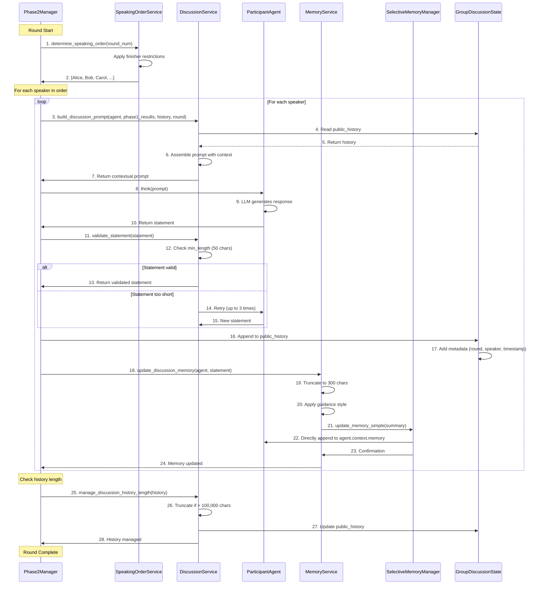

# Diagram 3.1: Phase 2 Discussion Round Sequence

**Purpose**: Show detailed interaction sequence for one complete discussion round

**Target Audience**: Developers implementing features or debugging Phase 2

**Complexity Level**: ⭐⭐⭐ Detailed (15-20 interactions)

---

## Complete Discussion Round Sequence



---

## Detailed Breakdown

### Phase 1: Speaking Order Determination

**Step 1-2: SpeakingOrderService.determine_speaking_order()**

```python
def determine_speaking_order(
    participants: List[ParticipantAgent],
    randomize_finisher: bool = False
) -> Dict[int, List[ParticipantAgent]]:
    """
    Determines speaking order with optional finisher restrictions.

    If randomize_finisher=True:
    - Randomly shuffle all participants (seeded RNG)
    - Check if last speaker spoke last in previous round
    - If yes, swap last speaker with random earlier speaker
    - Record finisher for next round's check
    """
```

**Why finisher restrictions?**
- Prevents same agent from always having "last word"
- Encourages diverse perspectives at round conclusion
- Configurable via `Phase2Settings.finisher_restrictions_active`

---

### Phase 2: Discussion Prompt Building

**Step 3-7: DiscussionService.build_discussion_prompt()**

The prompt includes:

1. **Agent's Phase 1 Results**:
   - Initial ranking: "You initially ranked Floor=1, Average=2, ..."
   - Post-explanation ranking: "After learning, you ranked Floor=1, ..."
   - Application results: "You chose distribution 2 in round 1, ..."

2. **Discussion History Summary**:
   - Truncated to 300 chars per statement
   - Recent statements preserved, oldest removed first
   - Format: "Round 1: Alice said '...', Bob said '...'"

3. **Current Round Context**:
   - Round number (e.g., "This is Round 3 of 10")
   - Consensus status (e.g., "No consensus yet")

4. **System Instructions**:
   - Tone: Professional, respectful
   - Length: 50-200 words recommended
   - Content: Focus on reasoning, not repetition

**Multilingual Support**:
```python
# English
prompt_key = "discussion_round_X_start"

# Spanish
"Ronda {round}: {agent_name}, comparte tus pensamientos..."

# Mandarin
"第{round}轮：{agent_name}，请分享您的想法..."
```

---

### Phase 3: Statement Generation and Validation

**Step 8-15: Agent thinks and validates**

**Agent.think() flow**:
1. Receives contextual prompt
2. Calls LLM API (OpenAI, Gemini, or OpenRouter)
3. Returns statement string

**DiscussionService.validate_statement() flow**:
```python
def validate_statement(
    statement: str,
    min_length: int = 50,
    max_retries: int = 3
) -> str:
    attempt = 0
    while attempt < max_retries:
        if len(statement) >= min_length:
            return statement
        else:
            # Too short, request longer statement
            statement = agent.think(
                "Your statement was too short. Please provide more detail."
            )
            attempt += 1

    raise ValidationError("Max retries exceeded")
```

**Why validation?**
- Ensures substantive contributions
- Prevents single-word or empty responses
- Configurable threshold (default 50 characters)

---

### Phase 4: Public History Update

**Step 16-17: Append to GroupDiscussionState**

Statement metadata:
```python
history_entry = {
    "round": 3,
    "speaker": "Alice",
    "statement": "I believe we should maximize the floor because...",
    "timestamp": "2025-01-15T10:35:42",
    "character_count": 87
}
```

**GroupDiscussionState.public_history** is shared among:
- All agents (for reading context)
- DiscussionService (for building prompts)
- Phase2Results (for final transcript export)

---

### Phase 5: Memory Update

**Step 18-24: MemoryService.update_discussion_memory()**

**Two-stage memory update**:

1. **Truncation Stage** (MemoryService):
   ```python
   # Original statement (150 chars)
   "I believe we should maximize the floor because it protects the most vulnerable members of society, and this aligns with Rawlsian principles of justice."

   # Truncated (300 char max, already under limit)
   "I believe we should maximize the floor because it protects the most vulnerable members of society, and this aligns with Rawlsian principles of justice."
   ```

2. **Guidance Style Application** (MemoryService):
   ```python
   # Narrative style
   "Alice discussed maximizing the floor to protect vulnerable members, citing Rawlsian principles."

   # Structured style
   "Speaker: Alice | Topic: Floor maximization | Key Point: Protecting vulnerable | Theory: Rawlsian"
   ```

3. **Simple Memory Update** (SelectiveMemoryManager):
   ```python
   # Direct append (no LLM call)
   agent.context.memory += "\n" + truncated_summary
   ```

**Why simple update for discussion?**
- Fast (~1 second vs ~10 seconds for complex update)
- Discussion statements don't require deep integration
- Agent already participated in the discussion (no surprises)

---

### Phase 6: History Management

**Step 25-28: DiscussionService.manage_discussion_history_length()**

**Truncation algorithm**:
```python
def manage_discussion_history_length(
    history: List[Dict],
    max_length: int = 100_000
) -> List[Dict]:
    total_chars = sum(len(entry["statement"]) for entry in history)

    while total_chars > max_length:
        # Remove oldest entry (first in list)
        oldest = history.pop(0)
        total_chars -= len(oldest["statement"])

    return history
```

**Why truncate history?**
- Prevents context window overflow (LLM limits)
- Preserves recent context (most relevant for decisions)
- Configurable via `Phase2Settings.public_history_max_length`

**Default: 100,000 characters** ≈ 25,000 words ≈ 50-100 statements

---

## Performance Characteristics

**Per speaker timing** (8 agents):
- Speaking order determination: < 0.1 seconds (once per round)
- Prompt building: ~0.5 seconds
- Agent.think() LLM call: ~20-30 seconds (largest bottleneck)
- Statement validation: < 0.1 seconds (unless retries)
- Memory update (simple): ~1 second
- History management: < 0.1 seconds

**Total per round**: ~2-4 minutes (8 speakers × 20-30 seconds each)

---

## Error Handling

### Validation Failures
**Scenario**: Agent provides statements < 50 characters repeatedly

**Recovery**:
1. Retry up to 3 times with clarifying prompt
2. If still fails, raise ValidationError
3. Phase2Manager catches error and logs
4. Round continues with best-effort statement

### LLM Timeout
**Scenario**: Agent.think() exceeds timeout (30 seconds default)

**Recovery**:
1. Timeout raises TimeoutError
2. Retry with exponential backoff (45s, 67.5s)
3. If max retries exceeded, raise to manager
4. Manager can skip speaker or abort round

### Memory Overflow
**Scenario**: Agent context exceeds token limits

**Recovery**:
1. SelectiveMemoryManager detects overflow
2. Triggers emergency truncation (most aggressive)
3. Removes oldest 50% of memory
4. Logs warning for debugging

---

## Configuration

**Relevant Phase2Settings**:
```yaml
phase2_settings:
  # Discussion
  statement_min_length: 50                  # Validation threshold
  statement_validation_retries: 3           # Max retry attempts
  public_history_max_length: 100000         # Character limit

  # Memory
  memory_management:
    guidance_style: "narrative"             # or "structured"
    statement_max_length: 300               # Truncation limit
    enable_truncation: true

  # Speaking order
  finisher_restrictions_active: true
  use_fixed_speaking_order: false
```

---

## Testing

**Unit Tests** (Fast, Protocol-Based):
```python
# tests/unit/test_fast_data_flows.py
def test_discussion_service_builds_prompt():
    mock_agent = create_mock_agent("Alice")
    discussion_service = DiscussionService()

    prompt = discussion_service.build_discussion_prompt(
        agent=mock_agent,
        phase1_results=mock_phase1_results,
        history=mock_history,
        round_num=3
    )

    assert "Round 3" in prompt
    assert "Alice" in prompt
    # Executes in < 0.001 seconds
```

**Component Tests** (Real LLM Calls):
```python
# tests/component/test_discussion_service.py
@pytest.mark.live
async def test_discussion_service_validates_statements():
    agent = ParticipantAgent(model="gpt-4o-mini")
    discussion_service = DiscussionService()

    statement = await agent.think("Share your thoughts on Floor principle")
    validated = discussion_service.validate_statement(statement)

    assert len(validated) >= 50
    # Executes in ~20 seconds
```

---

## Related Files

**Core Implementation**:
- `core/phase2_manager.py:150-220` - Discussion round loop
- `core/services/discussion_service.py` - Prompt building and validation
- `core/services/memory_service.py` - Memory update coordination
- `utils/selective_memory_manager.py` - Simple memory updates

**Data Models**:
- `models/discussion_state.py` - GroupDiscussionState
- `models/participant_context.py` - ParticipantContext

**Configuration**:
- `config/phase2_settings.py` - Phase2Settings.discussion subsection

---

## Next Steps

- **For voting process**: See Diagram 3.2 (Voting Process Flow)
- **For memory details**: See Diagram 3.3 (Memory Management Flow)
- **For complete Phase 2 flow**: See TECHNICAL_README.md Section 2.2
