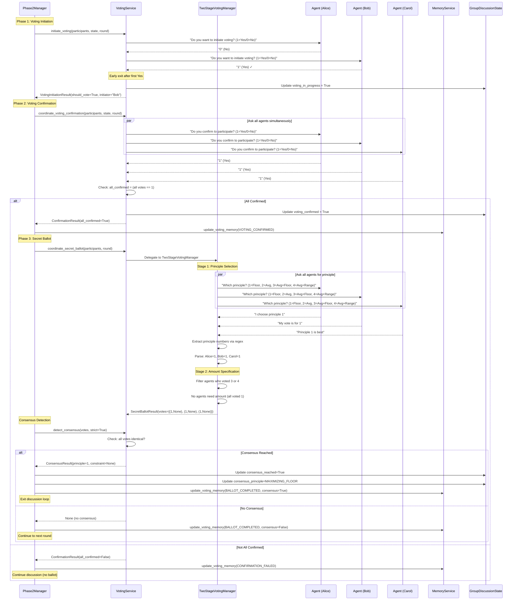

# Diagram 06: Voting Process Detailed Sequence

**Purpose**: Service-level interactions during the complete voting workflow
**Audience**: Developers implementing voting features, debugging
**Layer**: 2 - Detailed Service Interactions

---



---

## Phase Breakdown

### Phase 1: Voting Initiation (End-of-Round)

**When**: After discussion phase, every round

**Service**: `VotingService.initiate_voting()`

**Process**:
1. **Sequential Check**: Ask each agent in order: "Do you want to initiate voting? (1=Yes/0=No)"
2. **Numerical Response**: Extract 1 (Yes) or 0 (No) from agent response
3. **Early Exit**: Stop checking after first "Yes" response
4. **Update State**: Mark voting as in progress

**Why Sequential?**
- Prevents groupthink (agents vote independently)
- Respects turn order fairness
- Efficient (stops after first Yes)

**Code**: `core/services/voting_service.py:41-95`

---

### Phase 2: Voting Confirmation (Unanimous Required)

**When**: Immediately after voting initiation (if initiated)

**Service**: `VotingService.coordinate_voting_confirmation()`

**Process**:
1. **Parallel Check**: Ask all agents simultaneously for efficiency
2. **Prompt**: "Do you confirm to participate in voting? (1=Yes/0=No)"
3. **Unanimous Requirement**: ALL must respond with 1 (Yes)
4. **Failure Handling**: If ANY agent says 0 (No), voting aborted

**Why Unanimous?**
- Ensures voluntary participation (ethical requirement)
- Prevents coercion or pressure
- Aligns with consensus-based decision model

**Code**: `core/services/voting_service.py:98-152`

---

### Phase 3: Secret Ballot (Two-Stage Voting)

**When**: After all agents confirm participation

**Service**: `TwoStageVotingManager`

#### Stage 1: Principle Selection (Deterministic Numerical Extraction)

**Process**:
1. **Parallel Ballot**: All agents vote simultaneously
2. **Prompt**: "Which principle do you choose? (1=Floor, 2=Average, 3=Avg+Floor, 4=Avg+Range)"
3. **Regex Extraction**: Extract first digit 1-4 from response
4. **Fallback**: If regex fails, use keyword matching in agent's language

**Regex Pattern**:
```python
pattern = r'\b([1-4])\b'
match = re.search(pattern, response)
```

**Example Responses**:
```
✅ "I vote for principle 1" → Extracted: 1
✅ "My choice is 3 (Avg+Floor)" → Extracted: 3
✅ "I choose the second option" → Extracted: 2
❌ "I prefer the floor principle" → Regex fails, fallback to keyword "floor" → 1
```

**Code**: `core/two_stage_voting_manager.py:45-120`

---

#### Stage 2: Amount Specification (For Principles 3 & 4 Only)

**Process**:
1. **Filter Participants**: Only those who voted 3 (Floor) or 4 (Range)
2. **Prompt**: "What is your constraint amount? (positive integer)"
3. **Regex Extraction**: Extract first positive integer from response
4. **Cultural Adaptation**: Handle different number formats

**Number Parsing Examples**:
```python
# English
"15000" → 15000
"15,000" → 15000

# Spanish
"15.000" → 15000  (period as thousands separator)
"15,000" → 15000

# Mandarin
"15000" → 15000
"1万5千" → 15000  (using Chinese number characters)
```

**Code**: `core/two_stage_voting_manager.py:123-185`, `utils/cultural_adaptation.py`

---

### Phase 4: Consensus Detection

**Definition**: All agents must vote for the SAME principle AND the SAME constraint amount.

**Service**: `VotingService.detect_consensus()`

**Algorithm**:
```python
def detect_consensus(
    votes: List[Tuple[int, Optional[int]]],
    strict: bool = True
) -> Optional[ConsensusResult]:
    """
    Detect unanimous consensus.

    Returns:
        ConsensusResult if all votes identical, None otherwise
    """
    if not votes:
        return None

    first_vote = votes[0]

    # All votes must be identical
    if all(vote == first_vote for vote in votes):
        principle_num, constraint = first_vote
        return ConsensusResult(
            principle=PRINCIPLE_MAPPING[principle_num],
            constraint_amount=constraint
        )

    return None
```

**Consensus Examples**:

| Votes | Consensus? | Explanation |
|-------|-----------|-------------|
| [(1, None), (1, None), (1, None)] | ✅ Yes | All voted principle 1 |
| [(3, 15000), (3, 15000), (3, 15000)] | ✅ Yes | All voted principle 3 with $15k floor |
| [(1, None), (2, None), (1, None)] | ❌ No | Mixed votes (1 and 2) |
| [(3, 15000), (3, 20000), (3, 15000)] | ❌ No | Same principle, different amounts |

**Code**: `core/services/voting_service.py:230-265`

---

## Timeout and Retry Strategy

### Exponential Backoff Retry

**Configuration** (from `Phase2Settings`):
```yaml
voting_initiation_timeout: 30           # Base timeout (seconds)
voting_confirmation_timeout: 30         # Confirmation timeout
voting_secret_ballot_timeout: 45        # Longer for ballot
voting_retry_limit: 3                   # Max attempts
voting_retry_backoff_factor: 1.5        # Exponential multiplier
```

**Retry Algorithm**:
```python
async def _invoke_with_retry(
    agent: ParticipantAgent,
    prompt: str,
    base_timeout: int = 30,
    max_retries: int = 3
) -> str:
    """Execute with exponential backoff retry."""
    for attempt in range(max_retries):
        timeout = base_timeout * (1.5 ** attempt)

        try:
            response = await asyncio.wait_for(
                agent.think(prompt),
                timeout=timeout
            )
            return response

        except asyncio.TimeoutError:
            if attempt < max_retries - 1:
                await asyncio.sleep(1)
                continue
            else:
                raise
```

**Timeout Schedule**:
- Attempt 1: 30 seconds
- Attempt 2: 45 seconds (30 × 1.5)
- Attempt 3: 67.5 seconds (45 × 1.5)
- **Total max**: 142.5 seconds for 3 attempts

---

## Memory Updates (Post-Voting)

**Service**: `MemoryService`

### Three Memory Update Events

**1. VOTING_INITIATED**:
```python
memory_service.update_voting_memory(
    agent=alice,
    event_type=VotingEvent.VOTING_INITIATED,
    round_num=7
)
# Update: "Group is considering formal voting in round 7."
```

**2. VOTING_CONFIRMED**:
```python
memory_service.update_voting_memory(
    agent=alice,
    event_type=VotingEvent.VOTING_CONFIRMED,
    round_num=7
)
# Update: "All agents confirmed participation in voting (round 7)."
```

**3. BALLOT_COMPLETED** (with consensus outcome):
```python
memory_service.update_voting_memory(
    agent=alice,
    event_type=VotingEvent.BALLOT_COMPLETED,
    round_num=7,
    vote_choice=(1, None),
    consensus_reached=True
)
# Complex update (LLM-mediated):
# "You voted for principle 1 (Maximizing Floor). The group reached unanimous
#  consensus on this principle. This means your preferred approach will be
#  implemented, maximizing the income of the worst-off members."
```

**Code**: `core/services/memory_service.py:186-295`

---

## Error Handling

### Parsing Failures

**Scenario**: Regex fails to extract principle number

**Recovery Strategy**:
1. **Attempt 1**: Try regex extraction
2. **Attempt 2**: Try keyword matching in agent's language
3. **Attempt 3**: Request clarification ("Please respond with 1, 2, 3, or 4")
4. **After 3 attempts**: Raise ParsingError, log for manual review

**Keyword Fallback**:
```python
# English keywords
"floor" → 1
"average" or "mean" → 2
"floor constraint" → 3
"range constraint" → 4

# Spanish keywords
"piso" or "mínimo" → 1
"promedio" or "media" → 2

# Mandarin keywords
"最低" or "保底" → 1
"平均" → 2
```

**Code**: `core/principle_keywords.py`

---

### Confirmation Failure

**Scenario**: Not all agents confirm participation

**Recovery**:
1. Abort voting (no secret ballot)
2. Update memory: "Voting confirmation failed"
3. Continue to next discussion round
4. No penalty or special handling

---

### Timeout During Ballot

**Scenario**: Agent doesn't respond within timeout

**Recovery**:
1. Retry with exponential backoff (up to 3 attempts)
2. If all retries fail: Mark agent vote as "timeout"
3. Consensus detection treats timeout as "no consensus"
4. Round continues (no blocking failure)

---

## Performance Characteristics

### Timing (per phase, 5 agents)

| Phase | Duration | Parallelization | Bottleneck |
|-------|----------|-----------------|------------|
| Initiation | 15-45 sec | Sequential (early exit) | LLM calls |
| Confirmation | 15-30 sec | Parallel | LLM calls |
| Ballot Stage 1 | 20-30 sec | Parallel | LLM calls |
| Ballot Stage 2 | 15-25 sec | Parallel (filtered) | LLM calls |
| Consensus | < 0.1 sec | Synchronous | Computation |
| **Total** | **1.5-2.5 min** | Mixed | LLM latency |

### API Calls Per Voting Attempt

- **Initiation**: 1-N calls (sequential, early exit)
- **Confirmation**: N calls (parallel)
- **Stage 1 ballot**: N calls (parallel)
- **Stage 2 ballot**: 0-N calls (filtered, only principles 3 & 4)

**Total**: ~2N to 3N API calls per voting attempt (N = number of agents)

---

## Data Flow Summary

```
End of Round
    ↓
Phase 1: Initiation (Sequential)
    Agent 1: No
    Agent 2: Yes ← Stop here
    ↓
Phase 2: Confirmation (Parallel)
    All agents: 1 (Yes) → Proceed
    ↓
Phase 3: Secret Ballot
    Stage 1 (Parallel): All vote for principle 1-4
    Stage 2 (Filtered): Agents with 3 or 4 specify amount
    ↓
Phase 4: Consensus Detection
    All votes identical? → Consensus
    Any difference? → No consensus, continue discussion
    ↓
Memory Updates → All agents receive outcome
```

---

## Configuration Points

### Phase2Settings

**Voting Configuration**:
```yaml
voting_initiation_timeout: 30           # Initiation check timeout
voting_confirmation_timeout: 30         # Confirmation phase timeout
voting_secret_ballot_timeout: 45        # Ballot timeout (longer)
voting_retry_limit: 3                   # Max retry attempts
voting_retry_backoff_factor: 1.5        # Exponential multiplier

# Two-stage voting
principle_extraction_retries: 3         # Max parsing retries
amount_extraction_retries: 3            # Max amount parsing retries
constraint_tolerance: 0.05              # Constraint comparison tolerance
```

**Code**: `config/phase2_settings.py`

---

## Related Files

**Core Implementation**:
- `core/services/voting_service.py` - Main voting orchestration
- `core/two_stage_voting_manager.py` - Ballot execution
- `core/principle_keywords.py` - Keyword fallback matching
- `utils/cultural_adaptation.py` - Multilingual number parsing

**Data Models**:
- `models/voting_types.py` - VotingInitiationResult, ConfirmationResult, SecretBallotResult, ConsensusResult

**Testing**:
- `tests/unit/test_fast_response_parsing.py` - Deterministic parsing tests (43 tests in 0.04s)
- `tests/component/test_voting_service.py` - End-to-end voting tests

---

## Next Steps

- **Discussion Details**: [05_discussion_round_detailed.md](./05_discussion_round_detailed.md)
- **Data Models**: [07_data_models.md](./07_data_models.md)
- **High-Level Process**: [03_phase2_process_flow.md](./03_phase2_process_flow.md)
