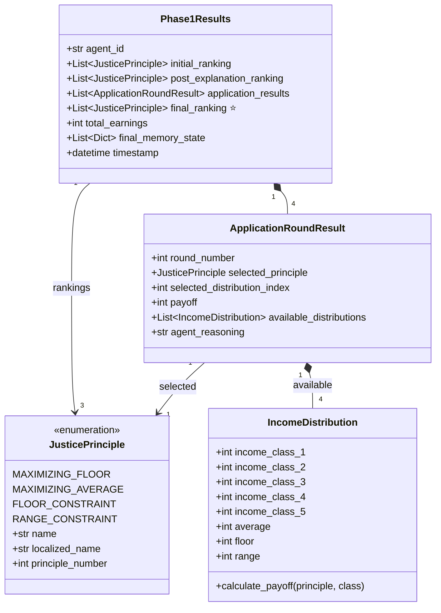
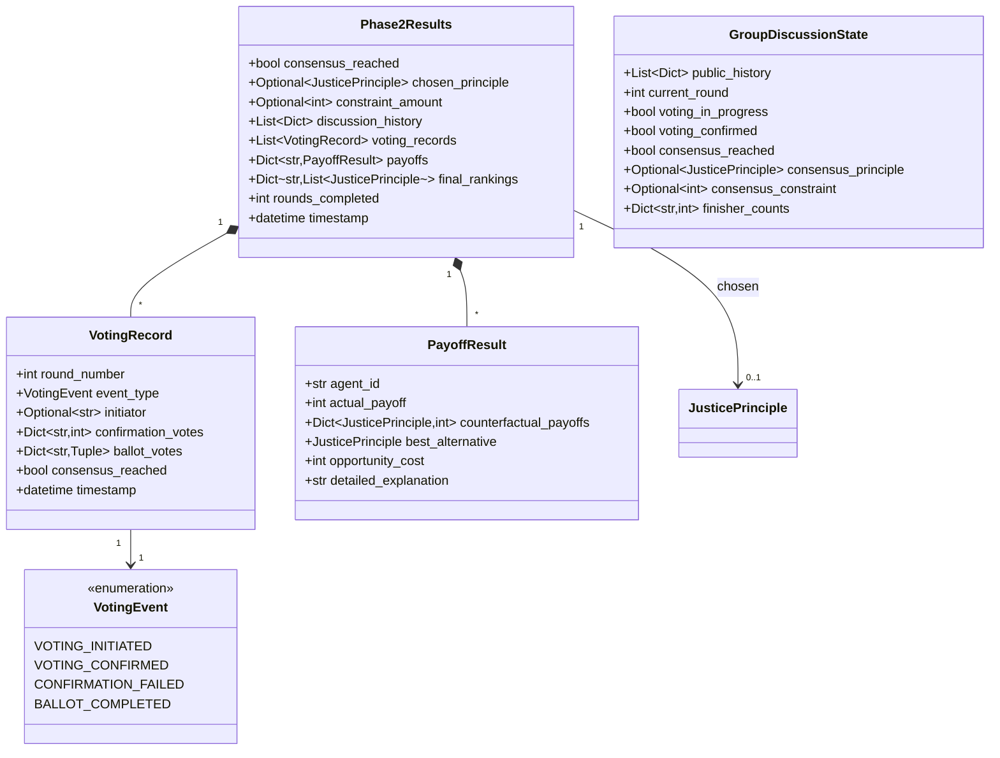
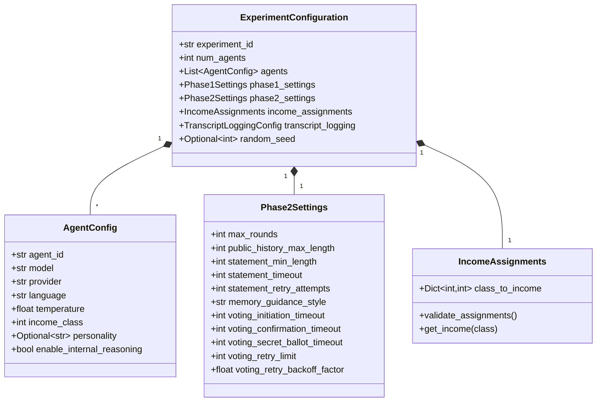
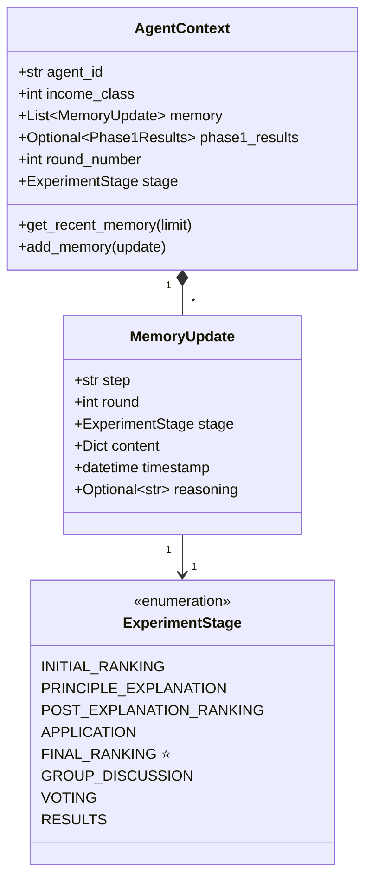

# Diagram 07: Core Data Models

**Purpose**: Key data structures used throughout the experiment framework
**Audience**: Developers implementing features, understanding data flow
**Layer**: 2 - Detailed Implementation Reference

---

## Phase 1 Data Models



---

## Phase 2 Data Models



---

## Configuration Models



---

## Memory Models



---

## Model Details

### Phase1Results ⭐ Updated

**Purpose**: Complete record of agent's Phase 1 experience

**Key Fields**:
- `initial_ranking`: Uninformed preferences (veil of ignorance)
- `post_explanation_ranking`: Preferences after learning
- `application_results`: 4 rounds of concrete choices and payoffs
- `final_ranking`: **Experience-based preferences after application** ⭐ (Previously missing from documentation)
- `total_earnings`: Accumulated payoffs from application rounds

**Usage**:
```python
phase1_results = await phase1_manager.run_phase1_for_agent(agent)

print(phase1_results.initial_ranking)           # [FLOOR, RANGE, AVERAGE, FLOOR_CONSTRAINT]
print(phase1_results.post_explanation_ranking)  # [FLOOR, FLOOR_CONSTRAINT, RANGE, AVERAGE]
print(phase1_results.final_ranking)             # [FLOOR_CONSTRAINT, FLOOR, RANGE, AVERAGE] ⭐
print(phase1_results.total_earnings)            # 45000
```

**Code**: `models/phase1_models.py`

---

### Phase2Results

**Purpose**: Complete record of group discussion and consensus process

**Key Fields**:
- `consensus_reached`: Whether unanimous agreement achieved
- `chosen_principle`: Principle selected by group (if consensus)
- `constraint_amount`: Floor/Range amount (for principles 3 & 4)
- `discussion_history`: Complete record of all statements
- `voting_records`: All voting attempts and outcomes
- `payoffs`: Actual and counterfactual payoffs for each agent
- `final_rankings`: Post-results preferences

**Usage**:
```python
phase2_results = await phase2_manager.run_group_discussion(contexts)

if phase2_results.consensus_reached:
    print(f"Consensus: {phase2_results.chosen_principle}")
    print(f"Rounds: {phase2_results.rounds_completed}")
    print(f"Payoffs: {phase2_results.payoffs}")
```

**Code**: `models/phase2_models.py`

---

### JusticePrinciple

**Purpose**: Represents the four distributive justice approaches

**Principles**:
1. **MAXIMIZING_FLOOR** (Principle 1): Maximize income of worst-off
2. **MAXIMIZING_AVERAGE** (Principle 2): Maximize average income
3. **FLOOR_CONSTRAINT** (Principle 3): Maximize average with minimum floor
4. **RANGE_CONSTRAINT** (Principle 4): Maximize average with maximum range

**Methods**:
- `get_localized_name(language)`: Return principle name in specified language
- `get_principle_number()`: Return principle number (1-4)

**Code**: `models/justice_principles.py`

---

### IncomeDistribution

**Purpose**: Represents a single income distribution scenario

**Key Fields**:
- 5 income classes (income_class_1 through income_class_5)
- Calculated properties: average, floor (minimum), range (max - min)

**Methods**:
```python
def calculate_payoff(
    principle: JusticePrinciple,
    agent_class: int
) -> int:
    """Calculate payoff for agent under given principle."""
```

**Usage**:
```python
dist = IncomeDistribution(
    income_class_1=10000,
    income_class_2=20000,
    income_class_3=30000,
    income_class_4=40000,
    income_class_5=50000
)

payoff = dist.calculate_payoff(
    principle=JusticePrinciple.MAXIMIZING_FLOOR,
    agent_class=1
)
```

**Code**: `models/income_models.py`

---

### VotingRecord

**Purpose**: Records a single voting attempt in Phase 2

**Tracks**:
- Initiation: Who initiated, responses from each agent
- Confirmation: All agents' confirmation votes (1=Yes, 0=No)
- Ballot: Secret ballot votes (principle + optional amount)
- Consensus: Whether unanimous agreement achieved

**Lifecycle**:
```python
record = VotingRecord(round_number=7)

# Initiation
record.event_type = VotingEvent.VOTING_INITIATED
record.initiator = "agent_2"

# Confirmation
record.event_type = VotingEvent.VOTING_CONFIRMED
record.confirmation_votes = {"agent_1": 1, "agent_2": 1, "agent_3": 1}

# Ballot
record.event_type = VotingEvent.BALLOT_COMPLETED
record.ballot_votes = {
    "agent_1": (1, None),
    "agent_2": (1, None),
    "agent_3": (1, None)
}
record.consensus_reached = True
```

**Code**: `models/voting_types.py`

---

### PayoffResult

**Purpose**: Records payoffs under chosen principle plus counterfactuals

**Key Fields**:
- `actual_payoff`: Payoff under consensus principle
- `counterfactual_payoffs`: Payoffs under all 4 principles
- `best_alternative`: Which principle would have been best for agent
- `opportunity_cost`: Difference between best alternative and actual

**Usage**:
```python
payoff_result = PayoffResult(
    agent_id="agent_1",
    actual_payoff=30000,  # Under FLOOR principle
    counterfactual_payoffs={
        FLOOR: 30000,
        AVERAGE: 25000,
        FLOOR_CONSTRAINT: 28000,
        RANGE_CONSTRAINT: 26000
    },
    best_alternative=FLOOR,
    opportunity_cost=0  # Best outcome achieved
)
```

**Code**: `models/payoff_models.py`

---

### GroupDiscussionState

**Purpose**: Maintains state during Phase 2 discussion

**Responsibilities**:
- Track public discussion history
- Manage speaking order (finisher counts)
- Coordinate voting state
- Store consensus outcome

**State Transitions**:
```
Initial State:
    voting_in_progress = False
    consensus_reached = False

→ Agent initiates voting:
    voting_in_progress = True

→ All agents confirm:
    voting_confirmed = True

→ Consensus reached:
    consensus_reached = True
    consensus_principle = <principle>
    consensus_constraint = <amount>
```

**Code**: `models/phase2_models.py`

---

### Phase2Settings

**Purpose**: Configurable behavior for Phase 2

**Key Configurations**:

**Discussion**:
- `max_rounds`: Maximum discussion rounds (default: 10-20)
- `public_history_max_length`: Character limit (default: 100,000)
- `statement_min_length`: Minimum statement length (default: 10)
- `statement_timeout`: Timeout for statement generation (default: 60s)
- `statement_retry_attempts`: Max retries (default: 3)

**Memory**:
- `memory_guidance_style`: "narrative" or "structured"
- `memory_compression_threshold`: Trigger truncation (default: 0.9)

**Voting**:
- `voting_initiation_timeout`: Initiation timeout (default: 30s)
- `voting_confirmation_timeout`: Confirmation timeout (default: 30s)
- `voting_secret_ballot_timeout`: Ballot timeout (default: 45s)
- `voting_retry_limit`: Max retries (default: 3)
- `voting_retry_backoff_factor`: Exponential multiplier (default: 1.5)

**Code**: `config/phase2_settings.py`

---

### AgentContext

**Purpose**: Maintains agent state throughout experiment

**Key Responsibilities**:
- Store agent identity and income class
- Manage memory updates
- Track current round and stage
- Provide access to Phase 1 results during Phase 2

**Memory Management**:
```python
context = AgentContext(agent_id="agent_1", income_class=3)

# Add memory
context.add_memory(MemoryUpdate(
    step="initial_ranking",
    round=0,
    stage=ExperimentStage.INITIAL_RANKING,
    content={"ranking": [1, 2, 3, 4]}
))

# Retrieve recent memory
recent = context.get_recent_memory(limit=1000)
```

**Code**: `models/context_models.py`

---

## Data Flow Across Phases

```mermaid
flowchart LR
    Config[ExperimentConfiguration] --> P1M[Phase1Manager]
    P1M --> P1R[Phase1Results]
    P1R --> AC[AgentContext]
    AC --> P2M[Phase2Manager]
    P2M --> GDS[GroupDiscussionState]
    GDS --> VR[VotingRecord]
    VR --> P2R[Phase2Results]
    P2R --> PR[PayoffResult]

    style P1R fill:#E8F4F8,stroke:#4A90E2
    style P2R fill:#F0F9F4,stroke:#7ED321
    style AC fill:#E0F2F1,stroke:#50E3C2
```



**Flow**:
1. **Configuration** → Experiment setup
2. **Phase1Manager** → Executes Phase 1 for all agents
3. **Phase1Results** → Includes final_ranking ⭐, stored in AgentContext
4. **AgentContext** → Carries state into Phase 2
5. **Phase2Manager** → Orchestrates group discussion
6. **GroupDiscussionState** → Tracks discussion progress
7. **VotingRecord** → Records voting attempts
8. **Phase2Results** → Consensus outcome
9. **PayoffResult** → Final payoffs and counterfactuals

---

## Related Files

**Data Models**:
- `models/phase1_models.py` - Phase1Results, ApplicationRoundResult
- `models/phase2_models.py` - Phase2Results, GroupDiscussionState
- `models/justice_principles.py` - JusticePrinciple enumeration
- `models/income_models.py` - IncomeDistribution
- `models/voting_types.py` - VotingRecord, VotingEvent
- `models/payoff_models.py` - PayoffResult
- `models/context_models.py` - AgentContext, MemoryUpdate
- `config/models.py` - ExperimentConfiguration, AgentConfig
- `config/phase2_settings.py` - Phase2Settings

---

## Next Steps

- **Phase 1 Process**: [02_phase1_process_flow.md](./02_phase1_process_flow.md)
- **Phase 2 Process**: [03_phase2_process_flow.md](./03_phase2_process_flow.md)
- **Service Details**: [04_phase1_service_sequence.md](./04_phase1_service_sequence.md), [05_discussion_round_detailed.md](./05_discussion_round_detailed.md)
