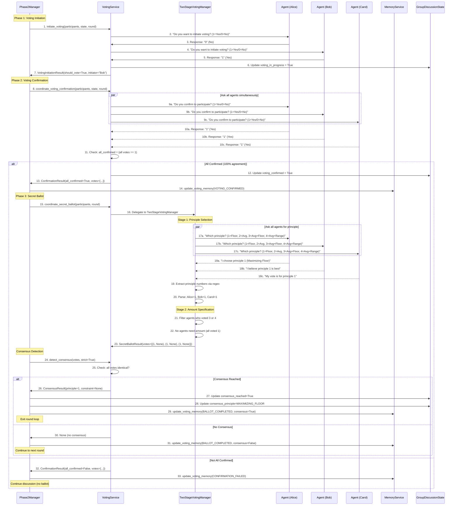

# Diagram 3.2: Voting Process Flow

**Purpose**: Show the complete voting workflow from initiation through consensus detection

**Target Audience**: Developers implementing or debugging voting logic

**Complexity Level**: ⭐⭐⭐ Detailed (20-25 interactions)

---

## Complete Voting Sequence



---

## Phase Breakdown

### Phase 1: Voting Initiation (End-of-Round Check)

**When**: After discussion stage, every round

**Process**:
1. **Sequential Check**: Ask each agent in order: "Do you want to initiate voting?"
2. **Numerical Response**: Agent responds with 1 (Yes) or 0 (No)
3. **Early Exit**: Stop checking after first "Yes" response
4. **Final Round Override**: If round equals max_rounds, automatically initiate

**Code**:
```python
async def initiate_voting(
    self,
    participants: List[ParticipantAgent],
    discussion_state: GroupDiscussionState,
    round_num: int,
    timeout: int = 30
) -> VotingInitiationResult:
    for agent in participants:
        response = await agent.think(
            self._build_initiation_prompt(round_num)
        )
        vote = self._extract_numerical_vote(response)  # 1 or 0

        if vote == 1:
            return VotingInitiationResult(
                should_vote=True,
                initiator=agent.name
            )

    return VotingInitiationResult(should_vote=False, initiator=None)
```

**Why sequential?**
- Prevents groupthink (agents vote independently)
- Respects turn order (fairness)
- Efficient (stops after first Yes)

---

### Phase 2: Voting Confirmation (Unanimous Agreement Required)

**When**: Immediately after voting initiation (if initiated)

**Process**:
1. **Parallel Check**: Ask all agents simultaneously (efficiency)
2. **Unanimous Requirement**: All must respond with 1 (Yes)
3. **Failure Handling**: If any agent says 0 (No), voting aborted

**Code**:
```python
async def coordinate_voting_confirmation(
    self,
    participants: List[ParticipantAgent],
    discussion_state: GroupDiscussionState,
    round_num: int,
    timeout: int = 30
) -> ConfirmationResult:
    # Parallel execution using asyncio.gather
    tasks = [
        self._get_confirmation(agent, round_num, timeout)
        for agent in participants
    ]
    responses = await asyncio.gather(*tasks)

    votes = {}
    for agent, response in zip(participants, responses):
        vote = self._extract_numerical_vote(response)
        votes[agent.name] = vote

    all_confirmed = all(vote == 1 for vote in votes.values())

    return ConfirmationResult(
        all_confirmed=all_confirmed,
        votes=votes
    )
```

**Why unanimous?**
- Ensures voluntary participation (ethical requirement)
- Prevents coercion or pressure
- Aligns with consensus-based decision model

---

### Phase 3: Secret Ballot (Two-Stage Voting)

**When**: After all agents confirm participation

**Stage 1: Principle Selection** (Deterministic Numerical Extraction)

**Process**:
1. **Parallel Ballot**: All agents vote simultaneously
2. **Prompt**: "Which principle? (1=Floor, 2=Average, 3=Avg+Floor, 4=Avg+Range)"
3. **Regex Extraction**: Extract first digit 1-4 from response
4. **Fallback**: If regex fails, use keyword matching in agent's language

**Regex Pattern**:
```python
import re

def _extract_principle_number(response: str) -> Optional[int]:
    """Extract principle number 1-4 from response."""
    # Pattern: digit 1-4 (possibly surrounded by text)
    pattern = r'\b([1-4])\b'
    match = re.search(pattern, response)

    if match:
        return int(match.group(1))

    # Fallback: keyword matching
    return _match_principle_from_keywords(response, language)
```

**Example Responses**:
```
✅ "I vote for principle 1" → Extracted: 1
✅ "My choice is 3 (Avg+Floor)" → Extracted: 3
✅ "I choose the second option" → Extracted: 2
❌ "I prefer the floor principle" → Regex fails, fallback to keyword "floor" → 1
```

**Stage 2: Amount Specification** (For Principles 3 & 4 Only)

**Process**:
1. **Filter Participants**: Only those who voted 3 or 4
2. **Prompt**: "What is your constraint amount? (positive integer)"
3. **Regex Extraction**: Extract first positive integer from response
4. **Cultural Adaptation**: Handle different number formats (English, Spanish, Mandarin)

**Number Parsing Examples**:
```python
# English
"15000" → 15000
"15,000" → 15000

# Spanish
"15.000" → 15000  (period as thousands separator)
"15,000" → 15000  (comma)

# Mandarin
"15000" → 15000
"1万5千" → 15000  (using Chinese number characters)
```

**Code**:
```python
def _extract_amount(response: str, language: str) -> Optional[int]:
    """Extract positive integer with cultural number format support."""
    # Try direct integer extraction first
    pattern = r'\b(\d{1,3}(?:[,\.]\d{3})*)\b'
    match = re.search(pattern, response)

    if match:
        amount_str = match.group(1)
        # Cultural adaptation: remove separators
        amount_str = amount_str.replace(',', '').replace('.', '')
        return int(amount_str)

    # Fallback: cultural number parser
    return parse_cultural_number(response, language)
```

---

### Phase 4: Consensus Detection

**Definition**: All agents must vote for the SAME principle AND the SAME constraint amount.

**Algorithm**:
```python
def detect_consensus(
    self,
    votes: List[Tuple[int, Optional[int]]],
    strict: bool = True
) -> Optional[ConsensusResult]:
    """
    Detect unanimous consensus.

    Args:
        votes: List of (principle_num, constraint_amount) tuples
        strict: Require 100% agreement (always True in current impl)

    Returns:
        ConsensusResult if consensus reached, None otherwise
    """
    if not votes:
        return None

    first_vote = votes[0]

    if strict:
        # All votes must be identical
        if all(vote == first_vote for vote in votes):
            principle_num, constraint = first_vote
            return ConsensusResult(
                principle=PRINCIPLE_MAPPING[principle_num],
                constraint_amount=constraint
            )

    return None
```

**Consensus Examples**:

| Votes | Consensus? | Explanation |
|-------|-----------|-------------|
| [(1, None), (1, None), (1, None)] | ✅ Yes | All voted principle 1 |
| [(3, 15000), (3, 15000), (3, 15000)] | ✅ Yes | All voted principle 3 with $15k floor |
| [(1, None), (2, None), (1, None)] | ❌ No | Mixed votes (1 and 2) |
| [(3, 15000), (3, 20000), (3, 15000)] | ❌ No | Same principle, different amounts |
| [(1, None), (1, None), (3, 15000)] | ❌ No | Different principles |

---

## Timeout and Retry Strategy

### Exponential Backoff Retry

**Configuration**:
```yaml
voting_confirmation_timeout: 30      # Base timeout (seconds)
voting_secret_ballot_timeout: 45     # Longer for ballot
voting_retry_limit: 3                # Max attempts
voting_retry_backoff_factor: 1.5     # Exponential multiplier
```

**Retry Algorithm**:
```python
async def _invoke_with_retry(
    self,
    agent: ParticipantAgent,
    prompt: str,
    base_timeout: int = 30,
    max_retries: int = 3
) -> str:
    """Execute with exponential backoff retry."""
    for attempt in range(max_retries):
        timeout = base_timeout * (1.5 ** attempt)  # Exponential backoff

        try:
            response = await asyncio.wait_for(
                agent.think(prompt),
                timeout=timeout
            )
            return response

        except asyncio.TimeoutError:
            if attempt < max_retries - 1:
                await asyncio.sleep(1)  # Brief pause before retry
                continue
            else:
                raise  # Final attempt failed
```

**Timeout Schedule**:
- Attempt 1: 30 seconds
- Attempt 2: 45 seconds (30 × 1.5)
- Attempt 3: 67.5 seconds (45 × 1.5)
- **Total max**: 142.5 seconds for 3 attempts

---

## Memory Updates (Post-Voting)

### Three Memory Update Events

**1. VOTING_INITIATED**:
```python
memory_service.update_voting_memory(
    agent=alice,
    event_type=VotingEvent.VOTING_INITIATED,
    round_num=7
)
# Update: "Group is considering formal voting in round 7."
```

**2. VOTING_CONFIRMED**:
```python
memory_service.update_voting_memory(
    agent=alice,
    event_type=VotingEvent.VOTING_CONFIRMED,
    round_num=7
)
# Update: "All agents confirmed participation in voting (round 7)."
```

**3. BALLOT_COMPLETED** (with consensus outcome):
```python
memory_service.update_voting_memory(
    agent=alice,
    event_type=VotingEvent.BALLOT_COMPLETED,
    round_num=7,
    vote_choice=(1, None),
    consensus_reached=True
)
# Complex update (LLM-mediated):
# "You voted for principle 1 (Maximizing Floor). The group reached unanimous
#  consensus on this principle. This means your preferred approach will be
#  implemented, maximizing the income of the worst-off members."
```

---

## Error Handling

### Parsing Failures

**Scenario**: Regex fails to extract principle number

**Recovery**:
1. **Attempt 1**: Try regex extraction
2. **Attempt 2**: Try keyword matching in agent's language
3. **Attempt 3**: Request clarification ("Please respond with 1, 2, 3, or 4")
4. **After 3 attempts**: Raise ParsingError, log for manual review

**Keyword Fallback**:
```python
# English keywords
"floor" → 1
"average" or "mean" → 2
"floor constraint" → 3
"range constraint" → 4

# Spanish keywords
"piso" or "mínimo" → 1
"promedio" or "media" → 2

# Mandarin keywords
"最低" or "保底" → 1
"平均" → 2
```

### Confirmation Failure

**Scenario**: Not all agents confirm participation

**Recovery**:
1. Abort voting (no secret ballot)
2. Update memory: "Voting confirmation failed"
3. Continue to next discussion round
4. No penalty or special handling

### Timeout During Ballot

**Scenario**: Agent doesn't respond within timeout

**Recovery**:
1. Retry with exponential backoff (up to 3 attempts)
2. If all retries fail: Mark agent vote as "timeout"
3. Consensus detection treats timeout as "no consensus"
4. Round continues (no blocking failure)

---

## Performance Characteristics

**Timing** (per phase, 8 agents):

| Phase | Duration | Parallelization | Bottleneck |
|-------|----------|-----------------|------------|
| Initiation | 20-60 sec | Sequential (early exit) | LLM calls |
| Confirmation | 20-30 sec | Parallel | LLM calls |
| Ballot Stage 1 | 20-30 sec | Parallel | LLM calls |
| Ballot Stage 2 | 15-25 sec | Parallel (filtered) | LLM calls |
| Consensus | < 0.1 sec | Synchronous | Computation |
| **Total** | **2-3 min** | Mixed | LLM latency |

**Token Usage** (GPT-4o):
- Initiation check: ~1,000 tokens per agent (sequential, early exit)
- Confirmation: ~1,500 tokens per agent
- Stage 1 ballot: ~2,000 tokens per agent
- Stage 2 ballot: ~1,500 tokens per agent (filtered)
- **Total per voting attempt**: ~15,000-20,000 tokens

---

## Testing

**Unit Tests** (Fast, Deterministic):
```python
# tests/unit/test_fast_response_parsing.py
@pytest.mark.parametrize("response,expected", [
    ("I vote for principle 1", 1),
    ("My choice is 3 (Avg+Floor)", 3),
    ("Prefiero el piso (1)", 1),  # Spanish
    ("我选择2（最大化平均）", 2),  # Mandarin
])
def test_extract_principle_number(response, expected):
    result = extract_principle_number(response, language="en")
    assert result == expected
    # Executes in < 0.001 seconds
```

**Component Tests** (Real LLM Calls):
```python
# tests/component/test_voting_service.py
@pytest.mark.live
@pytest.mark.parametrize("language", ["en", "es", "zh"])
async def test_voting_service_coordinates_secret_ballot(language):
    agents = [ParticipantAgent(model="gpt-4o-mini", language=language)]
    voting_service = VotingService()

    result = await voting_service.coordinate_secret_ballot(
        participants=agents,
        round_num=1
    )

    assert result.votes is not None
    assert len(result.votes) == len(agents)
    # Executes in ~30 seconds
```

---

## Configuration

**Relevant Phase2Settings**:
```yaml
phase2_settings:
  voting:
    voting_initiation_timeout: 30        # Initiation check timeout
    voting_confirmation_timeout: 30      # Confirmation phase timeout
    voting_secret_ballot_timeout: 45     # Ballot timeout (longer)
    voting_retry_limit: 3                # Max retry attempts
    voting_retry_backoff_factor: 1.5     # Exponential multiplier

    # Two-stage voting
    principle_extraction_retries: 3      # Max parsing retries
    amount_extraction_retries: 3         # Max amount parsing retries
    constraint_tolerance: 0.05           # Constraint comparison tolerance (not used in strict mode)
```

---

## Related Files

**Core Implementation**:
- `core/services/voting_service.py` (280 lines) - Orchestration
- `core/two_stage_voting_manager.py` (200 lines) - Ballot execution
- `core/principle_keywords.py` (80 lines) - Keyword fallback matching
- `utils/cultural_adaptation.py` (120 lines) - Number parsing

**Data Models**:
- `models/voting_types.py` - VotingInitiationResult, ConfirmationResult, SecretBallotResult, ConsensusResult

**Testing**:
- `tests/unit/test_fast_response_parsing.py` - Deterministic parsing tests
- `tests/component/test_voting_service.py` - End-to-end voting tests

---

## Next Steps

- **For memory updates**: See Diagram 3.3 (Memory Management Flow)
- **For consensus outcomes**: See Diagram 3.4 (Payoff Calculation Process)
- **For technical details**: See TECHNICAL_README.md Section 4 (Voting System)
