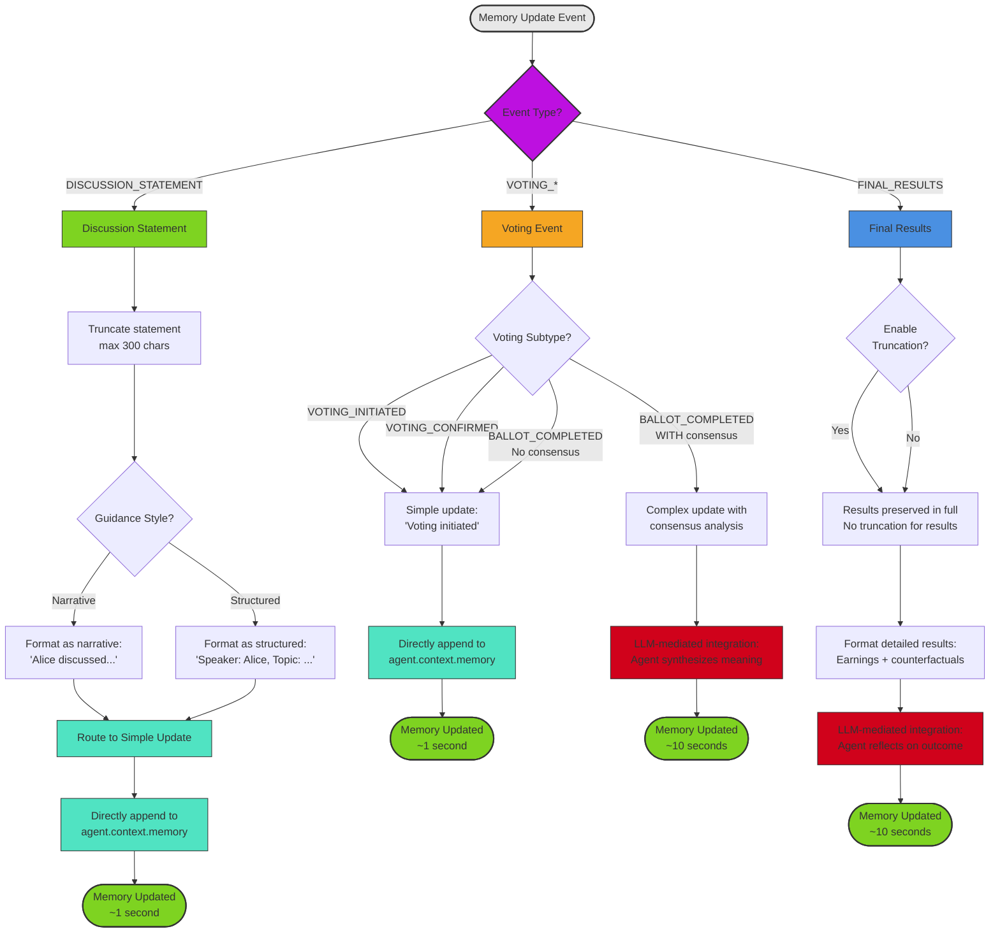

# Diagram 3.3: Memory Management Flow

**Purpose**: Show how the memory system routes events and applies truncation rules

**Target Audience**: Developers working with memory management

**Complexity Level**: ⭐⭐⭐ Detailed (12-15 decision boxes)

---

## Memory Management Decision Flow



---

## Three-Tier Memory Architecture

### Tier 1: Context Window (ParticipantAgent.context)
**What**: Current memories sent to LLM in every prompt

**Size**: Limited by LLM context window (e.g., 128K tokens for GPT-4o)

**Updated by**: MemoryService after each event

**Contains**:
- Current phase and stage
- Accumulated memory from events
- Phase 1 results (for Phase 2 context)
- Discussion history summary

### Tier 2: Agent Memory Storage (MemoryManager)
**What**: Persistent memory across rounds

**Size**: Configurable character limits per content type

**Updated by**: SelectiveMemoryManager

**Contains**:
- Discussion statements (truncated to 300 chars)
- Voting events and outcomes
- Internal reasoning (truncated to 200 chars)
- Results and earnings

### Tier 3: Discussion History (GroupDiscussionState.public_history)
**What**: Shared history among all agents

**Size**: Configurable max length (default 100,000 chars)

**Updated by**: DiscussionService

**Contains**:
- All agent statements from all rounds
- Metadata (round, speaker, timestamp)
- Used for building context windows

---

## Memory Update Strategies

### Strategy 1: Simple Memory Update (Fast ~1 second)

**When to use**:
- Discussion statements (routine updates)
- Voting initiation status
- Voting confirmation status
- Status updates without complex reasoning

**Process**:
```python
def update_memory_simple(
    agent: ParticipantAgent,
    context: ParticipantContext,
    summary: str
) -> str:
    """Direct append without LLM involvement."""
    # 1. Truncate if needed
    truncated = self._truncate_content(summary, content_type="statement")

    # 2. Apply guidance style formatting
    formatted = self._apply_guidance_style(truncated, style="narrative")

    # 3. Direct append
    agent.context.memory += "\n" + formatted

    return formatted
```

**Example**:
```
Input: "I believe we should maximize the floor because it protects vulnerable members and aligns with Rawlsian principles of justice."

Truncated (300 char max): "I believe we should maximize the floor because it protects vulnerable members and aligns with Rawlsian principles of justice."

Formatted (narrative): "Alice discussed maximizing the floor to protect vulnerable members, citing Rawlsian principles."

Appended to memory: agent.context.memory += "\nAlice discussed maximizing the floor..."
```

**Performance**: ~1 second (no LLM call)

---

### Strategy 2: Complex Memory Update (Slow ~10 seconds)

**When to use**:
- Final results with counterfactuals
- Voting completion with consensus
- Events requiring deep integration and reflection

**Process**:
```python
async def update_memory_complex(
    agent: ParticipantAgent,
    context: ParticipantContext,
    new_information: str,
    internal_reasoning: Optional[str] = None
) -> str:
    """LLM-mediated integration with reasoning."""
    # 1. Build integration prompt
    prompt = f"""
    Here's what happened: {new_information}

    Your current memory: {agent.context.memory}

    Task: Integrate this new information into your memory,
    updating your beliefs and understanding. Reflect on what
    this means for your decision-making.
    """

    # 2. Agent synthesizes memory update
    synthesized = await agent.think(prompt)

    # 3. Update agent memory
    agent.context.memory = synthesized

    return synthesized
```

**Example**:
```
Input: "Consensus reached on Maximizing Floor. You voted for principle 1 and the group unanimously agreed. Your assigned income class is MEDIUM. Your earnings: $24,000. Counterfactuals: If Avg ($24k), If Avg+Floor ($25k), If Avg+Range ($23k)."

Agent synthesizes: "The group reached consensus on my preferred principle (Maximizing Floor). I'm relieved that we agreed unanimously. As a medium-income earner, I earned $24,000. Interestingly, I would have earned more under Avg+Floor ($25k), but the difference is small. I feel this outcome validates my reasoning that protecting the floor is important, even if it means slightly lower average income."

Memory updated with: agent.context.memory = synthesized
```

**Performance**: ~10 seconds (LLM call required)

---

## Truncation Rules

### Content Type-Based Truncation

```python
def _truncate_content(
    content: str,
    content_type: str  # "statement", "reasoning", "result"
) -> str:
    """Apply content-specific truncation rules."""
    if content_type == "statement":
        max_length = 300
        return content[:max_length] + "..." if len(content) > max_length else content

    elif content_type == "reasoning":
        max_length = 200
        return content[:max_length] + "..." if len(content) > max_length else content

    elif content_type == "result":
        # Results are NOT truncated (preserve full detail)
        return content

    else:
        # Default: no truncation
        return content
```

### Truncation Examples

**Statement Truncation** (300 char limit):
```
Original (450 chars): "I believe we should maximize the floor because it protects the most vulnerable members of society. This approach aligns with Rawlsian principles of justice, which emphasize that we should organize society to benefit the worst-off. From a practical standpoint, this also reduces inequality and promotes social cohesion, which benefits everyone in the long run. Additionally, research shows that societies with stronger safety nets experience..."

Truncated (300 chars): "I believe we should maximize the floor because it protects the most vulnerable members of society. This approach aligns with Rawlsian principles of justice, which emphasize that we should organize society to benefit the worst-off. From a practical standpoint, this also reduces inequality..."
```

**Reasoning Truncation** (200 char limit):
```
Original (350 chars): "My internal reasoning: I initially preferred maximizing average because it seemed most efficient. However, after considering the payoff distributions and the probability of being in the low-income class, I realized that the floor principle provides better protection against worst-case scenarios..."

Truncated (200 chars): "My internal reasoning: I initially preferred maximizing average because it seemed most efficient. However, after considering the payoff distributions and the probability of being in the low-income..."
```

---

## Guidance Style Formatting

### Narrative Style (Default)
**When**: Most experiments (easier for LLMs to process)

**Format**: "Agent X discussed topic Y with reasoning Z"

**Example**:
```
Input: "I believe we should maximize the floor because it protects vulnerable members."

Narrative output: "Alice discussed maximizing the floor to protect vulnerable members of society."
```

### Structured Style
**When**: Experiments requiring precise formatting

**Format**: "Key: Value | Key: Value | ..."

**Example**:
```
Input: "I believe we should maximize the floor because it protects vulnerable members."

Structured output: "Speaker: Alice | Topic: Floor maximization | Reasoning: Protecting vulnerable | Certainty: High"
```

**Configuration**:
```yaml
phase2_settings:
  memory_management:
    guidance_style: "narrative"  # or "structured"
```

---

## History Management

### Discussion History Truncation

**Trigger**: When total history exceeds `public_history_max_length` (default 100,000 chars)

**Algorithm**:
```python
def manage_discussion_history_length(
    history: List[Dict],
    max_length: int = 100_000
) -> List[Dict]:
    """Truncate oldest statements first."""
    total_chars = sum(len(entry["statement"]) for entry in history)

    while total_chars > max_length:
        # Remove oldest entry (FIFO)
        oldest = history.pop(0)
        total_chars -= len(oldest["statement"])

    return history
```

**Why FIFO (First In, First Out)?**
- Preserves recent context (most relevant for decisions)
- Removes old statements (less relevant as experiment progresses)
- Maintains chronological coherence

**Example**:
```
History before truncation (120,000 chars):
- Round 1: 50 statements (~15,000 chars)
- Round 2: 48 statements (~14,500 chars)
- Round 3: 50 statements (~15,500 chars)
- Round 4: 52 statements (~16,000 chars)
- Round 5: 48 statements (~14,500 chars)
- Round 6: 50 statements (~15,000 chars)
- Round 7: 45 statements (~13,500 chars)
- Round 8: 46 statements (~13,000 chars)
- Total: ~120,000 chars

After truncation (100,000 chars):
- Round 1: REMOVED (oldest)
- Round 2: REMOVED
- Round 3: 50 statements (~15,500 chars)
- Round 4: 52 statements (~16,000 chars)
- Round 5: 48 statements (~14,500 chars)
- Round 6: 50 statements (~15,000 chars)
- Round 7: 45 statements (~13,500 chars)
- Round 8: 46 statements (~13,000 chars)
- Round 9: (current round in progress)
- Total: ~102,500 chars (within limit after current round)
```

---

## Memory Overflow Prevention

### Emergency Truncation

**Trigger**: Agent context exceeds token limits (detected by LLM API error)

**Process**:
1. **Detect overflow**: LLM API returns "context_length_exceeded" error
2. **Aggressive truncation**: Remove oldest 50% of memory
3. **Re-attempt**: Retry agent.think() call with truncated memory
4. **Logging**: Log warning for debugging

**Example**:
```python
try:
    response = await agent.think(prompt)
except ContextLengthExceededError:
    # Emergency truncation
    memory_length = len(agent.context.memory)
    agent.context.memory = agent.context.memory[memory_length // 2:]

    # Retry with truncated memory
    response = await agent.think(prompt)
    logger.warning(f"Emergency memory truncation for {agent.name}")
```

---

## Configuration

**Relevant Phase2Settings**:
```yaml
phase2_settings:
  # Memory management
  memory_management:
    guidance_style: "narrative"          # "narrative" or "structured"
    statement_max_length: 300            # Characters
    reasoning_max_length: 200            # Characters
    enable_truncation: true              # Enable/disable truncation

  # Discussion history
  public_history_max_length: 100000      # Characters

  # Memory compression (advanced)
  memory_compression_threshold: 0.8     # Trigger compression at 80% capacity
  memory_compression_target: 0.6        # Compress to 60% capacity
```

---

## Performance Characteristics

### Memory Update Timing

| Update Type | Strategy | LLM Call? | Duration | Use Case |
|-------------|----------|-----------|----------|----------|
| Discussion Statement | Simple | No | ~1 sec | Routine updates |
| Voting Initiation | Simple | No | ~1 sec | Status updates |
| Voting Confirmation | Simple | No | ~1 sec | Status updates |
| Voting with Consensus | Complex | Yes | ~10 sec | Reflection needed |
| Final Results | Complex | Yes | ~10 sec | Deep integration |

### Memory Size Growth

**Typical experiment** (8 agents, 10 rounds, consensus round 7):

| Round | Statements | Memory Size (per agent) | History Size (shared) |
|-------|-----------|-------------------------|----------------------|
| 1 | 8 | ~2,400 chars | ~2,400 chars |
| 2 | 8 | ~4,800 chars | ~4,800 chars |
| 3 | 8 | ~7,200 chars | ~7,200 chars |
| 4 | 8 | ~9,600 chars | ~9,600 chars |
| 5 | 8 | ~12,000 chars | ~12,000 chars |
| 6 | 8 | ~14,400 chars | ~14,400 chars |
| 7 | 8 | ~16,800 chars | ~16,800 chars |
| **Total** | **56** | **~16,800 chars** | **~16,800 chars** |

**Note**: With truncation, per-agent memory stays under 20,000 characters (~5,000 words)

---

## Testing

**Unit Tests** (Fast):
```python
# tests/unit/test_memory_service.py
def test_truncate_statement_content():
    memory_service = MemoryService()

    long_statement = "a" * 500  # 500 characters
    truncated = memory_service._truncate_content(
        long_statement,
        content_type="statement"
    )

    assert len(truncated) <= 300
    assert truncated.endswith("...")
    # Executes in < 0.001 seconds
```

**Component Tests** (Real LLM Calls):
```python
# tests/component/test_memory_service.py
@pytest.mark.live
async def test_memory_service_complex_update():
    agent = ParticipantAgent(model="gpt-4o-mini")
    memory_service = MemoryService()

    result = await memory_service.update_final_results_memory(
        agent=agent,
        context=mock_context,
        result_content="Consensus reached on Floor. Earnings: $24k.",
        earnings=24000,
        consensus_reached=True
    )

    assert len(result) > 0
    assert "consensus" in result.lower()
    # Executes in ~10 seconds
```

---

## Related Files

**Core Implementation**:
- `core/services/memory_service.py` (190 lines) - Public API and routing
- `utils/selective_memory_manager.py` (150 lines) - Simple and complex updates

**Data Models**:
- `models/participant_context.py` - ParticipantContext with memory field
- `models/discussion_state.py` - GroupDiscussionState with public_history

**Configuration**:
- `config/phase2_settings.py` - Phase2Settings.memory_management

---

## Next Steps

- **For payoff calculation**: See Diagram 3.4 (Payoff Calculation Process)
- **For discussion context**: See Diagram 3.1 (Discussion Sequence)
- **For technical details**: See TECHNICAL_README.md Section 7 (Memory Management)
