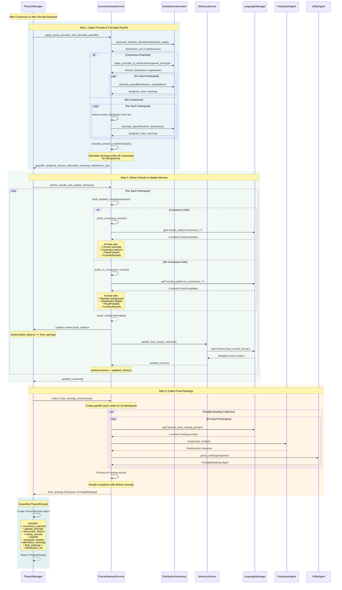

# Diagram 08: Post-Discussion Results Service Sequence (Detailed)

**Purpose**: Service-level interactions for applying principle, calculating payoffs, and collecting final rankings
**Audience**: Developers implementing Phase 2 results features, debugging post-discussion flows
**Layer**: 2 - Detailed Service Interactions

---



---

## Service Responsibilities

### CounterfactualsService
**Role**: Manages post-discussion payoff calculations, counterfactual analysis, results delivery, and final ranking collection

**Key Methods**:
- `apply_group_principle_and_calculate_payoffs()` - Apply consensus/random principle (lines 148-229)
- `calculate_phase2_counterfactuals()` - Calculate alternative earnings (lines 231-350)
- `build_detailed_results()` - Format comprehensive results (lines 352-399)
- `deliver_results_and_update_memory()` - Results delivery with memory update (lines 1120-1249)
- `collect_final_rankings_streamlined()` - Parallel final ranking collection (lines 1252-1341)

**Code**: `core/services/counterfactuals_service.py`

---

### DistributionGenerator
**Role**: Generate Phase 2 distributions and calculate payoffs

**Key Methods**:
- `generate_dynamic_distribution()` - Create new Phase 2 distribution set
- `apply_principle_to_distributions()` - Select distribution based on principle
- `calculate_payoff()` - Assign income class and calculate earnings

**Code**: `utils/distribution_generator.py`

---

### MemoryService
**Role**: Update participant memory with Phase 2 results

**Key Method**:
- `update_final_results_memory()` - Wrap results in proper memory format

**Integration**:
- Uses language manager for localized memory templates
- Applies guidance style (narrative/structured)
- Enforces character limits and truncation

**Code**: `core/services/memory_service.py`

---

### LanguageManager
**Role**: Provide localized templates for results and prompts

**Key Translations**:
- `results_explicit.consensus_*` - Consensus result templates
- `results_explicit.no_consensus_*` - No-consensus result templates
- `memory.final_results_format` - Memory wrapper template
- `phase2_final_ranking_prompt` - Final ranking collection prompt

**Code**: `utils/language_manager.py`

---

### ParticipantAgent
**Role**: Generate final principle rankings after seeing results

**Interaction**:
- Receives results in memory via context
- Receives final ranking prompt
- Returns ranking text for parsing

**Code**: `experiment_agents/participant_agent.py`

---

### UtilityAgent
**Role**: Parse final ranking responses into structured data

**Functionality**:
- Parse ranking text → `PrincipleRanking` object
- Extract ranked principles and certainty level
- Handle multilingual responses

**Code**: `experiment_agents/utility_agent.py`

---

## Critical Decision Points

### Consensus vs No Consensus

**Consensus Path**:
- Apply agreed principle to distribution set
- Use constraint amount if applicable (principles 3 & 4)
- All participants receive income from same distribution
- Results emphasize group agreement

**No Consensus Path**:
- Random assignment for each participant
- Each participant may receive income from different distribution
- Results emphasize individual random assignment
- Display which distribution (1-4) was assigned to each participant

---

## Counterfactual Transparency

The framework provides complete transparency by showing what participants would have earned under all 4 principles:

1. **Maximizing Floor** (principle 1)
2. **Maximizing Average** (principle 2)
3. **Maximizing Average with Floor Constraint** (principle 3)
4. **Maximizing Average with Range Constraint** (principle 4)

This allows participants to:
- Understand trade-offs between principles
- See how their assigned income class affects earnings
- Make informed final rankings based on actual outcomes

---

## Parallel Execution Strategy

### Final Rankings Collection

CounterfactualsService uses `asyncio.gather()` for parallel ranking collection:

```python
# Create async tasks for all participants
tasks = [
    asyncio.create_task(
        self._get_final_ranking_task(participant, context, utility_agent)
    )
    for participant in participants
]

# Gather results in parallel
rankings_results = await asyncio.gather(*tasks, return_exceptions=True)
```

**Performance**: All participants rank simultaneously, reducing total time from N×ranking_time to 1×ranking_time

---

## Error Handling

### Ranking Collection Failures

When a participant fails to provide ranking:
- Exception caught via `return_exceptions=True`
- Default ranking applied automatically:
  1. Maximizing Floor (rank 1)
  2. Maximizing Average (rank 2)
  3. Average + Floor Constraint (rank 3)
  4. Average + Range Constraint (rank 4)
- Certainty level set to `NO_OPINION`
- Experiment continues without blocking

### Memory Update Failures

Two-tier fallback system:
1. **Primary**: MemoryService with proper formatting
2. **Fallback**: Direct memory append with wrapped content
3. **Last Resort**: Continue without memory update, log warning

---

## Data Flow Summary

```
Discussion Complete → Phase2Manager
    ↓
1. CounterfactualsService: Apply principle + Calculate payoffs
    ├─ Consensus: Use agreed principle
    └─ No Consensus: Random assignment
    ↓
2. CounterfactualsService: Build detailed results
    ├─ Build consensus/no-consensus format
    └─ Include counterfactuals for all 4 principles
    ↓
3. MemoryService: Update participant memory
    ├─ Update context bank balance
    └─ Add formatted results to memory
    ↓
4. CounterfactualsService: Collect final rankings (parallel)
    ├─ Get ranking prompt from LanguageManager
    ├─ ParticipantAgent generates ranking
    └─ UtilityAgent parses ranking
    ↓
Phase2Results (with final_rankings ⭐) → ExperimentManager
```

---

## API Calls Per Participant

- **Results Delivery**: 0 calls (memory update only)
- **Final Ranking**: 1 call (ParticipantAgent) + 1 call (UtilityAgent) = 2 calls

**Total**: 2 API calls per participant (with retries may increase)

**Parallel Execution**: All participants process simultaneously, so total wall-clock time ≈ single participant time

---

## Memory State After Results

Each participant's memory contains:
- Full Phase 2 discussion history
- Voting records (if voting occurred)
- **Phase 2 Results**:
  - Consensus/no-consensus status
  - Chosen/assigned principle
  - Constraint amount (if applicable)
  - Assigned income class
  - Actual earnings
  - Counterfactual earnings under all 4 principles
  - Distribution details
- Updated bank balance (Phase 1 + Phase 2 earnings)

This complete context enables informed final ranking.

---

## Integration with Phase2Manager

Phase2Manager calls these methods in sequence:

```python
# After discussion/voting complete
payoffs, assigned_classes, alternative_earnings, distribution_set = \
    await counterfactuals_service.apply_group_principle_and_calculate_payoffs(
        discussion_result, config, participants
    )

updated_contexts = await counterfactuals_service.deliver_results_and_update_memory(
    participants, contexts, discussion_result, payoffs,
    assigned_classes, alternative_earnings, config, distribution_set
)

final_rankings = await counterfactuals_service.collect_final_rankings_streamlined(
    updated_contexts, participants, utility_agent
)

# Create Phase2Results with final_rankings
phase2_results = Phase2Results(
    consensus_reached=discussion_result.consensus_reached,
    agreed_principle=discussion_result.agreed_principle,
    # ... other fields ...
    final_rankings=final_rankings,  # ⭐ New field
)
```

---

## Related Files

- `core/services/counterfactuals_service.py` - Complete service implementation
- `core/services/memory_service.py` - Memory update logic
- `utils/distribution_generator.py` - Distribution and payoff calculation
- `utils/language_manager.py` - Localization
- `experiment_agents/participant_agent.py` - Agent implementation
- `experiment_agents/utility_agent.py` - Response parsing
- `models/phase2_models.py` - Phase2Results data model

---

## Next Steps

- **Voting Process Details**: [06_voting_detailed.md](./06_voting_detailed.md)
- **Discussion Round Details**: [05_discussion_round_detailed.md](./05_discussion_round_detailed.md)
- **Data Models**: [07_data_models.md](./07_data_models.md)
- **High-Level Architecture**: [TECHNICAL_ARCHITECTURE.md](../../TECHNICAL_ARCHITECTURE.md)
