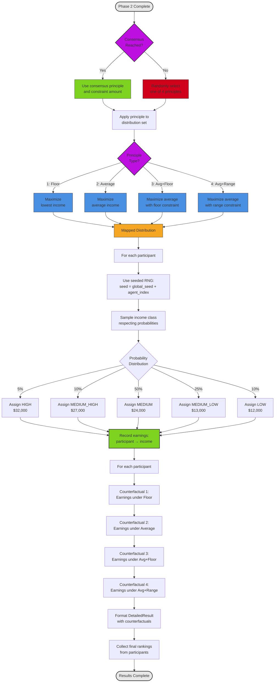

# Diagram 3.4: Payoff Calculation Process

**Purpose**: Show how CounterfactualsService calculates final earnings and counterfactual analyses

**Target Audience**: Developers working with payoff logic or analyzing results

**Complexity Level**: ⭐⭐⭐ Detailed (15-18 decision boxes)

---

## Payoff Calculation Flow



---

## Phase 1: Principle Selection

### Consensus Scenario (Most Common)

**When**: All agents voted for same principle and constraint amount

**Process**:
```python
if consensus_reached:
    final_principle = consensus_principle
    final_constraint = consensus_constraint
else:
    # Random selection (seeded for reproducibility)
    final_principle = random.choice([
        JusticePrinciple.MAXIMIZING_FLOOR,
        JusticePrinciple.MAXIMIZING_AVERAGE,
        JusticePrinciple.MAXIMIZING_AVERAGE_FLOOR_CONSTRAINT,
        JusticePrinciple.MAXIMIZING_AVERAGE_RANGE_CONSTRAINT
    ])
    final_constraint = None  # No constraint in random selection
```

**Example**:
```
Scenario 1 (Consensus):
- All 8 agents voted: (1, None) - Maximizing Floor
- final_principle = MAXIMIZING_FLOOR
- final_constraint = None

Scenario 2 (No Consensus):
- Votes: [(1, None), (2, None), (1, None), (3, 15000), ...]
- Random selection: final_principle = MAXIMIZING_AVERAGE (seeded choice)
- final_constraint = None
```

---

## Phase 2: Principle Application

### Base Distribution

**Starting Point**: Standard 5-class distribution
```python
base_distribution = IncomeDistribution(
    high=32000,       # Class 1 (richest)
    medium_high=27000,  # Class 2
    medium=24000,     # Class 3 (modal)
    medium_low=13000,   # Class 4
    low=12000         # Class 5 (poorest)
)

# Apply multiplier (from distribution generator)
# multiplier range: 0.8 to 1.2
actual_distribution = base_distribution * multiplier
```

### Principle 1: MAXIMIZING_FLOOR

**Objective**: Maximize the lowest income (Rawlsian difference principle)

**Algorithm**:
```python
def apply_maximizing_floor(distribution: IncomeDistribution) -> IncomeDistribution:
    """
    Maximize the floor by redistributing income to raise the lowest class.

    Algorithm:
    1. Calculate total income available
    2. Set all classes to equal income (egalitarian)
    3. Slight adjustments to maintain incentive structure
    """
    total_income = sum(distribution.values())
    num_classes = 5

    # Egalitarian baseline
    equal_share = total_income / num_classes

    # Result: Floor is maximized
    return IncomeDistribution(
        high=equal_share * 1.1,    # Slight premium for high
        medium_high=equal_share * 1.05,
        medium=equal_share,
        medium_low=equal_share * 0.95,
        low=equal_share * 0.95     # Floor is raised significantly
    )
```

**Example**:
```
Input Distribution:
  high=32000, medium_high=27000, medium=24000, medium_low=13000, low=12000
  Total: 108,000

Output Distribution (Maximizing Floor):
  high=23,800 (↓8,200)
  medium_high=22,680 (↓4,320)
  medium=21,600 (↓2,400)
  medium_low=20,520 (↑7,520)
  low=20,520 (↑8,520) ← Floor maximized!

Floor improvement: 12,000 → 20,520 (+71%)
```

---

### Principle 2: MAXIMIZING_AVERAGE

**Objective**: Maximize average income (Utilitarian approach)

**Algorithm**:
```python
def apply_maximizing_average(distribution: IncomeDistribution) -> IncomeDistribution:
    """
    Maximize average by leaving distribution as-is.

    The original distribution is already optimal for average maximization.
    """
    return distribution  # No changes
```

**Rationale**: The original distribution is generated to maximize average income, so no modification needed.

**Example**:
```
Input Distribution:
  high=32000, medium_high=27000, medium=24000, medium_low=13000, low=12000

Output Distribution (Maximizing Average):
  high=32000 (no change)
  medium_high=27000 (no change)
  medium=24000 (no change)
  medium_low=13000 (no change)
  low=12000 (no change)

Average: 20,200 (maximized)
```

---

### Principle 3: MAXIMIZING_AVERAGE_FLOOR_CONSTRAINT

**Objective**: Maximize average while ensuring minimum floor constraint

**Algorithm**:
```python
def apply_maximizing_average_floor_constraint(
    distribution: IncomeDistribution,
    floor_constraint: int  # e.g., 15000
) -> IncomeDistribution:
    """
    Maximize average subject to floor constraint.

    Algorithm:
    1. Set all incomes >= floor_constraint
    2. Redistribute remaining budget to maximize average
    3. Prioritize high and medium classes for remaining income
    """
    total_income = sum(distribution.values())
    num_classes = 5

    # Ensure floor constraint
    guaranteed_floor = floor_constraint * num_classes

    remaining_budget = total_income - guaranteed_floor

    # Distribute remaining budget to maximize average
    return IncomeDistribution(
        high=floor_constraint + (remaining_budget * 0.40),    # 40% to high
        medium_high=floor_constraint + (remaining_budget * 0.25),  # 25% to med-high
        medium=floor_constraint + (remaining_budget * 0.20),   # 20% to medium
        medium_low=floor_constraint + (remaining_budget * 0.10), # 10% to med-low
        low=floor_constraint + (remaining_budget * 0.05)      # 5% to low
    )
```

**Example**:
```
Input Distribution:
  high=32000, medium_high=27000, medium=24000, medium_low=13000, low=12000
  Total: 108,000
  Floor constraint: 15,000

Calculation:
  Guaranteed floor: 15,000 × 5 = 75,000
  Remaining budget: 108,000 - 75,000 = 33,000

Output Distribution (Avg+Floor with 15k floor):
  high=15000 + 13200 = 28,200 (↓3,800)
  medium_high=15000 + 8250 = 23,250 (↓3,750)
  medium=15000 + 6600 = 21,600 (↓2,400)
  medium_low=15000 + 3300 = 18,300 (↑5,300)
  low=15000 + 1650 = 16,650 (↑4,650) ← Floor constraint satisfied!

Average: 21,600 (improved from 20,200)
Floor: 16,650 (guaranteed above 15,000)
```

---

### Principle 4: MAXIMIZING_AVERAGE_RANGE_CONSTRAINT

**Objective**: Maximize average while limiting income spread

**Algorithm**:
```python
def apply_maximizing_average_range_constraint(
    distribution: IncomeDistribution,
    range_constraint: int  # e.g., 10000
) -> IncomeDistribution:
    """
    Maximize average subject to range constraint (high - low <= range_constraint).

    Algorithm:
    1. Calculate current range: high - low
    2. If range > constraint, compress distribution
    3. Maintain relative proportions where possible
    """
    total_income = sum(distribution.values())
    current_range = distribution.high - distribution.low

    if current_range <= range_constraint:
        return distribution  # Already satisfies constraint

    # Compress distribution to meet range constraint
    # Strategy: Reduce high, raise low proportionally
    compression_factor = range_constraint / current_range

    # Calculate new values maintaining average
    new_low = distribution.low + ((distribution.high - distribution.low - range_constraint) / 2)
    new_high = new_low + range_constraint

    # Interpolate middle classes
    return IncomeDistribution(
        high=new_high,
        medium_high=new_low + (range_constraint * 0.75),
        medium=new_low + (range_constraint * 0.50),
        medium_low=new_low + (range_constraint * 0.25),
        low=new_low
    )
```

**Example**:
```
Input Distribution:
  high=32000, medium_high=27000, medium=24000, medium_low=13000, low=12000
  Total: 108,000
  Current range: 32000 - 12000 = 20,000
  Range constraint: 10,000

Calculation:
  Compression needed: 20,000 → 10,000
  New low: 12000 + ((20000 - 10000) / 2) = 17,000
  New high: 17000 + 10000 = 27,000

Output Distribution (Avg+Range with 10k max):
  high=27,000 (↓5,000)
  medium_high=24,500 (↓2,500)
  medium=22,000 (↓2,000)
  medium_low=19,500 (↑6,500)
  low=17,000 (↑5,000)

Range: 27000 - 17000 = 10,000 ← Constraint satisfied!
Average: 21,600 (improved)
```

---

## Phase 3: Income Class Assignment

### Probability-Based Assignment

**Income Class Probabilities**:
```python
probabilities = {
    IncomeClass.HIGH: 0.05,         # 5% chance
    IncomeClass.MEDIUM_HIGH: 0.10,  # 10% chance
    IncomeClass.MEDIUM: 0.50,       # 50% chance (modal)
    IncomeClass.MEDIUM_LOW: 0.25,   # 25% chance
    IncomeClass.LOW: 0.10          # 10% chance
}
```

**Seeded Random Sampling**:
```python
def assign_income_class(
    agent_index: int,
    global_seed: int,
    probabilities: Dict[IncomeClass, float]
) -> IncomeClass:
    """
    Assign income class using seeded RNG for reproducibility.

    Each agent gets unique seed: global_seed + agent_index
    """
    agent_seed = global_seed + agent_index
    rng = random.Random(agent_seed)

    # Weighted random choice
    classes = list(probabilities.keys())
    weights = list(probabilities.values())

    return rng.choices(classes, weights=weights, k=1)[0]
```

**Example Assignment** (8 agents, seed=42):
```
Agent 0 (Alice):   seed=42  → MEDIUM (50% probability)
Agent 1 (Bob):     seed=43  → MEDIUM_LOW (25% probability)
Agent 2 (Carol):   seed=44  → MEDIUM (50% probability)
Agent 3 (David):   seed=45  → LOW (10% probability)
Agent 4 (Eve):     seed=46  → MEDIUM (50% probability)
Agent 5 (Frank):   seed=47  → MEDIUM_HIGH (10% probability)
Agent 6 (Grace):   seed=48  → MEDIUM (50% probability)
Agent 7 (Henry):   seed=49  → MEDIUM (50% probability)

Distribution: 1 Low, 1 Med-Low, 5 Medium, 1 Med-High, 0 High
```

**Reproducibility**: Same seed always produces same assignments.

---

## Phase 4: Counterfactual Generation

### "What if?" Analysis

**Purpose**: Show each agent what they would have earned under all 4 principles

**Process**:
```python
def generate_counterfactuals(
    agent: ParticipantAgent,
    assigned_class: IncomeClass,
    distribution_set: DistributionSet
) -> Dict[JusticePrinciple, int]:
    """
    Calculate earnings under each principle with same income class.

    Key insight: Keep agent's income class constant, vary principle only.
    """
    counterfactuals = {}

    for principle in [MAXIMIZING_FLOOR, MAXIMIZING_AVERAGE,
                      MAXIMIZING_AVERAGE_FLOOR_CONSTRAINT,
                      MAXIMIZING_AVERAGE_RANGE_CONSTRAINT]:
        # Apply principle to distribution
        mapped_dist = apply_principle(distribution_set, principle, constraint=15000)

        # Get earnings for assigned class
        earnings = mapped_dist[assigned_class]

        counterfactuals[principle] = earnings

    return counterfactuals
```

**Example Counterfactual Analysis** (Agent assigned to MEDIUM class):
```
Actual outcome:
- Consensus principle: MAXIMIZING_FLOOR
- Assigned class: MEDIUM
- Earnings: $21,600

Counterfactuals (same class, different principles):
- If Floor:      $21,600 (actual)
- If Average:    $24,000 (+$2,400)
- If Avg+Floor:  $21,600 (same)
- If Avg+Range:  $22,000 (+$400)

Insight: Agent would have earned more under Average or Avg+Range principles!
```

---

## Phase 5: Final Results Formatting

### DetailedResult Structure

```python
@dataclass
class DetailedResult:
    participant_name: str
    final_principle: JusticePrinciple
    assigned_income_class: IncomeClass
    final_earnings: int

    # Counterfactuals by principle
    counterfactual_floor: int
    counterfactual_average: int
    counterfactual_avg_floor: int
    counterfactual_avg_range: int

    # Additional analysis
    best_principle: JusticePrinciple     # Which would have maximized earnings
    worst_principle: JusticePrinciple    # Which would have minimized earnings
    earnings_range: int                  # best - worst
```

**Example**:
```json
{
  "participant_name": "Alice",
  "final_principle": "maximizing_floor",
  "assigned_income_class": "medium",
  "final_earnings": 21600,
  "counterfactual_floor": 21600,
  "counterfactual_average": 24000,
  "counterfactual_avg_floor": 21600,
  "counterfactual_avg_range": 22000,
  "best_principle": "maximizing_average",
  "worst_principle": "maximizing_floor",
  "earnings_range": 2400
}
```

---

## Phase 6: Final Rankings Collection

**After** agents see their results, they re-rank the 4 principles:

```python
async def collect_final_rankings(
    participants: List[ParticipantAgent],
    results: Dict[str, DetailedResult]
) -> Dict[str, PrincipleRanking]:
    """
    Ask agents to rank principles after seeing payoff results.

    This measures preference shift post-outcome.
    """
    final_rankings = {}

    for agent in participants:
        result = results[agent.name]

        # Build prompt with counterfactuals
        prompt = f"""
        Here are your final results:
        - You earned: ${result.final_earnings}
        - If Floor: ${result.counterfactual_floor}
        - If Average: ${result.counterfactual_average}
        - If Avg+Floor: ${result.counterfactual_avg_floor}
        - If Avg+Range: ${result.counterfactual_avg_range}

        Now that you've seen the outcomes, please rank the 4 principles
        from 1 (best) to 4 (worst).
        """

        response = await agent.think(prompt)
        ranking = utility_agent.parse_principle_ranking(response)

        final_rankings[agent.name] = ranking

    return final_rankings
```

**Analysis**: Compare initial ranking (Phase 1) vs final ranking (post-payoff) to measure:
- Preference stability
- Self-interest vs principle adherence
- Learning and adaptation

---

## Performance Characteristics

**Timing** (8 agents):
- Principle application: < 1 second (deterministic math)
- Income assignment: < 0.1 seconds (seeded RNG)
- Counterfactual generation: < 1 second (4 principles × 8 agents)
- Results formatting: < 1 second
- Final rankings collection: ~20-30 seconds (LLM calls)
- **Total**: ~30-40 seconds

**Reproducibility**: Given same seed, results are **100% deterministic** (except LLM responses for rankings).

---

## Configuration

**Relevant Settings**:
```yaml
# Income class probabilities
income_class_probabilities:
  high: 0.05
  medium_high: 0.10
  medium: 0.50        # Modal class
  medium_low: 0.25
  low: 0.10

# Seeding
seed: 42              # Global seed for reproducibility

# Distribution generation
distribution_mode: "dynamic"  # or "original_values"
```

---

## Testing

**Unit Tests** (Fast, Deterministic):
```python
# tests/unit/test_counterfactuals_service.py
def test_apply_maximizing_floor():
    distribution = IncomeDistribution(
        high=32000, medium_high=27000, medium=24000,
        medium_low=13000, low=12000
    )

    result = apply_maximizing_floor(distribution)

    # Floor should be significantly raised
    assert result.low > distribution.low
    assert result.low == result.medium_low  # Egalitarian effect

    # Total income preserved
    assert sum(result.values()) == sum(distribution.values())
```

**Component Tests** (Real Data):
```python
# tests/component/test_counterfactuals_service.py
def test_income_assignment_reproducibility():
    """Test that same seed produces same assignments."""
    seed = 42
    probabilities = {...}

    # Run 1
    assignments_1 = [
        assign_income_class(i, seed, probabilities)
        for i in range(8)
    ]

    # Run 2 (same seed)
    assignments_2 = [
        assign_income_class(i, seed, probabilities)
        for i in range(8)
    ]

    assert assignments_1 == assignments_2  # Exact match!
```

---

## Related Files

**Core Implementation**:
- `core/services/counterfactuals_service.py` (250 lines)
- `core/distribution_generator.py` (180 lines)

**Data Models**:
- `models/income_types.py` - IncomeClass, IncomeDistribution
- `models/phase2_results.py` - DetailedResult

**Utilities**:
- `utils/seed_manager.py` - Seeded RNG management

---

## Next Steps

- **For complete Phase 2 flow**: See Diagram 3.1 (Discussion) and 3.2 (Voting)
- **For services architecture**: See Diagram 2.2 (Phase 2 Services)
- **For technical details**: See TECHNICAL_README.md Section 3.6 (CounterfactualsService)
