# Diagram 10: Phase 1 Complete Process Flow

**Alternative to Diagram 03** - Process-oriented view showing step-by-step flow with all components.

This diagram shows the complete Phase 1 process with all components and their roles.

```mermaid
flowchart TD
    Start([Start Phase 1]) --> Init[Phase1Manager Initializes]
    Init --> Parallel{8 Agents<br/>Execute in Parallel}

    Parallel --> Step1[Step 1: Initial Ranking]
    Step1 --> Agent1[Agent ranks 4 principles<br/>without prior knowledge]
    Agent1 --> Util1[UtilityAgent parses ranking]

    Util1 --> Step2[Step 2: Principle Explanation]
    Step2 --> Lang1[LanguageManager provides<br/>localized explanations]
    Lang1 --> Agent2[Agent studies each principle<br/>with payoff examples]

    Agent2 --> Step3[Step 3: Post-Explanation Ranking]
    Step3 --> Agent3[Agent re-ranks principles<br/>after learning]
    Agent3 --> Util2[UtilityAgent parses ranking]

    Util2 --> Step4[Step 4: Application Rounds<br/>4 rounds per agent]

    Step4 --> Round{For Each<br/>Round 1-4}

    Round --> DistGen[DistributionGenerator creates<br/>4 income distributions]
    DistGen --> Seed1[SeedManager provides<br/>deterministic multiplier]
    Seed1 --> Agent4[Agent selects preferred<br/>distribution]
    Agent4 --> Payoff[Calculate expected payoff<br/>for selected distribution]
    Payoff --> Memory1[SelectiveMemoryManager<br/>truncates old content]
    Memory1 --> NextRound{More<br/>rounds?}

    NextRound -->|Yes| Round
    NextRound -->|No| Complete[Phase1Results compiled]

    Complete --> AllDone{All 8 agents<br/>finished?}
    AllDone -->|No| Parallel
    AllDone -->|Yes| Output[Phase1Results<br/>for all participants]
    Output --> End([Phase 1 Complete<br/>~60 seconds total])

    style Start fill:#4A90E2,stroke:#333,stroke-width:2px,color:#fff
    style End fill:#4A90E2,stroke:#333,stroke-width:2px,color:#fff
    style Init fill:#7ED321,stroke:#333,stroke-width:2px
    style DistGen fill:#7ED321,stroke:#333,stroke-width:2px
    style Seed1 fill:#7ED321,stroke:#333,stroke-width:2px
    style Memory1 fill:#7ED321,stroke:#333,stroke-width:2px
    style Util1 fill:#F5A623,stroke:#333,stroke-width:2px
    style Util2 fill:#F5A623,stroke:#333,stroke-width:2px
    style Lang1 fill:#F5A623,stroke:#333,stroke-width:2px
    style Agent1 fill:#50E3C2,stroke:#333,stroke-width:2px
    style Agent2 fill:#50E3C2,stroke:#333,stroke-width:2px
    style Agent3 fill:#50E3C2,stroke:#333,stroke-width:2px
    style Agent4 fill:#50E3C2,stroke:#333,stroke-width:2px
    style Output fill:#BD10E0,stroke:#333,stroke-width:2px,color:#fff
    style Parallel fill:#FFD700,stroke:#333,stroke-width:3px
```

## Component Legend

- 🔵 **Blue**: Start/End milestones
- 🟢 **Green**: Manager & Services (Phase1Manager, DistributionGenerator, SeedManager, MemoryManager)
- 🟠 **Orange**: Supporting utilities (UtilityAgent, LanguageManager)
- 🟦 **Teal**: Agent actions (participant thinking/decision points)
- 🟣 **Purple**: Data outputs (Phase1Results)
- 🟡 **Yellow**: Parallelization points

## Key Process Insights

**Parallel Execution**: All 8 agents execute simultaneously (~60 seconds total)

**Deterministic Seeding**: SeedManager ensures reproducibility (seed = base_seed + agent_index)

**Memory Management**: SelectiveMemoryManager prevents context overflow (300 char statements, 200 char reasoning)

**4 Application Rounds**: Each agent applies principles to 4 different distribution sets
