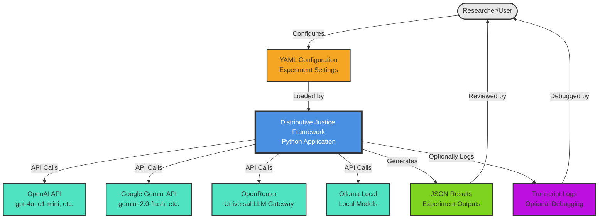
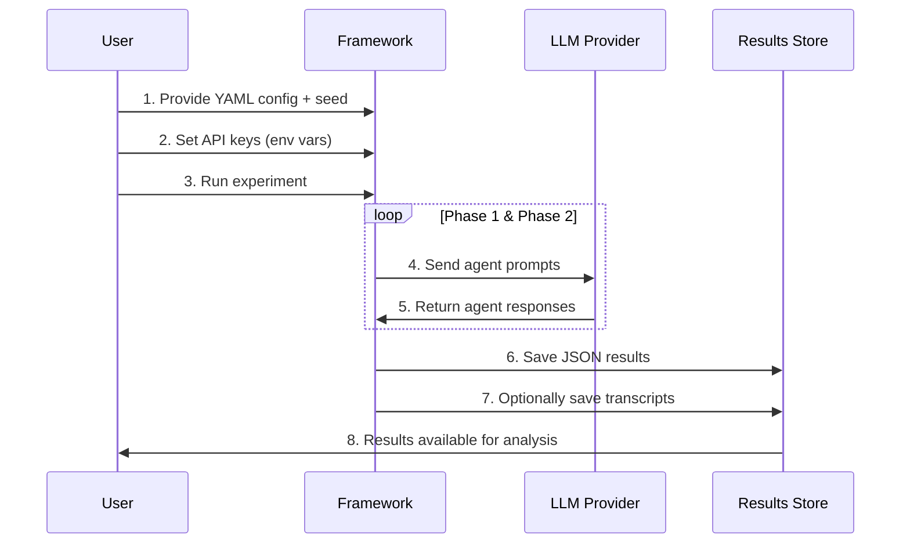

# Diagram 1.2: High-Level System Context

**Purpose**: Show how the Distributive Justice Experiment Framework interacts with external systems

**Target Audience**: Researchers, system architects, first-time readers

**Complexity Level**: Executive (5-7 boxes)

---

## System Context

---

## System Components

### Core Application: Frohlich Experiment Framework
- **Technology**: Python 3.11+, OpenAI Agents SDK
- **Purpose**: Orchestrates multi-agent distributive justice experiments
- **Key Features**: Two-phase experiments, voting systems, multilingual support

### External LLM Providers (Choose One or Mix)
1. **OpenAI API**: Native support for GPT models (`gpt-4o`, `o1-mini`, etc.)
2. **Google Gemini**: Native support for Gemini models (`gemini-2.0-flash`, etc.)
3. **OpenRouter**: Universal gateway for any LLM provider (`anthropic/claude-3.5-sonnet`, etc.)
4. **Ollama**: Local model execution (`ollama/gemma3:1b`, etc.)

### Configuration Inputs
- **YAML Files**: Experiment configuration (agents, settings, principles)
- **Environment Variables**: API keys, feature flags
- **Seed Values**: Reproducibility settings

### Experiment Outputs
- **JSON Results**: Complete experiment data (rankings, votes, payoffs, transcripts)
- **Transcript Logs**: Optional detailed interaction logs for debugging
- **Statistical Reports**: R-based analysis outputs (separate pipeline)

---

## Data Flow

---

## Integration Points

| Component | Direction | Data Format | Purpose |
|-----------|-----------|-------------|---------|
| YAML Config | Input | YAML | Experiment parameters, agent settings |
| API Keys | Input | Environment Variables | Authentication for LLM providers |
| LLM API Calls | Bidirectional | JSON (OpenAI format) | Agent reasoning and responses |
| Results | Output | JSON | Complete experiment data |
| Transcripts | Output | JSON | Debugging logs (optional) |

---

## Environment Requirements

**Required**:
- Python 3.11+
- At least one API key: `OPENAI_API_KEY` OR `GEMINI_API_KEY` OR `OPENROUTER_API_KEY`
- Network connection (except for Ollama local models)

**Optional**:
- `OLLAMA_BASE_URL` for local model deployment
- R programming language for statistical analysis
- Mermaid CLI for diagram rendering

---

## Related Files

- `main.py` - Entry point for running experiments
- `config/models.py` - Pydantic models for configuration validation
- `experiment_agents/participant_agent.py` - LLM provider detection and client creation

---

## Next Steps

- **For framework internals**: See Diagram 2.1 (Phase 1 Architecture) and Diagram 2.2 (Phase 2 Services)
- **For configuration details**: See TECHNICAL_README.md Section 5
- **For model provider setup**: See GEMINI.md and CLAUDE.md
