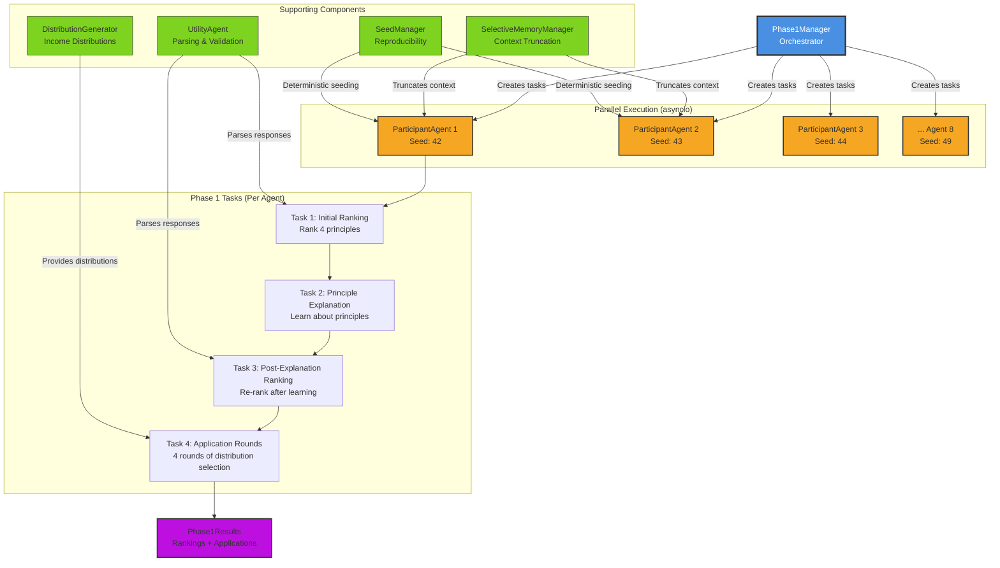
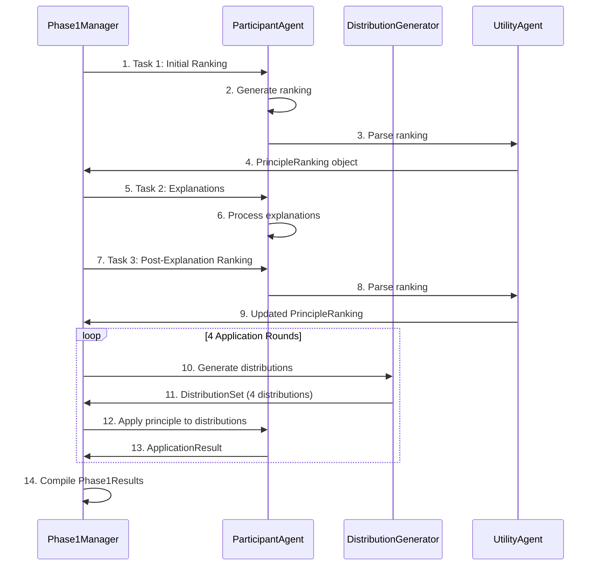

# Diagram 2.1: Phase 1 Architecture

**Purpose**: Show how Phase 1 manages parallel agent familiarization with justice principles

**Target Audience**: Developers starting to work with the codebase

**Complexity Level**: Conceptual Conceptual (10-12 boxes)

---

## Phase 1 Component Architecture



---

## Key Architectural Concepts

### 1. Parallel Execution Strategy
**Why Parallel?** Phase 1 has no inter-agent dependencies - each agent learns independently.

- **Implementation**: Uses Python `asyncio.gather()` to execute all 8 agents simultaneously
- **Performance**: Reduces Phase 1 time from ~8 minutes (sequential) to ~60 seconds (parallel)
- **Isolation**: Each agent receives its own seeded random number generator

### 2. Deterministic Seeding
**Why Seeded?** Ensures reproducible experiments for scientific rigor.

- **Global Seed**: Set in configuration (e.g., `seed: 42`)
- **Per-Agent Seed**: `global_seed + agent_index` (Agent 0 gets 42, Agent 1 gets 43, etc.)
- **What's Seeded**: Distribution generation, income class assignment
- **What's NOT Seeded**: LLM responses (inherently stochastic)

### 3. Memory Management
**Why Truncation?** Prevents context window overflow as experiments progress.

- **Statement Truncation**: Max 300 characters per statement
- **Reasoning Truncation**: Max 200 characters per reasoning block
- **Strategy**: Oldest content removed first (chronological FIFO)

### 4. Task Sequence (Per Agent)
Each agent executes 4 sequential tasks:

1. **Initial Ranking**: Rank 4 principles without any information (baseline preferences)
2. **Principle Explanation**: Receive detailed explanations with payoff examples
3. **Post-Explanation Ranking**: Re-rank after learning (measures preference stability)
4. **Application Rounds**: Apply principles to 4 different distributions (tests understanding)

---

## Data Flow



---

## Component Responsibilities

| Component | Responsibility | Key Methods | File Location |
|-----------|----------------|-------------|---------------|
| **Phase1Manager** | Orchestrates Phase 1 execution | `run_phase1()`, `_execute_participant_tasks()` | `core/phase1_manager.py` |
| **ParticipantAgent** | Represents individual AI agent | `think()`, `rank_principles()` | `experiment_agents/participant_agent.py` |
| **DistributionGenerator** | Generates income distributions | `generate_distribution_for_round()` | `core/distribution_generator.py` |
| **SelectiveMemoryManager** | Manages agent memory | `update_memory_simple()`, `update_memory_complex()` | `utils/selective_memory_manager.py` |
| **UtilityAgent** | Parses agent responses | `parse_principle_ranking()`, `parse_principle_choice()` | `experiment_agents/utility_agent.py` |
| **SeedManager** | Manages reproducibility | `get_seed_for()`, `_build_participant_rngs()` | `utils/seed_manager.py` |

---

## Output: Phase1Results

Each agent produces a `Phase1Results` object containing:

```python
Phase1Results:
    participant_name: str                      # e.g., "Alice"
    initial_ranking: PrincipleRanking          # Before learning
    post_explanation_ranking: PrincipleRanking # After learning
    application_results: List[ApplicationResult] # 4 rounds of applications
    completion_status: str                     # "completed" or error
```

These results are:
1. **Passed to Phase 2** for contextual discussion prompts
2. **Saved in final experiment results** for analysis
3. **Used to measure learning** (compare initial vs post-explanation rankings)

---

## Performance Characteristics

**Timing** (8 agents, parallel execution):
- Initial Ranking: ~5-10 seconds
- Explanations: ~10-15 seconds
- Post-Explanation Ranking: ~5-10 seconds
- 4 Application Rounds: ~15-30 seconds
- **Total**: ~60 seconds (±20 seconds)

**Token Usage** (GPT-4o):
- Per agent: ~6,000 tokens
- Total (8 agents): ~50,000 tokens
- **Cost**: ~$1-2 at current pricing

---

## Related Files

**Core Implementation**:
- `core/phase1_manager.py` - Main orchestrator (220 lines)
- `core/distribution_generator.py` - Income distribution logic (180 lines)
- `experiment_agents/participant_agent.py` - Agent implementation (350 lines)

**Supporting Components**:
- `utils/selective_memory_manager.py` - Memory management (150 lines)
- `utils/seed_manager.py` - Seeding logic (90 lines)
- `experiment_agents/utility_agent.py` - Parsing utilities (200 lines)

**Data Models**:
- `models/principle_types.py` - JusticePrinciple, PrincipleRanking
- `models/phase1_results.py` - Phase1Results structure

---

## Next Steps

- **For Phase 2 architecture**: See Diagram 2.2 (Phase 2 Services Architecture)
- **For detailed task workflows**: See TECHNICAL_README.md Section 2.1
- **For understanding seeding**: See TECHNICAL_README.md Section 8
