# Diagram 10: Phase 1 Complete Process Flow (v2)

**Alternative to Diagram 03** - Process-oriented view showing step-by-step flow with services clearly labeled.

This diagram shows the complete Phase 1 process with all components, services, and their roles.

```mermaid
flowchart TD
    Start([Start Phase 1]) --> Init[🟢 Phase1Manager<br/>Initializes]
    Init --> Parallel{8 Agents<br/>Execute in Parallel}

    %% Step 1: Initial Ranking
    Parallel --> Step1[📋 STEP 1: Initial Ranking]
    Step1 --> Agent1[Agent ranks 4 principles<br/>1=best, 4=worst<br/>without prior knowledge]
    Agent1 --> Util1[🟠 UtilityAgent<br/>parses ranking]

    %% Step 2: Principle Explanation
    Util1 --> Step2[📋 STEP 2: Principle Explanation]
    Step2 --> Lang1[🟠 LanguageManager<br/>provides localized explanations]
    Lang1 --> Agent2[Agent studies each principle<br/>with payoff examples<br/>empirical outcomes shown]

    %% Step 3: Post-Explanation Ranking
    Agent2 --> Step3[📋 STEP 3: Post-Explanation Ranking]
    Step3 --> Agent3[Agent re-ranks principles<br/>after understanding implications]
    Agent3 --> Util2[🟠 UtilityAgent<br/>parses ranking]

    %% Step 4: Application Rounds
    Util2 --> Step4[📋 STEP 4: Application Rounds<br/>4 rounds per agent]

    Step4 --> Round{For Each<br/>Round 1-4}

    Round --> DistGen[🟢 DistributionGenerator<br/>creates 4 income distributions]
    DistGen --> Seed1[🟢 SeedManager<br/>provides deterministic multiplier<br/>seed = base + agent_index]
    Seed1 --> Agent4[Agent selects preferred<br/>distribution to apply principle]
    Agent4 --> Payoff[Calculate expected payoff<br/>for selected distribution]
    Payoff --> Reason[Agent provides reasoning<br/>for selection choice]
    Reason --> Memory1[🟢 SelectiveMemoryManager<br/>truncates old content<br/>300 chars max statements<br/>200 chars max reasoning]
    Memory1 --> NextRound{More<br/>rounds?}

    NextRound -->|Yes| Round
    NextRound -->|No| Complete[Phase1Results compiled:<br/>- Initial ranking<br/>- Post-explanation ranking<br/>- 4 application results<br/>- Completion status]

    Complete --> AllDone{All 8 agents<br/>finished?}
    AllDone -->|No| Parallel
    AllDone -->|Yes| Output[🟣 Phase1Results<br/>for all participants]
    Output --> End([Phase 1 Complete<br/>~60 seconds total<br/>Ready for Phase 2])

    style Start fill:#4A90E2,stroke:#333,stroke-width:2px,color:#fff
    style End fill:#4A90E2,stroke:#333,stroke-width:2px,color:#fff
    style Init fill:#7ED321,stroke:#333,stroke-width:2px
    style DistGen fill:#7ED321,stroke:#333,stroke-width:2px
    style Seed1 fill:#7ED321,stroke:#333,stroke-width:2px
    style Memory1 fill:#7ED321,stroke:#333,stroke-width:2px
    style Util1 fill:#F5A623,stroke:#333,stroke-width:2px
    style Util2 fill:#F5A623,stroke:#333,stroke-width:2px
    style Lang1 fill:#F5A623,stroke:#333,stroke-width:2px
    style Agent1 fill:#50E3C2,stroke:#333,stroke-width:2px
    style Agent2 fill:#50E3C2,stroke:#333,stroke-width:2px
    style Agent3 fill:#50E3C2,stroke:#333,stroke-width:2px
    style Agent4 fill:#50E3C2,stroke:#333,stroke-width:2px
    style Reason fill:#50E3C2,stroke:#333,stroke-width:2px
    style Output fill:#BD10E0,stroke:#333,stroke-width:2px,color:#fff
    style Parallel fill:#FFD700,stroke:#333,stroke-width:3px
    style Step1 fill:#E8F5E9,stroke:#333,stroke-width:2px
    style Step2 fill:#E8F5E9,stroke:#333,stroke-width:2px
    style Step3 fill:#E8F5E9,stroke:#333,stroke-width:2px
    style Step4 fill:#E8F5E9,stroke:#333,stroke-width:2px
```



## Service Legend

### 🟢 Core Services
- **Phase1Manager**: Orchestrates entire Phase 1 execution, manages parallel agent tasks
- **DistributionGenerator**: Creates 4 income distributions per round with dynamic/original values mode
- **SeedManager**: Provides deterministic seeding (base_seed + agent_index) for reproducibility
- **SelectiveMemoryManager**: Truncates content to prevent overflow (300 char statements, 200 char reasoning)

### 🟠 Supporting Utilities
- **UtilityAgent**: Parses agent responses (rankings, choices) into structured data
- **LanguageManager**: Provides multilingual explanations (English, Spanish, Mandarin)

### 🟦 Agent Actions
- **Participant Agents**: AI agents making decisions at each step
- Agents execute independently in parallel (8 concurrent tasks)

### 🟣 Data Outputs
- **Phase1Results**: Structured output containing all rankings and application results

## Complete Process Flow

### STEP 1: Initial Ranking (~5-10 seconds)
1. Agent receives list of 4 justice principles
2. Agent ranks them 1-4 without income distribution knowledge
3. UtilityAgent parses ranking into structured format

### STEP 2: Principle Explanation (~10-15 seconds)
1. LanguageManager provides localized explanations for each principle
2. Explanations include empirical payoff examples
3. Agent studies each principle's implications

### STEP 3: Post-Explanation Ranking (~5-10 seconds)
1. Agent re-ranks principles after understanding outcomes
2. Tests learning effectiveness and preference stability
3. UtilityAgent parses ranking

### STEP 4: Application Rounds (~15-30 seconds)
**For each of 4 rounds:**
1. **DistributionGenerator** creates 4 different income distributions
2. **SeedManager** provides deterministic multiplier for reproducibility
3. Agent selects preferred distribution to apply principle
4. System calculates expected payoff for selection
5. Agent provides reasoning for choice
6. **SelectiveMemoryManager** truncates content to prevent overflow

**Output:** Phase1Results compiled with all rankings and application results

### Parallelization
- All 8 agents execute simultaneously
- Total Phase 1 time: ~60 seconds (not 8×60 seconds)
- Each agent has independent seeded RNG

### Key Design Features

**Reproducibility**:
- SeedManager: seed = global_seed + agent_index
- Same seed → identical distributions and assignments

**Memory Management**:
- SelectiveMemoryManager prevents context overflow
- Statements truncated to 300 characters
- Reasoning truncated to 200 characters

**Multilingual Support**:
- LanguageManager handles English, Spanish, Mandarin
- Translations from JSON files in `translations/`

**Structured Parsing**:
- UtilityAgent converts free-text responses to structured data
- Enables consistent data processing

## Phase1Results Structure

```
{
  "participant_name": "Alice",
  "initial_ranking": [P1, P3, P2, P4],
  "post_explanation_ranking": [P3, P1, P2, P4],
  "application_results": [
    {round: 1, selected_distribution: 2, payoff: 24000, reasoning: "..."},
    {round: 2, selected_distribution: 1, payoff: 27000, reasoning: "..."},
    {round: 3, selected_distribution: 3, payoff: 21000, reasoning: "..."},
    {round: 4, selected_distribution: 4, payoff: 19000, reasoning: "..."}
  ],
  "completion_status": "completed"
}
```

These results are then used in Phase 2 for building discussion context.
