# Diagram 11: Phase 2 Complete Process Flow (v2)

**Alternative to Diagram 04** - Process-oriented view showing complete discussion round with all 6 services clearly labeled.

This diagram shows a complete Phase 2 discussion round with all services and where they are employed.

```mermaid
flowchart TD
    Start([Start Phase 2]) --> Init[🟢 Phase2Manager<br/>initializes 6 services]

    Init --> Services[Services initialized:<br/>✓ SpeakingOrderService<br/>✓ DiscussionService<br/>✓ VotingService<br/>✓ MemoryService<br/>✓ CounterfactualsService<br/>✓ ManipulatorService optional]

    Services --> RoundStart{Start Round N<br/>Max 10 rounds}

    %% Speaking Order
    RoundStart --> SO_Start[📋 SPEAKING ORDER PHASE]
    SO_Start --> SO1[🟢 SpeakingOrderService:<br/>determine_speaking_order]
    SO1 --> SO2[Apply finisher restrictions<br/>if enabled]
    SO2 --> Order[Speaking order determined:<br/>Agent1, Agent2, ..., Agent8]

    %% Discussion Loop
    Order --> DiscLoop{For each<br/>speaker in order}

    DiscLoop --> Disc_Start[📋 DISCUSSION PHASE]
    Disc_Start --> DS1[🟢 DiscussionService:<br/>build_discussion_prompt]
    DS1 --> DS2[Include Phase 1 results<br/>+ discussion history<br/>+ round context]
    DS2 --> Agent1[Agent generates<br/>statement]
    Agent1 --> DS3[🟢 DiscussionService:<br/>validate_statement]
    DS3 --> DS4{Valid?<br/>≥50 chars}

    DS4 -->|No - Retry up to 3x| DS1
    DS4 -->|Yes| History[Append to<br/>public history<br/>with metadata]

    History --> Mem_Start[📋 MEMORY UPDATE]
    Mem_Start --> MS1[🟢 MemoryService:<br/>update_discussion_memory]
    MS1 --> MS2[Truncate to 300 chars<br/>+ apply guidance style<br/>narrative or structured]
    MS2 --> MS3[🟠 SelectiveMemoryManager:<br/>update_memory_simple<br/>~1 second]

    MS3 --> MoreSpeakers{More<br/>speakers?}
    MoreSpeakers -->|Yes| DiscLoop
    MoreSpeakers -->|No| Vote_Start

    %% Voting Check
    Vote_Start[📋 VOTING INITIATION CHECK]
    Vote_Start --> VoteCheck[🟢 VotingService:<br/>initiate_voting]
    VoteCheck --> VS1{Any agent<br/>votes Yes?<br/>OR final round?}

    VS1 -->|No| NextRound
    VS1 -->|Yes| Confirm_Start[📋 CONFIRMATION PHASE]

    %% Confirmation
    Confirm_Start --> VS2[🟢 VotingService:<br/>coordinate_voting_confirmation]
    VS2 --> VS3[All agents confirm:<br/>1=Yes, 0=No<br/>parallel execution]
    VS3 --> VS4{100%<br/>unanimous<br/>agreement?}

    VS4 -->|No| FailMem[🟢 MemoryService:<br/>update voting failure memory]
    FailMem --> NextRound

    %% Secret Ballot
    VS4 -->|Yes| Ballot_Start[📋 SECRET BALLOT PHASE]
    Ballot_Start --> Ballot[🟢 VotingService:<br/>coordinate_secret_ballot]

    Ballot --> Stage1[🟠 TwoStageVotingManager:<br/>conduct_principle_selection<br/>Stage 1: Select 1-4<br/>regex extraction + keyword fallback]
    Stage1 --> Stage2[🟠 TwoStageVotingManager:<br/>conduct_amount_specification<br/>Stage 2: Amount for P3/P4<br/>multilingual number parsing]
    Stage2 --> Consensus[🟢 VotingService:<br/>detect_consensus]
    Consensus --> ConsCheck{All votes<br/>identical?}

    ConsCheck -->|No| NoConsMem[🟢 MemoryService:<br/>update no-consensus memory]
    NoConsMem --> NextRound

    %% Payoff Calculation
    ConsCheck -->|Yes| Payoff_Start[📋 PAYOFF CALCULATION]
    Payoff_Start --> Payoff[🟢 CounterfactualsService:<br/>calculate_payoffs]

    Payoff --> CF1[Apply consensus principle<br/>to distribution]
    CF1 --> CF2[🟢 SeedManager:<br/>Assign income classes<br/>via seeded RNG]
    CF2 --> CF3[Calculate final earnings<br/>+ counterfactuals<br/>what if? analysis]

    CF3 --> Mem_Results[📋 RESULTS MEMORY UPDATE]
    Mem_Results --> MS4[🟢 MemoryService:<br/>update_final_results_memory]
    MS4 --> MS5[🟠 SelectiveMemoryManager:<br/>update_memory_complex<br/>~10 seconds<br/>LLM-mediated integration]
    MS5 --> Rankings[🟢 CounterfactualsService:<br/>collect_final_rankings]

    Rankings --> Results[🟣 Phase2Results:<br/>Consensus + transcripts<br/>+ detailed payoffs<br/>+ final rankings]
    Results --> End([Phase 2 Complete<br/>~20-40 minutes])

    NextRound{Round < 10?}
    NextRound -->|Yes| RoundStart
    NextRound -->|No| NoCons[No consensus reached:<br/>Random principle selected]
    NoCons --> Payoff_Start

    %% Styling
    style Start fill:#4A90E2,stroke:#333,stroke-width:2px,color:#fff
    style End fill:#4A90E2,stroke:#333,stroke-width:2px,color:#fff
    style Init fill:#7ED321,stroke:#333,stroke-width:2px
    style Services fill:#7ED321,stroke:#333,stroke-width:3px
    style SO1 fill:#7ED321,stroke:#333,stroke-width:2px
    style DS1 fill:#7ED321,stroke:#333,stroke-width:2px
    style DS3 fill:#7ED321,stroke:#333,stroke-width:2px
    style MS1 fill:#7ED321,stroke:#333,stroke-width:2px
    style MS4 fill:#7ED321,stroke:#333,stroke-width:2px
    style VoteCheck fill:#7ED321,stroke:#333,stroke-width:2px
    style VS2 fill:#7ED321,stroke:#333,stroke-width:2px
    style Ballot fill:#7ED321,stroke:#333,stroke-width:2px
    style Consensus fill:#7ED321,stroke:#333,stroke-width:2px
    style Payoff fill:#7ED321,stroke:#333,stroke-width:2px
    style Rankings fill:#7ED321,stroke:#333,stroke-width:2px
    style CF2 fill:#7ED321,stroke:#333,stroke-width:2px
    style Agent1 fill:#50E3C2,stroke:#333,stroke-width:2px
    style Results fill:#BD10E0,stroke:#333,stroke-width:2px,color:#fff
    style Stage1 fill:#F5A623,stroke:#333,stroke-width:2px
    style Stage2 fill:#F5A623,stroke:#333,stroke-width:2px
    style MS3 fill:#F5A623,stroke:#333,stroke-width:2px
    style MS5 fill:#F5A623,stroke:#333,stroke-width:2px
    style SO_Start fill:#E8F5E9,stroke:#333,stroke-width:2px
    style Disc_Start fill:#E8F5E9,stroke:#333,stroke-width:2px
    style Mem_Start fill:#E8F5E9,stroke:#333,stroke-width:2px
    style Vote_Start fill:#E8F5E9,stroke:#333,stroke-width:2px
    style Confirm_Start fill:#E8F5E9,stroke:#333,stroke-width:2px
    style Ballot_Start fill:#E8F5E9,stroke:#333,stroke-width:2px
    style Payoff_Start fill:#E8F5E9,stroke:#333,stroke-width:2px
    style Mem_Results fill:#E8F5E9,stroke:#333,stroke-width:2px
```

## Service Legend

### 🟢 Core Phase 2 Services

#### SpeakingOrderService
- **When**: Start of each discussion round
- **Methods**: `determine_speaking_order()`, `apply_finisher_restrictions()`
- **What**: Manages turn allocation, ensures last speaker differs from previous rounds
- **Output**: Ordered list of participants for the round

#### DiscussionService
- **When**: For each speaker's turn
- **Methods**: `build_discussion_prompt()`, `validate_statement()`, `manage_discussion_history_length()`
- **What**: Builds contextual prompts with Phase 1 context, validates statement quality (≥50 chars)
- **Output**: Validated statement + updated discussion history

#### VotingService
- **When**: End of each discussion round
- **Methods**: `initiate_voting()`, `coordinate_voting_confirmation()`, `coordinate_secret_ballot()`, `detect_consensus()`
- **What**: Complete voting orchestration (initiation → confirmation → ballot → consensus)
- **Output**: VotingResult with consensus status

#### MemoryService
- **When**: After each statement + after voting events + after results
- **Methods**: `update_discussion_memory()`, `update_voting_memory()`, `update_final_results_memory()`
- **What**: Routes to simple (~1s) or complex (~10s) memory updates
- **Routing**:
  - Simple: Discussion statements, voting initiated
  - Complex: Voting complete, final results (LLM-mediated)

#### CounterfactualsService
- **When**: After consensus (or max rounds reached)
- **Methods**: `calculate_payoffs()`, `format_detailed_results()`, `collect_final_rankings()`
- **What**: Applies principle, assigns income classes, generates "what if?" counterfactuals
- **Output**: DetailedResults with earnings under all 4 principles

#### ManipulatorService (Optional)
- **When**: Experimental manipulation scenarios
- **What**: Controlled intervention for research purposes

### 🟠 Supporting Components

#### TwoStageVotingManager
- **Methods**: `conduct_principle_selection()`, `conduct_amount_specification()`
- **Stage 1**: Extract principle 1-4 via regex, fallback to keyword matching
- **Stage 2**: Extract constraint amount with multilingual number parsing
- **Languages**: English (1,000), Spanish (1.000), Mandarin (1千, 1万)

#### SelectiveMemoryManager
- **Methods**: `update_memory_simple()`, `update_memory_complex()`
- **Simple**: Direct append without LLM (~1 second)
- **Complex**: LLM-mediated integration (~10 seconds)

#### SeedManager
- **When**: Income class assignment during payoff calculation
- **What**: Provides deterministic seeding for reproducible experiments

## Complete Process Phases

### PHASE 1: SPEAKING ORDER (~instant)
1. **SpeakingOrderService** determines turn allocation
2. Applies finisher restrictions if enabled (last speaker must differ)
3. Returns ordered participant list

### PHASE 2: DISCUSSION (~2-4 minutes)
**For each speaker in order:**
1. **DiscussionService** builds prompt with Phase 1 context + history
2. Agent generates statement
3. **DiscussionService** validates (≥50 chars, up to 3 retries)
4. Append to public history
5. **MemoryService** updates agent memory via simple insertion (~1s)

### PHASE 3: VOTING INITIATION CHECK (~30 seconds)
1. **VotingService** asks each agent "Initiate voting?" (1=Yes, 0=No)
2. If any Yes OR final round → proceed to Confirmation
3. If all No → continue to next round

### PHASE 4: CONFIRMATION (~1-2 minutes)
1. **VotingService** asks all agents to confirm (parallel execution)
2. Requires 100% unanimous agreement
3. If not unanimous → update memory, continue to next round

### PHASE 5: SECRET BALLOT (~2-3 minutes)
1. **VotingService** coordinates secret ballot
2. **TwoStageVotingManager** Stage 1: Principle selection (1-4)
3. **TwoStageVotingManager** Stage 2: Amount for principles 3 & 4
4. **VotingService** detects consensus (all votes identical)
5. If no consensus → update memory, continue to next round

### PHASE 6: PAYOFF CALCULATION (~instant)
1. **CounterfactualsService** applies consensus principle
2. **SeedManager** assigns income classes deterministically
3. Calculate final earnings for each agent
4. Generate counterfactuals (earnings under all 4 principles)

### PHASE 7: RESULTS & RANKINGS (~1-2 minutes)
1. **MemoryService** updates with results via complex update (~10s per agent)
2. **CounterfactualsService** collects final rankings from all agents
3. Compile Phase2Results

## Critical Decision Points

1. **Statement Validation**: ≥50 characters required, retry up to 3 times
2. **Voting Initiation**: Any Yes vote OR final round triggers voting
3. **Confirmation Gate**: Requires 100% unanimous agreement to proceed to ballot
4. **Consensus Detection**: All votes must be identical (principle + constraint)
5. **Round Limit**: Maximum 10 rounds before forcing payoff calculation

## Timing Breakdown

- **Speaking Order**: Instant
- **Discussion Stage**: 2-4 minutes (8 agents × 20-30 seconds each)
- **Voting Check**: 30 seconds
- **Confirmation Phase**: 1-2 minutes (parallel execution)
- **Secret Ballot**: 2-3 minutes (two stages)
- **Payoff Calculation**: Instant
- **Results Memory Update**: ~80 seconds (8 agents × 10 seconds complex update)
- **Final Rankings**: 1-2 minutes

**Total per round**: 2-4 minutes
**Typical experiment**: 20-40 minutes (consensus usually achieved round 3-7)

## Memory Update Routing

**Simple Update (~1 second)**:
- Discussion statements
- Voting initiated notification
- Voting confirmation result
- Direct append without LLM involvement

**Complex Update (~10 seconds)**:
- Voting ballot completed
- Final results with counterfactuals
- LLM-mediated integration asking agent to synthesize new information
