# Phase 2: Group Discussion Process Flow (PROPOSED)

This diagram shows a complete Phase 2 discussion round with all 6 services.

```mermaid
flowchart TD
    Start([Start Phase 2]) --> Init[Phase2Manager<br/>initializes 6 services]

    Init --> Services[✓ SpeakingOrderService<br/>✓ DiscussionService<br/>✓ VotingService<br/>✓ MemoryService<br/>✓ CounterfactualsService<br/>✓ ManipulatorService]

    Services --> RoundStart{Start Round N<br/>Max 10 rounds}

    RoundStart --> SO1[SpeakingOrderService:<br/>Determine turn order]
    SO1 --> SO2[Apply finisher restrictions<br/>if enabled]
    SO2 --> Order[Speaking order:<br/>Agent1, Agent2, ..., Agent8]

    Order --> DiscLoop{For each<br/>speaker}

    DiscLoop --> DS1[DiscussionService:<br/>Build contextual prompt]
    DS1 --> DS2[Include Phase 1 results<br/>+ discussion history]
    DS2 --> Agent1[Agent generates<br/>statement]
    Agent1 --> DS3[DiscussionService:<br/>Validate statement length]
    DS3 --> DS4{Valid?<br/>≥50 chars}

    DS4 -->|Retry up to 3x| DS1
    DS4 -->|Yes| History[Append to<br/>public history]

    History --> MS1[MemoryService:<br/>Update agent memory]
    MS1 --> MS2[Truncate to 300 chars<br/>+ apply guidance style]
    MS2 --> MS3[SelectiveMemoryManager:<br/>Simple insertion ~1sec]

    MS3 --> MoreSpeakers{More<br/>speakers?}
    MoreSpeakers -->|Yes| DiscLoop
    MoreSpeakers -->|No| VoteCheck

    VoteCheck[VotingService:<br/>Check voting initiation]
    VoteCheck --> VS1{Any agent<br/>votes Yes?<br/>OR final round?}

    VS1 -->|No| NextRound
    VS1 -->|Yes| VS2[VotingService:<br/>Confirmation phase]

    VS2 --> VS3[All agents confirm:<br/>1=Yes, 0=No]
    VS3 --> VS4{100%<br/>agreement?}

    VS4 -->|No| FailMem[Update voting<br/>failure memory]
    FailMem --> NextRound

    VS4 -->|Yes| Ballot[VotingService:<br/>Secret ballot]

    Ballot --> Stage1[TwoStageVotingManager:<br/>Stage 1 - Select principle 1-4]
    Stage1 --> Stage2[TwoStageVotingManager:<br/>Stage 2 - Amount for P3/P4]
    Stage2 --> Consensus{Detect<br/>consensus?<br/>All votes equal?}

    Consensus -->|No| NoConsMem[Update no-consensus<br/>memory]
    NoConsMem --> NextRound

    Consensus -->|Yes| Payoff[CounterfactualsService:<br/>Calculate payoffs]

    Payoff --> CF1[Apply consensus principle<br/>to distribution]
    CF1 --> CF2[Assign income classes<br/>via seeded RNG]
    CF2 --> CF3[Calculate final earnings<br/>+ counterfactuals]

    CF3 --> MS4[MemoryService:<br/>Update results memory]
    MS4 --> MS5[SelectiveMemoryManager:<br/>Complex update ~10sec]
    MS5 --> Rankings[CounterfactualsService:<br/>Collect final rankings]

    Rankings --> Results[Phase2Results:<br/>Consensus + transcripts<br/>+ payoffs]
    Results --> End([Phase 2 Complete<br/>~20-40 minutes])

    NextRound{Round < 10?}
    NextRound -->|Yes| RoundStart
    NextRound -->|No| NoCons[No consensus reached:<br/>Random principle selected]
    NoCons --> Payoff

    style Start fill:#4A90E2,stroke:#333,stroke-width:2px,color:#fff
    style End fill:#4A90E2,stroke:#333,stroke-width:2px,color:#fff
    style Init fill:#7ED321,stroke:#333,stroke-width:2px
    style Services fill:#7ED321,stroke:#333,stroke-width:3px
    style SO1 fill:#7ED321,stroke:#333,stroke-width:2px
    style SO2 fill:#7ED321,stroke:#333,stroke-width:2px
    style DS1 fill:#7ED321,stroke:#333,stroke-width:2px
    style DS3 fill:#7ED321,stroke:#333,stroke-width:2px
    style MS1 fill:#7ED321,stroke:#333,stroke-width:2px
    style MS4 fill:#7ED321,stroke:#333,stroke-width:2px
    style VoteCheck fill:#7ED321,stroke:#333,stroke-width:2px
    style VS2 fill:#7ED321,stroke:#333,stroke-width:2px
    style Ballot fill:#7ED321,stroke:#333,stroke-width:2px
    style Payoff fill:#7ED321,stroke:#333,stroke-width:2px
    style Rankings fill:#7ED321,stroke:#333,stroke-width:2px
    style Agent1 fill:#50E3C2,stroke:#333,stroke-width:2px
    style Results fill:#BD10E0,stroke:#333,stroke-width:2px,color:#fff
    style Stage1 fill:#F5A623,stroke:#333,stroke-width:2px
    style Stage2 fill:#F5A623,stroke:#333,stroke-width:2px
    style MS3 fill:#F5A623,stroke:#333,stroke-width:2px
    style MS5 fill:#F5A623,stroke:#333,stroke-width:2px
```

## Service-by-Service Breakdown

### 🟢 SpeakingOrderService
- **When**: Start of each discussion round
- **What**: Determines speaking order with optional finisher restrictions
- **Output**: Ordered list of participants

### 🟢 DiscussionService
- **When**: For each speaker's turn
- **What**: Builds contextual prompts, validates statements, manages history
- **Output**: Validated statement + updated discussion history

### 🟢 MemoryService
- **When**: After each statement + after voting + after results
- **What**: Updates agent memories with truncation and routing
- **Routing**:
  - Simple (~1s): Discussion statements, voting initiated
  - Complex (~10s): Voting complete, final results

### 🟢 VotingService
- **When**: End of each discussion round
- **What**: Orchestrates initiation → confirmation → secret ballot → consensus
- **Components**: Uses TwoStageVotingManager for ballot execution

### 🟢 CounterfactualsService
- **When**: After consensus (or max rounds)
- **What**: Calculates payoffs, generates counterfactuals, collects final rankings
- **Output**: DetailedResults with "what if?" analysis

### 🟢 ManipulatorService (Optional)
- **When**: Experimental manipulation scenarios
- **What**: Provides controlled intervention capabilities

## Critical Decision Points

1. **Voting Initiation**: Any agent votes Yes OR final round reached
2. **Confirmation Gate**: Requires 100% unanimous agreement to proceed
3. **Consensus Detection**: All votes must be identical (principle + constraint)
4. **Round Limit**: Maximum 10 rounds before forcing payoff calculation

## Timing Breakdown

- **Discussion Stage**: 2-4 minutes (8 agents × 20-30 seconds each)
- **Voting Check**: 30 seconds
- **Confirmation Phase**: 1-2 minutes
- **Secret Ballot**: 2-3 minutes (Stage 1 + Stage 2)
- **Total per round**: 2-4 minutes
- **Typical experiment**: 20-40 minutes (consensus usually round 3-7)
